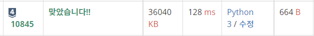
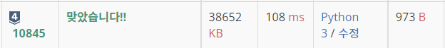

# 10845번 : 큐 [↩](../../acmicpc)

[10845번 : 큐](https://www.acmicpc.net/problem/10845)

## 🖋️문제

정수를 저장하는 큐를 구현한 다음, 입력으로 주어지는 명령을 처리하는 프로그램을 작성하시오.

명령은 총 여섯 가지이다.

- push X: 정수 X를 큐에 넣는 연산이다.
- pop: 큐에서 가장 앞에 있는 정수를 빼고, 그 수를 출력한다. 만약 큐에 들어있는 정수가 없는 경우에는 -1을 출력한다.
- size: 큐에 들어있는 정수의 개수를 출력한다.
- empty: 큐가 비어있으면 1, 아니면 0을 출력한다.
- front: 큐의 가장 앞에 있는 정수를 출력한다. 만약 큐에 들어있는 정수가 없는 경우에는 -1을 출력한다.
- back: 큐의 가장 뒤에 있는 정수를 출력한다. 만약 큐에 들어있는 정수가 없는 경우에는 -1을 출력한다.

### 입력

첫째 줄에 주어지는 명령의 수 N (1 ≤ N ≤ 10,000)이 주어진다. 둘째 줄부터 N개의 줄에는 명령이 하나씩 주어진다. 주어지는 정수는 1보다 크거나 같고, 100,000보다 작거나 같다. 문제에 나와있지 않은 명령이 주어지는 경우는 없다.


### 출력

출력해야하는 명령이 주어질 때마다, 한 줄에 하나씩 출력한다. 

### 예제 입력

```python
in[0]
15
push 1
push 2
front
back
size
empty
pop
pop
pop
size
empty
pop
push 3
empty
front

out[0]
1
2
2
0
1
2
-1
0
1
-1
0
3

```

---

## 💡풀이

### 1차 시도

```python
import sys

N = int(sys.stdin.readline())

queue = []

for _ in range(N):
    input = sys.stdin.readline().split()
    command = input[0]
    if command == 'push':   # push X : 정수 X를 큐에 넣는 연산이다.
        queue.append(input[1])
        
    if command == 'pop':    # pop: 큐에서 가장 앞에 있는 정수를 빼고, 그 수를 출력한다. 만약 큐에 들어있는 정수가 없는 경우에는 -1을 출력한다.
        if len(queue) == 0:
            print(-1)
        else:
            print(queue.pop(0))

    if command == 'size':   # size: 큐에 들어있는 정수의 개수를 출력한다.
        print(len(queue))
    
    if command == 'empty':  # empty: 큐가 비어있으면 1, 아니면 0을 출력한다.
        if len(queue) == 0:
            print(1)
        else:
            print(0)
    
    if command == 'front':  # front: 큐의 가장 앞에 있는 정수를 출력한다. 만약 큐에 들어있는 정수가 없는 경우에는 -1을 출력한다.
        if len(queue) == 0:
            print(-1)
        else:
            print(queue[0])

    if command == 'back':   # back: 큐의 가장 뒤에 있는 정수를 출력한다. 만약 큐에 들어있는 정수가 없는 경우에는 -1을 출력한다.
        if len(queue) == 0:
            print(-1)
        else:
            print(queue[-1])
```

###  성공😊



* python에서 제공하는 모듈을 최대한 이용하여 풀이

### 2차 시도

> 바킹독님 영상 참고 [✏️](../../baaarking_dog_algorithm_lecture/0x06_queue.md) 

```python
import sys

mx = 1000005
dat = [0] * mx
head, tail = 0, 0

def push(x : int):
    global tail
    dat[tail] = x
    tail += 1

def pop() -> int:
    global head
    if tail != head:
        head += 1
        return dat[head - 1]
    else:
        return -1

def size() -> int:
    return tail - head

def empty() -> int:
    if tail != head:
        return 0
    else:
        return 1

def front() -> int:
    if tail != head:
        return dat[head]
    else:
        return -1

def back() -> int:
    if tail != head:
        return dat[tail - 1]
    else:
        return -1

input = sys.stdin.readline

for _ in range(int(input())):
    command = input().split()
    if command[0] == 'push':
        push(int(command[1]))
    elif command[0] == 'pop':
        print(pop())
    elif command[0] == 'size':
        print(size())
    elif command[0] == 'empty':
        print(empty())
    elif command[0] == 'front':
        print(front())
    else:
        print(back())
```

###  성공😊



* 큐와 그에 따른 기능을 구현하여 풀이

