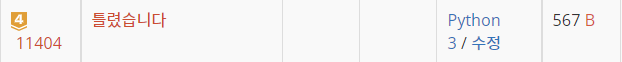
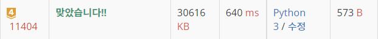

# 11404 : 플로이드 [↩](../../acmicpc)

[11404 : 플로이드](https://www.acmicpc.net/problem/11404)

| 시간 제한 | 메모리 제한 | 제출  | 정답  | 맞힌 사람 | 정답 비율 |
| :-------- | :---------- | :---- | :---- | :-------- | :-------- |
| 1 초      | 256 MB      | 47945 | 19815 | 14027     | 41.673%   |

## 문제

n(2 ≤ n ≤ 100)개의 도시가 있다. 그리고 한 도시에서 출발하여 다른 도시에 도착하는 m(1 ≤ m ≤ 100,000)개의 버스가 있다. 각 버스는 한 번 사용할 때 필요한 비용이 있다.

모든 도시의 쌍 (A, B)에 대해서 도시 A에서 B로 가는데 필요한 비용의 최솟값을 구하는 프로그램을 작성하시오.

## 입력

첫째 줄에 도시의 개수 n이 주어지고 둘째 줄에는 버스의 개수 m이 주어진다. 그리고 셋째 줄부터 m+2줄까지 다음과 같은 버스의 정보가 주어진다. 먼저 처음에는 그 버스의 출발 도시의 번호가 주어진다. 버스의 정보는 버스의 시작 도시 a, 도착 도시 b, 한 번 타는데 필요한 비용 c로 이루어져 있다. 시작 도시와 도착 도시가 같은 경우는 없다. 비용은 100,000보다 작거나 같은 자연수이다.

시작 도시와 도착 도시를 연결하는 노선은 하나가 아닐 수 있다.

## 출력

n개의 줄을 출력해야 한다. i번째 줄에 출력하는 j번째 숫자는 도시 i에서 j로 가는데 필요한 최소 비용이다. 만약, i에서 j로 갈 수 없는 경우에는 그 자리에 0을 출력한다.

### 예제 입력

```python
in[0]
5
14
1 2 2
1 3 3
1 4 1
1 5 10
2 4 2
3 4 1
3 5 1
4 5 3
3 5 10
3 1 8
1 4 2
5 1 7
3 4 2
5 2 4

out[0]
0 2 3 1 4
12 0 15 2 5
8 5 0 1 1
10 7 13 0 3
7 4 10 6 0
```

---

## 💡풀이

### 1차 시도

```python
import sys

input = sys.stdin.readline

n = int(input())
matrix = [[100001]*n for _ in range(n)]

for _ in range(int(input())):
    x, y, cost = map(int, input().split())
    matrix[x-1][y-1] = min(matrix[x-1][y-1], cost)

# print(matrix)

for s in range(n):
    for i in range(n):
        for j in range(n):
            if i != s or j != s:
                matrix[i][j] = min(matrix[i][s]+matrix[s][j], matrix[i][j])
            if i == j:
                matrix[i][j] = 0

for i in matrix:
    for j in i:
        print(0 if j == 100001 else j, end=' ')
    print()
```

### 실패😂



* 플루이드-와샬 알고리즘을 3중 for문을 사용하여 구현하였지만, 실패

### 2차 시도

```python
import sys

input = sys.stdin.readline

n = int(input())
matrix = [[100000000]*n for _ in range(n)]

for _ in range(int(input())):
    x, y, cost = map(int, input().split())
    matrix[x-1][y-1] = min(matrix[x-1][y-1], cost)

for i in range(n):
    matrix[i][i] = 0


for s in range(n):
    for i in range(n):
        for j in range(n):
            if i != s or j != s:
                matrix[i][j] = min(matrix[i][s]+matrix[s][j], matrix[i][j])

for i in range(n):
    for j in range(n):
        print(0 if matrix[i][j] == 100000000 else matrix[i][j], end=' ')
    print()
```

### 성공😊



* `INF`값을 1억으로 수정 후 성공.