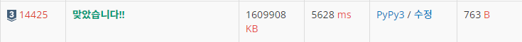

# 14425 : 문자열 집합 [↩](../../acmicpc)

[14425 : 문자열 집합](https://www.acmicpc.net/problem/14425)

| 시간 제한                                                  | 메모리 제한 | 제출  | 정답  | 맞힌 사람 | 정답 비율 |
| :--------------------------------------------------------- | :---------- | :---- | :---- | :-------- | :-------- |
| 2 초 ([하단 참고](https://www.acmicpc.net/problem/14425#)) | 1536 MB     | 24195 | 13132 | 9852      | 54.194%   |

## 문제

총 N개의 문자열로 이루어진 집합 S가 주어진다.

입력으로 주어지는 M개의 문자열 중에서 집합 S에 포함되어 있는 것이 총 몇 개인지 구하는 프로그램을 작성하시오.

## 입력

첫째 줄에 문자열의 개수 N과 M (1 ≤ N ≤ 10,000, 1 ≤ M ≤ 10,000)이 주어진다. 

다음 N개의 줄에는 집합 S에 포함되어 있는 문자열들이 주어진다.

다음 M개의 줄에는 검사해야 하는 문자열들이 주어진다.

입력으로 주어지는 문자열은 알파벳 소문자로만 이루어져 있으며, 길이는 500을 넘지 않는다. 집합 S에 같은 문자열이 여러 번 주어지는 경우는 없다.

## 출력

첫째 줄에 M개의 문자열 중에 총 몇 개가 집합 S에 포함되어 있는지 출력한다.

### 예제 입력

```python
in[0]
5 11
baekjoononlinejudge
startlink
codeplus
sundaycoding
codingsh
baekjoon
codeplus
codeminus
startlink
starlink
sundaycoding
codingsh
codinghs
sondaycoding
startrink
icerink

out[0]
4
```

---

## 💡풀이

### 1차 시도

```python
import sys

input = sys.stdin.readline

ROOT = 1
unused = 2
MX = 10000 * 500 + 5
chk = [False] * MX
nxt = [[-1] * 26 for _ in range(MX)]

def c2i(c: str):
    return ord(c) - ord('a')

def insert(s: str):
    global unused, ROOT
    cur = ROOT
    for c in s:
        if nxt[cur][c2i(c)] == -1:
            nxt[cur][c2i(c)] = unused
            unused += 1
        cur = nxt[cur][c2i(c)]
    chk[cur] = True

def find(s: str)->bool:
    cur = ROOT
    for c in s:
        if nxt[cur][c2i(c)] == -1:
            return False
        cur = nxt[cur][c2i(c)]
    return chk[cur]

n, m = map(int, input().split())

for _ in range(n):
    s = input().rstrip()
    insert(s)

answer = 0

for _ in range(m):
    s = input().rstrip()
    answer += find(s)

print(answer)
```

### 성공😊



* 트라이 구조 구현 후 성공
