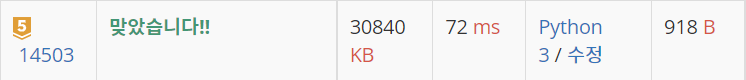

# 백준 14503 : 로봇 청소기 [↩](../../acmicpc)

[14503 : 로봇 청소기](https://www.acmicpc.net/problem/14503)

| 시간 제한 | 메모리 제한 | 제출  | 정답  | 맞힌 사람 | 정답 비율 |
| :-------- | :---------- | :---- | :---- | :-------- | :-------- |
| 2 초      | 512 MB      | 44588 | 24205 | 16175     | 53.556%   |

## 🖋️문제

- 로봇 청소기가 주어졌을 때, 청소하는 영역의 개수를 구하는 프로그램을 작성하시오.

  로봇 청소기가 있는 장소는 N×M 크기의 직사각형으로 나타낼 수 있으며, 1×1크기의 정사각형 칸으로 나누어져 있다. 각각의 칸은 벽 또는 빈 칸이다. 청소기는 바라보는 방향이 있으며, 이 방향은 동, 서, 남, 북중 하나이다. 지도의 각 칸은 (r, c)로 나타낼 수 있고, r은 북쪽으로부터 떨어진 칸의 개수, c는 서쪽으로 부터 떨어진 칸의 개수이다.

  로봇 청소기는 다음과 같이 작동한다.

  1. 현재 위치를 청소한다.
  2. 현재 위치에서 현재 방향을 기준으로 왼쪽방향부터 차례대로 탐색을 진행한다.
     1. 왼쪽 방향에 아직 청소하지 않은 공간이 존재한다면, 그 방향으로 회전한 다음 한 칸을 전진하고 1번부터 진행한다.
     2. 왼쪽 방향에 청소할 공간이 없다면, 그 방향으로 회전하고 2번으로 돌아간다.
     3. 네 방향 모두 청소가 이미 되어있거나 벽인 경우에는, 바라보는 방향을 유지한 채로 한 칸 후진을 하고 2번으로 돌아간다.
     4. 네 방향 모두 청소가 이미 되어있거나 벽이면서, 뒤쪽 방향이 벽이라 후진도 할 수 없는 경우에는 작동을 멈춘다.

  로봇 청소기는 이미 청소되어있는 칸을 또 청소하지 않으며, 벽을 통과할 수 없다.

### 입력

첫째 줄에 세로 크기 N과 가로 크기 M이 주어진다. (3 ≤ N, M ≤ 50)

둘째 줄에 로봇 청소기가 있는 칸의 좌표 (r, c)와 바라보는 방향 d가 주어진다. d가 0인 경우에는 북쪽을, 1인 경우에는 동쪽을, 2인 경우에는 남쪽을, 3인 경우에는 서쪽을 바라보고 있는 것이다.

셋째 줄부터 N개의 줄에 장소의 상태가 북쪽부터 남쪽 순서대로, 각 줄은 서쪽부터 동쪽 순서대로 주어진다. 빈 칸은 0, 벽은 1로 주어진다. 지도의 첫 행, 마지막 행, 첫 열, 마지막 열에 있는 모든 칸은 벽이다.

로봇 청소기가 있는 칸의 상태는 항상 빈 칸이다.

### 출력

로봇 청소기가 청소하는 칸의 개수를 출력한다.

### 예제 입력

```python
in[0]
3 3
1 1 0
1 1 1
1 0 1
1 1 1

out[0]
1

in[1]
11 10
7 4 0
1 1 1 1 1 1 1 1 1 1
1 0 0 0 0 0 0 0 0 1
1 0 0 0 1 1 1 1 0 1
1 0 0 1 1 0 0 0 0 1
1 0 1 1 0 0 0 0 0 1
1 0 0 0 0 0 0 0 0 1
1 0 0 0 0 0 0 1 0 1
1 0 0 0 0 0 1 1 0 1
1 0 0 0 0 0 1 1 0 1
1 0 0 0 0 0 0 0 0 1
1 1 1 1 1 1 1 1 1 1

out[1]
57
```

---

## 💡풀이

### 1차 시도 [코드⌨️](14503.py)

```python
import sys

input = sys.stdin.readline

n, m = map(int, input().split()) # 장소의 크기 N*M
matrix = [[0] * m for _ in range(n)] # 방문 여부를 파악하기 위한 행렬

x, y, direction = map(int, input().split()) # 현재 위치 (x, y), 바라보는 방향 direction
matrix[x][y] = 1 # 현재 위치에 방문 처리

mapping = [list(map(int, input().split())) for _ in range(n)] # 빈칸(0)과 벽(1)의 여부를 담은 행렬

# 북 - 동 - 남 - 서 를 index로 순차적으로 표현
dx = [-1, 0, 1, 0]
dy = [0, 1, 0, -1]

# 왼쪽으로 도는 경우를 함수로 규정
def turn_left():
    global direction
    direction -= 1
    if direction == -1:
        direction = 3

answer = 1 # 현재 위치에서 출발하기 때문에 1부터 시작
turn_time = 0 # 회전한 횟수

while True:
    turn_left() # 왼쪽 방향으로 회전
    nx, ny = x + dx[direction], y + dy[direction] # 회전한 좌표

    if matrix[nx][ny] == 0 and mapping[nx][ny] == 0: # 회전한 좌표가 방문하지 않았고 벽이 아닌 경우
        matrix[nx][ny] = 1 # 방문 여부 행렬에 방문 처리
        x, y = nx, ny # 해당 위치로 이동
        answer += 1 # 청소하는 칸의 개수에 1을 더함
        turn_time = 0 # 회전한 횟수 초기화
        continue
    else:
        turn_time += 1 # 추가로 회전

    if turn_time == 4: # 360도 회전한 경우
        nx, ny = x - dx[direction], y - dy[direction] # 다시 돌아가기
        if mapping[nx][ny] == 0: # 돌아간 위치가 벽이 아니면
            x, y = nx, ny # 해당 위치로 이동
        else: # 360도로 회전했는데 돌아간 위치가 모두 벽이라면 탈출
            break
        turn_time = 0 # 회전한 횟수 초기화
print(answer)
```

###  성공😊



* 입력값 정의

  * 장소의 크기 : `n*m`
  * 현재 위치 : `(x, y)`
  * 현재 바라보는 방향 : `direction`
  * 지도 상에 벽인지 빈칸인지 확인하는 행렬 : `mapping`

  ```python
  n, m = map(int, input().split()) # 장소의 크기 N*M
  matrix = [[0] * m for _ in range(n)] # 방문 여부를 파악하기 위한 행렬
  
  x, y, direction = map(int, input().split()) # 현재 위치 (x, y), 바라보는 방향 direction
  matrix[x][y] = 1 # 현재 위치에 방문 처리
  
  mapping = [list(map(int, input().split())) for _ in range(n)] # 빈칸(0)과 벽(1)의 여부를 담은 행렬
  ```

* 북-동-남-서 방향 `index`로 정의

  ```python
  dx = [-1, 0, 1, 0]
  dy = [0, 1, 0, -1]

* 로봇청소기가 왼쪽 방향부터 확인하기 때문에 이를 나타내는 함수 정의

  ```python
  def turn_left():
      global direction
      direction -= 1
      if direction == -1: # -1이 이면 direction 값을 3으로
          direction = 3
  ```

* 청소기가 이동한 위치의 갯수를 담을 `answer`와 청소기가 돌아간 횟수 `turn_time` 정의

  ```python
  answer = 1 # 현재 위치에서 출발하기 때문에 1부터 시작
  turn_time = 0 # 회전한 횟수
  ```

* 왼쪽 방향으로 회전하면서 회전한 좌표 탐색

  ```python
  turn_left() # 왼쪽 방향으로 회전
  nx, ny = x + dx[direction], y + dy[direction] # 회전한 좌표
  ```

  

* 만약 회전한 좌표가 방문한 적 없고`matrix[nx][ny] == 0` 벽이 아니라면 `mapping[nx][ny] == 0` 그 좌표로 이동

  ```python
  if matrix[nx][ny] == 0 and mapping[nx][ny] == 0: # 회전한 좌표가 방문하지 않았고 벽이 아닌 경우
      matrix[nx][ny] = 1 # 방문 여부 행렬에 방문 처리
      x, y = nx, ny # 해당 위치로 이동
      answer += 1 # 청소하는 칸의 개수에 1을 더함
      turn_time = 0 # 회전한 횟수 초기화
      continue
  ```

* 그렇지 않다면 왼쪽 방향으로 회전

  ```python
  else:
      turn_time += 1 # 추가로 회전
  ```

* 4방향 모두 회전했다면 이전 좌표로 다시 이동

  ```python
  if turn_time == 4: # 360도 회전한 경우
      nx, ny = x - dx[direction], y - dy[direction] # 다시 돌아가기
      if mapping[nx][ny] == 0: # 돌아간 위치가 벽이 아니면
          x, y = nx, ny # 해당 위치로 이동
  ```

* 이전 좌표로 이동했을때 4방향 모두 벽이라면 탈출

  ```python
  else: # 360도로 회전했는데 돌아간 위치가 모두 벽이라면 탈출
      break
  ```

  
