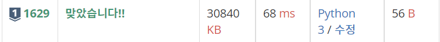
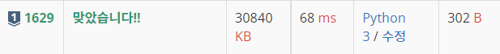

# 1629번 : 곱셈 [↩](../../acmicpc)

[1629번 : 곱셈](https://www.acmicpc.net/problem/1629)

| 시간 제한               | 메모리 제한 | 제출  | 정답  | 맞힌 사람 | 정답 비율 |
| :---------------------- | :---------- | :---- | :---- | :-------- | :-------- |
| 0.5 초 (추가 시간 없음) | 128 MB      | 78045 | 21169 | 15555     | 26.227%   |

## 🖋️문제

자연수 A를 B번 곱한 수를 알고 싶다. 단 구하려는 수가 매우 커질 수 있으므로 이를 C로 나눈 나머지를 구하는 프로그램을 작성하시오.

### 입력

첫째 줄에 A, B, C가 빈 칸을 사이에 두고 순서대로 주어진다. A, B, C는 모두 2,147,483,647 이하의 자연수이다.

### 출력

첫째 줄에 A를 B번 곱한 수를 C로 나눈 나머지를 출력한다.

### 예제 입력

```python
in[0]
10 11 12

out[0]
4
```

---

## 💡풀이

### 1차 시도

> 파이썬의 `pow` 모듈을 사용

```python
import sys

input = sys.stdin.readline

a, b, c = map(int, input().split())

print(pow(a, b, c))
```

###  성공😊



* python의 `pow`는 a의 b승의 나머지 연산을 출력한다.

### 2차 시도

> 재귀함수를 이용하여 풀이

```python
import sys

input = sys.stdin.readline

a, b, c = map(int, input().split())

def solution(a : int, b : int, c : int) -> int:
    if b == 1:
        return a % c
    val = solution(a, b//2, c)
    val = val * val % c
    if b % 2 == 0:
        return val
    return val * a % c

print(solution(a, b, c))
```

###  성공😊



* 이 문제는 간단하게 다음과 같이 구현해볼 수 있다.

  ```python
  print(a ** b % c)
  ```

* 하지만 이럴 경우 20억을 넘어가기에 재귀를 사용하여 풀어야 한다.

* 다음과 같은 수학적 법칙을 생각한다.

  * a<sup>n</sup> * a<sup>n</sup> = a<sup>2n</sup>
  * 12<sup>58</sup> ≡ 4(mod 67) -> 12<sup>116</sup> ≡ 16(mod 67)
  * 위의 법칙을 정리하면 : a * b % c = ((a % c) * (b % c)) % c

* 이 법칙을 활용하여 귀납적 추론을 할 경우 다음과 같은 결론에 도달할 수 있다.

  ```python
  '''
  1승을 계산할 수 있다.
  k승을 계산했으면 2k승과 2k+1승도 O(1)에 계산할 수 았다.
  '''
  ```

* Base Condition을 다음과 같이 설정한다.

  ```python
      if b == 1:
          return a % c
  ```
