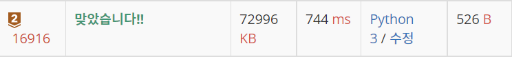

# 16916 : 부분 문자열 [↩](../../acmicpc)

[16916 : 부분 문자열](https://www.acmicpc.net/problem/16916)

| 시간 제한 | 메모리 제한 | 제출  | 정답 | 맞힌 사람 | 정답 비율 |
| :-------- | :---------- | :---- | :--- | :-------- | :-------- |
| 1 초      | 512 MB      | 12114 | 3870 | 2840      | 37.221%   |

## 문제

문자열 S의 부분 문자열이란, 문자열의 연속된 일부를 의미한다.

예를 들어, "aek", "joo", "ekj"는 "baekjoon"의 부분 문자열이고, "bak", "p", "oone"는 부분 문자열이 아니다.

문자열 S와 P가 주어졌을 때, P가 S의 부분 문자열인지 아닌지 알아보자.

## 입력

첫째 줄에 문자열 S, 둘째 줄에 문자열 P가 주어진다. 두 문자열은 빈 문자열이 아니며, 길이는 100만을 넘지 않는다. 또, 알파벳 소문자로만 이루어져 있다.

## 출력

P가 S의 부분 문자열이면 1, 아니면 0을 출력한다.

### 예제 입력

```python
in[0]
baekjoon
aek

out[0]
1

in[1]
baekjoon
bak

out[1]
0

in[2]
baekjoon
joo

out[2]
1

in[3]
baekjoon
oone

out[3]
0

in[4]
baekjoon
online

out[4]
0

in[5]
baekjoon
baekjoon

out[5]
1
```

---

## 💡풀이

### 1차 시도

```python
import sys

input = sys.stdin.readline

def failure(s: str) -> list[int]:
    f = [0] * len(s)
    j = 0
    for i in range(1, len(s)):
        while j > 0 and s[i] != s[j]:
            j = f[j - 1]
        if s[i] == s[j]:
            j += 1
            f[i] = j
    return f

s = input().rstrip()
p = input().rstrip()

f = failure(p)
j = 0
for i in range(len(s)):
    while j > 0 and s[i] != p[j]:
        j = f[j - 1]
    if s[i] == p[j]:
        j += 1
    if j == len(p):
        print(1)
        break
else:
    print(0)
```

### 성공😊



* KMP 알고리즘을 활용하여 풀이