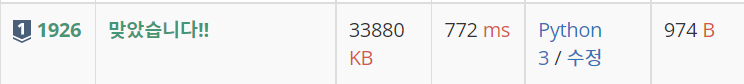

# 1926번 : 그림 [↩](../../acmicpc)

[1926번 : 그림](https://www.acmicpc.net/problem/1926)

| 시간 제한 | 메모리 제한 | 제출  | 정답 | 맞힌 사람 | 정답 비율 |
| :-------- | :---------- | :---- | :--- | :-------- | :-------- |
| 2 초      | 128 MB      | 21554 | 8977 | 6319      | 40.579%   |

## 🖋️문제

어떤 큰 도화지에 그림이 그려져 있을 때, 그 그림의 개수와, 그 그림 중 넓이가 가장 넓은 것의 넓이를 출력하여라. 단, 그림이라는 것은 1로 연결된 것을 한 그림이라고 정의하자. 가로나 세로로 연결된 것은 연결이 된 것이고 대각선으로 연결이 된 것은 떨어진 그림이다. 그림의 넓이란 그림에 포함된 1의 개수이다.

### 입력

첫째 줄에 도화지의 세로 크기 n(1 ≤ n ≤ 500)과 가로 크기 m(1 ≤ m ≤ 500)이 차례로 주어진다. 두 번째 줄부터 n+1 줄 까지 그림의 정보가 주어진다. (단 그림의 정보는 0과 1이 공백을 두고 주어지며, 0은 색칠이 안된 부분, 1은 색칠이 된 부분을 의미한다)

### 출력

첫째 줄에는 그림의 개수, 둘째 줄에는 그 중 가장 넓은 그림의 넓이를 출력하여라. 단, 그림이 하나도 없는 경우에는 가장 넓은 그림의 넓이는 0이다.

### 예제 입력

```python
in[0]
6 5
1 1 0 1 1
0 1 1 0 0
0 0 0 0 0
1 0 1 1 1
0 0 1 1 1
0 0 1 1 1

out[0]
4
9
```

---

## 💡풀이

### 1차 시도

```python
import sys
from collections import deque

input = sys.stdin.readline

n, m = map(int, input().split()) # 도화지의 크기 n*m
paper = [list(map(int, input().split())) for _ in range(n)] # 도화지의 좌표상 공백 여부
visited = [[False]*m for _ in range(n)] # 방문 처리를 위한 행렬 

dx, dy = [-1, 0, 1, 0], [0, 1, 0, -1] # 상-좌-하-우

mx = 0 # 그림의 크기 최댓값
num = 0 # 그림의 갯수

# 시작점을 찾기 위한 이중 for문
for i in range(n):
    for j in range(m):
        if paper[i][j] == 0 or visited[i][j]: # 좌표상 공백이거나 이미 방문한 곳이면 넘어감
            continue
        num += 1 # 그림의 갯수 추가
        queue = deque() # 큐 구현
        visited[i][j] = True # 시작점 방문 처리
        queue.append([i, j]) # 큐에 시작점 push
        area = 0 # 면적 재기
        while queue: # 큐가 남아있을때까지
            area += 1 # 면적 추가
            cur = queue.popleft() # 큐의 front값을 pop하면서 현재 위치 저장
            for dir in range(4): # 상-좌-하-우를 확인
                nx = cur[0] + dx[dir]
                ny = cur[1] + dy[dir]
                if nx < 0 or nx >= n or ny < 0 or ny >= m: # 도화지의 범위를 넘어갈 경우 넘어감
                    continue
                if visited[nx][ny] or paper[nx][ny] != 1: # 이미 방문했거나 공백이면 넘어감
                    continue
                visited[nx][ny] = True # 좌표 방문 처리
                queue.append([nx, ny]) # 좌표 큐에 push
        mx = max(mx, area) # 최대 면적 최신화

print(num)
print(mx)
```

###  성공😊



* 바킹독님의 `C++` 풀이 참고하여 풀이

### 다른 풀이🤝

> 수민님 풀이

```python
# BFS 구현
import sys
input = sys.stdin.readline
from collections import deque


dx = [-1, 1, 0, 0]
dy = [0, 0, -1, 1]


def bfs(x, y):
    size = 1
    q = deque()
    q.append((x, y))
    check[x][y] = True
    while q:
        x, y = q.popleft()
        for k in range(4):
            nx, ny = x+dx[k], y+dy[k]
            if 0 <= nx < n and 0 <= ny < m and not check[nx][ny]:
                if a[nx][ny] == 1:
                    q.append((nx, ny))
                    check[nx][ny] = True
                    size += 1
    return size


n, m = map(int, input().split())
a = [list(map(int, input().split())) for _ in range(n)]
check = [[False] * m for _ in range(n)]

cnt = 0 # 그림의 개수
res = 0 # 가장 넓이가 큰 그림의 넓이
for i in range(n):
    for j in range(m):
        if a[i][j] == 1 and not check[i][j]: # 방문하지 않은 칸
            size = bfs(i, j)
            if size > res:
                res = size
            cnt += 1
print(cnt)
print(res)
```

> 남곤님 풀이

```python
import sys
from collections import deque

input = sys.stdin.readline

dx = (1, 0, -1, 0)
dy = (0, -1, 0, 1)


n, m = map(int, input().split())
matrix = [list(map(int, input().split())) for _ in range(n)]

paints = 0
max_size = 0
visited = [[False] * m for _ in range(n)]


def bfs(y, x):
    cnt = 1
    que = deque()
    que.append((y, x))
    visited[ny][nx] = True
    while que:
        y, x = que.popleft()
				
        for i in range(4):
            ny = y + dy[i]
            nx = x + dx[i]
            if 0 <= ny < n and 0 <= nx < m and matrix[ny][nx] == 1 and not visited[ny][nx]:
                cnt += 1
                visited[ny][nx] = True
                que.append((ny, nx))
    return cnt


for i in range(n):
    for j in range(m):
        if matrix[i][j] == 1:
            paints += 1
            max_size = max(max_size, bfs(i, j))


print(paints)
print(max_size)
```

