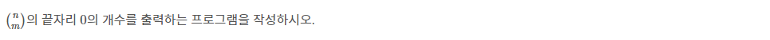

# 2004번 : 조합 0의 개수 [↩](../../acmicpc)

[2004번 : 조합 0의 개수](https://www.acmicpc.net/problem/2004)

## 🖋️문제



### 입력


### 출력


### 예제 입력

```python
in[0]
25 12

out[0]
2

```

---

## 💡풀이

```python

```

### 성공😊

* `math` 패키지 중 `factorial()` 함수 사용후 런타임 에러 해결!

#### 🤝다른 풀이

* 준오


```python

```

* 찬구

```java

```

* 진숙

```java

```

