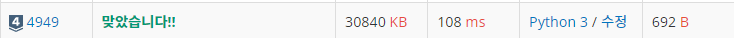

# 4949번 : 균형잡힌 세상 [↩](../../acmicpc)

[4949번 : 균형잡힌 세상](https://www.acmicpc.net/problem/10866)

| 시간 제한 | 메모리 제한 | 제출  | 정답  | 맞힌 사람 | 정답 비율 |
| :-------- | :---------- | :---- | :---- | :-------- | :-------- |
| 1 초      | 128 MB      | 78116 | 25908 | 20385     | 32.343%   |

## 🖋️문제

- 세계는 균형이 잘 잡혀있어야 한다. 양과 음, 빛과 어둠 그리고 왼쪽 괄호와 오른쪽 괄호처럼 말이다.

  정민이의 임무는 어떤 문자열이 주어졌을 때, 괄호들의 균형이 잘 맞춰져 있는지 판단하는 프로그램을 짜는 것이다.

  문자열에 포함되는 괄호는 소괄호("()") 와 대괄호("[]")로 2종류이고, 문자열이 균형을 이루는 조건은 아래와 같다.

  - 모든 왼쪽 소괄호("(")는 오른쪽 소괄호(")")와만 짝을 이뤄야 한다.
  - 모든 왼쪽 대괄호("[")는 오른쪽 대괄호("]")와만 짝을 이뤄야 한다.
  - 모든 오른쪽 괄호들은 자신과 짝을 이룰 수 있는 왼쪽 괄호가 존재한다.
  - 모든 괄호들의 짝은 1:1 매칭만 가능하다. 즉, 괄호 하나가 둘 이상의 괄호와 짝지어지지 않는다.
  - 짝을 이루는 두 괄호가 있을 때, 그 사이에 있는 문자열도 균형이 잡혀야 한다.

  정민이를 도와 문자열이 주어졌을 때 균형잡힌 문자열인지 아닌지를 판단해보자.

### 입력

하나 또는 여러줄에 걸쳐서 문자열이 주어진다. 각 문자열은 영문 알파벳, 공백, 소괄호("( )") 대괄호("[ ]")등으로 이루어져 있으며, 길이는 100글자보다 작거나 같다. 각 줄은 마침표(".")로 끝난다.

입력의 종료조건으로 맨 마지막에 점 하나(".")가 들어온다.

### 출력

각 줄마다 해당 문자열이 균형을 이루고 있으면 "yes"를, 아니면 "no"를 출력한다.

### 예제 입력

```python
in[0]
So when I die (the [first] I will see in (heaven) is a score list).
[ first in ] ( first out ).
Half Moon tonight (At least it is better than no Moon at all].
A rope may form )( a trail in a maze.
Help( I[m being held prisoner in a fortune cookie factory)].
([ (([( [ ] ) ( ) (( ))] )) ]).
 .
.

out[0]
yes
yes
no
no
no
yes
yes

```

---

## 💡풀이

### 1차 시도

```python
import sys

input = sys.stdin.readline

bracket = {'(':')', '[':']'}

while True:
    sentence = input().rstrip()
    if sentence == '.': # while문 종료 조건
        break
    stack = [] # 스택 정의
    flag = True # flag 정의
    for letter in sentence: # 문장에서 문자 하나씩 확인
        if letter in '([': # 여는 괄호일 경우 스택에 집어넣기 
            stack.append(letter)
        elif letter in ')]': # 닫는 괄호일 경우 검사
            if not stack: # 스택이 비어 있다면 괄호쌍 성립하지 않음 -> 종료
                flag = False
                break
            elif stack:
                if bracket[stack[-1]] != letter: # 가장 위의 여는괄호랑 쌍을 이루지 않으면 괄호 쌍 성립하지 않음 -> 종료
                    flag = False
                    break
                elif bracket[stack[-1]] == letter: # 가장 위의 여는괄호와 쌍을 이루면 여는 괄호 삭제
                    stack.pop()
    if stack: # while문을 마치고 스택이 남아있다면 괄호 쌍을 성립하지 않음
        flag = False
    if flag:# 괄호 쌍 성립 여부 출력
        print('yes')
    else:
        print('no')
```

###  성공😊



* 파이썬의 list 자료형으로 스택을 구현하여 풀이

* 다음의 괄호쌍 원칙을 구현
  ```python
  '''
  1. 여는 괄호가 나오면 스택에 추가
  2. 닫는 괄호가 나왔을 경우,
  	2-1. 스택이 비어있으면 올바르지 않은 괄호 쌍
      2-2. 스택의 top이 짝이 맞지 않은 괄호일 경우 올바르지 않은 괄호 쌍
      2-3. 스택의 top이 짝이 맞는 괄호일 경우 pop
  3. 모든 과정을 끝낸 후 스택에 괄호가 남아있으면 올바르지 않은 괄호 쌍, 남아있지 않으면 올바른 괄호 쌍
  '''
  ```

### 다른 풀이🤝

> 수민님 풀이

```python
# 위 코드를 좀 더 짧게 써 본 코드, 시간은 똑같음
import sys
input = sys.stdin.readline

pair = {'(':')', '[':']'}
while True:
    a = input().rstrip()
    if a == '.': # 종료조건
        break
    stack = []
    flag = True
    for x in a:
        if x in '([': # 여는 괄호가 나오면 스택에 추가
            stack.append(x)
        elif x in ')]': # 닫는 괄호가 나왔을 때
            if not stack or pair[stack[-1]] != x: # 스택이 비어있거나, 쌍이 맞지 않으면 올바르지 않은 괄호쌍
                flag = False
                break
            stack.pop()
    if stack: # 스택에 괄호가 남아있으면 올바르지 않은 괄호쌍
        flag = False
    print('yes' if flag else 'no')
```

