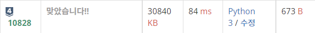
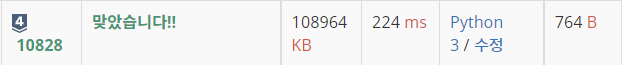

# 10828 : 스택 [↩](../../acmicpc)

[10828번: 스택](https://www.acmicpc.net/problem/10828)

## 🖋️문제

정수를 저장하는 스택을 구현한 다음, 입력으로 주어지는 명령을 처리하는 프로그램을 작성하시오.

명령은 총 다섯 가지이다.

- push X: 정수 X를 스택에 넣는 연산이다.
- pop: 스택에서 가장 위에 있는 정수를 빼고, 그 수를 출력한다. 만약 스택에 들어있는 정수가 없는 경우에는 -1을 출력한다.
- size: 스택에 들어있는 정수의 개수를 출력한다.
- empty: 스택이 비어있으면 1, 아니면 0을 출력한다.
- top: 스택의 가장 위에 있는 정수를 출력한다. 만약 스택에 들어있는 정수가 없는 경우에는 -1을 출력한다.

### 입력

첫째 줄에 주어지는 명령의 수 N (1 ≤ N ≤ 10,000)이 주어진다. 둘째 줄부터 N개의 줄에는 명령이 하나씩 주어진다. 주어지는 정수는 1보다 크거나 같고, 100,000보다 작거나 같다. 문제에 나와있지 않은 명령이 주어지는 경우는 없다.

### 출력

출력해야하는 명령이 주어질 때마다, 한 줄에 하나씩 출력한다.

### 예제 입력

```python
in[0]
14
push 1
push 2
top
size
empty
pop
pop
pop
size
empty
pop
push 3
empty
top

out[0]2
2
0
2
1
-1
0
1
-1
0
3

in[1]
7
pop
top
push 123
top
pop
top
pop

in[2]
-1
-1
123
123
-1
-1
```

---

## 💡풀이

* python의 리스트 자료구조를 이용하여 풀이

    ```python
    import sys
    
    # 스택을 구현하는 문제
    input = sys.stdin.readline
    N = int(input())
    
    stack = []
    for _ in range(N):
        order = input().split()
        command = order[0].rstrip()
        if len(order) == 2:
            X = order[1].rstrip()
        if command == 'push':
           stack.append(X)
        elif command == 'pop':
            if len(stack) == 0:
                print(-1)
            else:
                print(stack.pop())
        elif command == 'size':
            print(len(stack))
        elif command == 'empty':
            if len(stack) == 0:
                print(1)
            else:
                print(0)
        elif command == 'top':
            if len(stack) == 0:
                print(-1)
            else:
                print(stack[-1])
    ```
    
    
    
* stack 자료구조의 기본 기능인 `push()`, `pop()`, `top()`을 함수로 구현하여 풀이

    ```python
    import sys
    
    input = sys.stdin.readline
    
    mx = 10000005
    dat = [0]*mx
    pos = 0
    
    def push(x: int):
        global pos
        dat[pos] = x
        pos += 1
    
    def pop():
        global pos
        pos -= 1
    
    def size():
        return pos
    
    def top():
        return dat[pos - 1]
    
    n = int(input())
    
    for _ in range(n):
        command = input().split()
        if command[0] == 'push':
            push(int(command[1]))
        elif command[0] == 'pop':
            if pos == 0:
                print(-1)
            else:
                print(top())
                pop()
        elif command[0] == 'size':
            print(size())
        elif command[0] == 'empty':
            if pos == 0:
                print(1)
            else:
                print(0)
        else: # top()
            if pos == 0:
                print(-1)
            else:
                print(top())
    ```

    

