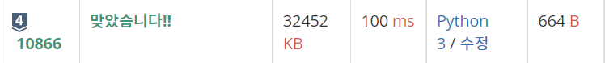
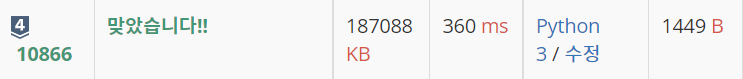

# 10866번 : 덱 [↩](../../acmicpc)

[10866번 : 덱](https://www.acmicpc.net/problem/10866)

## 🖋️문제

정수를 저장하는 덱(Deque)를 구현한 다음, 입력으로 주어지는 명령을 처리하는 프로그램을 작성하시오.

명령은 총 여덟 가지이다.

- push_front X: 정수 X를 덱의 앞에 넣는다.
- push_back X: 정수 X를 덱의 뒤에 넣는다.
- pop_front: 덱의 가장 앞에 있는 수를 빼고, 그 수를 출력한다. 만약, 덱에 들어있는 정수가 없는 경우에는 -1을 출력한다.
- pop_back: 덱의 가장 뒤에 있는 수를 빼고, 그 수를 출력한다. 만약, 덱에 들어있는 정수가 없는 경우에는 -1을 출력한다.
- size: 덱에 들어있는 정수의 개수를 출력한다.
- empty: 덱이 비어있으면 1을, 아니면 0을 출력한다.
- front: 덱의 가장 앞에 있는 정수를 출력한다. 만약 덱에 들어있는 정수가 없는 경우에는 -1을 출력한다.
- back: 덱의 가장 뒤에 있는 정수를 출력한다. 만약 덱에 들어있는 정수가 없는 경우에는 -1을 출력한다.

### 입력

 첫째 줄에 주어지는 명령의 수 N (1 ≤ N ≤ 10,000)이 주어진다. 둘째 줄부터 N개의 줄에는 명령이 하나씩 주어진다. 주어지는 정수는 1보다 크거나 같고, 100,000보다 작거나 같다. 문제에 나와있지 않은 명령이 주어지는 경우는 없다.

### 출력

출력해야하는 명령이 주어질 때마다, 한 줄에 하나씩 출력한다.

### 예제 입력

```python
in[0]
15
push_back 1
push_front 2
front
back
size
empty
pop_front
pop_back
pop_front
size
empty
pop_back
push_front 3
empty
front

out[0]
2
1
2
0
2
1
-1
0
1
-1
0
3

in[1]
22
front
back
pop_front
pop_back
push_front 1
front
pop_back
push_back 2
back
pop_front
push_front 10
push_front 333
front
back
pop_back
pop_back
push_back 20
push_back 1234
front
back
pop_back
pop_back

out[1]
-1
-1
-1
-1
1
1
2
2
333
10
10
333
20
1234
1234
20
```

---

## 💡풀이

### 1차 시도

> `deque()`을 이용한 풀이[👉](re_10866.py)

```python
import sys
from collections import deque

input = sys.stdin.readline

N = int(input())

que = deque()

for _ in range(N):
    order = input().split()
    if order[0] == 'push_front':
        que.appendleft(order[1])
    if order[0] == 'push_back':
        que.append(order[1])
    if order[0] == 'pop_front':
        print(que.popleft() if que else -1)
    if order[0] == 'pop_back':
        print(que.pop() if que else -1)
    if order[0] == 'size':
        print(len(que))
    if order[0] == 'empty':
        print(0 if que else 1)
    if order[0] == 'front':
        print(que[0] if que else -1)
    if order[0] == 'back':
        print(que[-1] if que else -1)
```

###  성공😊



### 2차 시도

> deque을 직접 구현하여 풀이[👉](../../baaarking_dog_algorithm_lecture/0x07_10866.py)

```python
import sys

input = sys.stdin.readline

mx = 10000005
dat = [0]*(2*mx+1)
head, tail = mx, mx

def push_front(x : int):
    global head
    head -= 1
    dat[head] = x

def push_back(x : int):
    global tail
    dat[tail] = x
    tail += 1

def pop_front() -> int:
    global head, tail
    if head == tail:
        return -1
    else:
        head += 1
        return dat[head-1]

def pop_back() -> int:
    global head, tail

    if head == tail:
        return -1
    else:
        tail -= 1
        return dat[tail]

def size() -> int:
    global head, tail

    return tail - head

def empty() -> int:
    global head, tail

    if head == tail:
        return 1
    else:
        return 0
def front() -> int:
    global head, tail

    if head == tail:
        return -1
    else:
        return dat[head]

def back() -> int:
    global head, tail

    if head == tail:
        return -1
    else:
        return dat[tail-1]

for _ in range(int(input())):
    command = input().split()
    if command[0] == 'push_back':
        push_back(command[1])
    elif command[0] == 'push_front':
        push_front(command[1])
    elif command[0] == 'pop_front':
        print(pop_front())
    elif command[0] == 'pop_back':
        print(pop_back())
    elif command[0] == 'size':
        print(size())
    elif command[0] == 'empty':
        print(empty())
    elif command[0] == 'front':
        print(front())
    else: # back
        print(back())
```

### 성공😊


