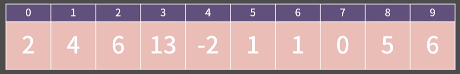
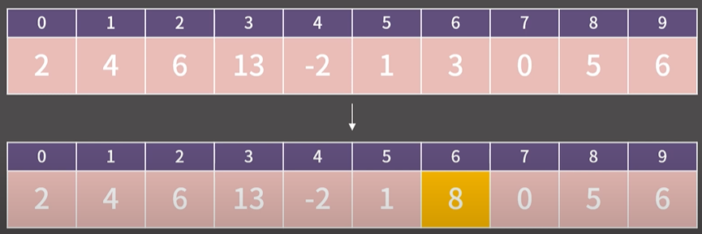
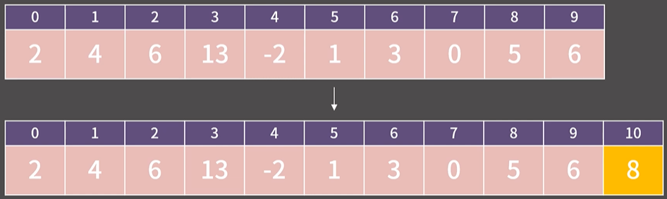
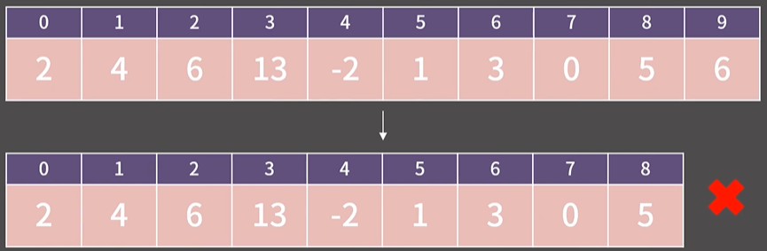
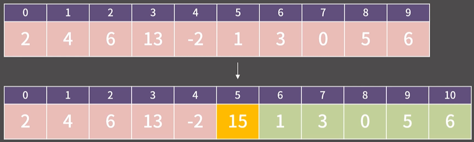

# ✏️0x03강 배열

## 📑Contents

* 0x00 정의와 성질
* 0x01 기능과 구현
* 0x02 STL Vector
* 0x03 연습 문제

## 0x00 정의와 성질



* **배열** : 메모리 상에 원소를 연속하게 배치한 자료구조

### 배열의 성질

1. O(1)에 k번째 원소를 확인/변경 가능
2. 추가적으로 소모되는 메모리의 양(=overhead)가 거의 없음
3. Cache hit rate가 높음
4. 메모리 상에 연속한 구간을 잡아야 해서 할당에 제약이 걸림.

### 임의의 위치에 있는 원소를 확인/변경, O(1)



### 원소를 끝에 추가, O(1)



### 마지막 원소를 제거, O(1)



### 임의의 위치에 있는 원소를 추가, O(N)



### 임의의 위치에 있는 원소를 제거, O(N)


```python
'''
임의의 위치에 있는 원소를 확인/변경, O(1)
원소를 끝에 추가, O(1)
마지막 원소를 제거, O(1)
임의의 위치에 있는 원소를 추가, O(N)
임의의 위치에 있는 원소를 제거, O(N)
'''
```

### 배열의 구현 [⌨️](./0x03_array_test.py)

```python
# 배열 임의의 위치에 있는 원소를 추가
def insert(idx : int, num : int, arr : list):
    arr += [0]
    for i in reversed(range(idx, len(arr))):
        arr[i] = arr[i-1]
    arr[idx] = num
    return arr
# 배열 임의의 위치에 있는 원소를 제거
def erase(idx : int, arr : list):
    for i in range(idx, len(arr)-1):
        arr[i] = arr[i+1]
    arr.pop()
    return arr

arr1 = [10, 20, 30]
print(*insert(3, 40, arr1))
# 10 20 30 40

print(*insert(1, 50, arr1))
# 10 50 20 30 40

print(*insert(0, 15, arr1))
# 15 10 50 20 30 40

arr2 = [10, 50, 40, 30, 70, 20]
print(*erase(4, arr2))
# 10 50 40 30 20

print(*erase(1, arr2))
# 10 40 30 20

print(*erase(3, arr2))
# 10 40 30
```


