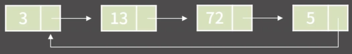
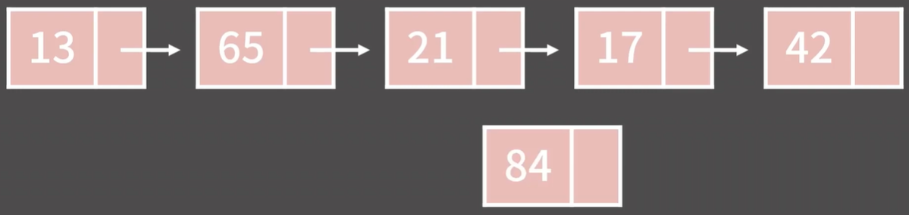
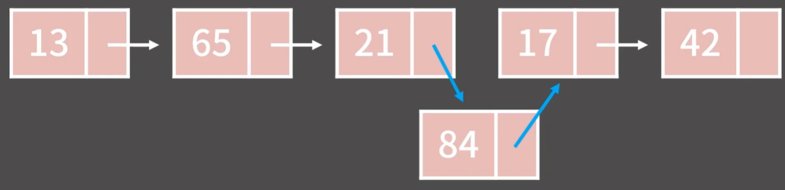
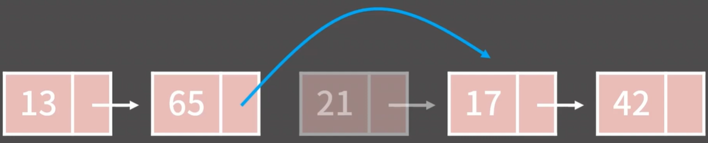
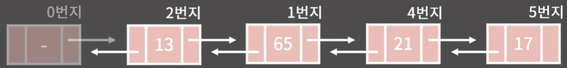
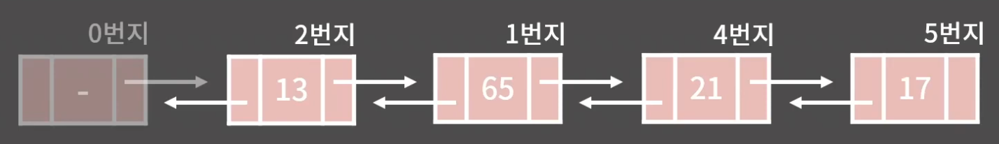
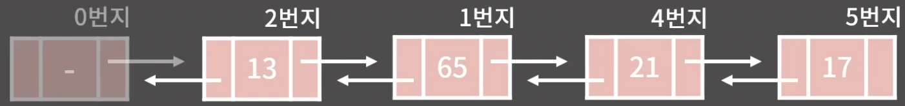

# ✏️0x04강 연결 리스트

> 영상 URL[📹](https://youtu.be/C6MX5u7r72E)

## 📑Contents<a id='contents'></a>

* 0x00 정의와 성질[👉🏻](#0x00)
* 0x01 기능과 구현[👉🏻](#0x01)
* 0x02 STL list
* 0x03 연습문제[👉🏻](#0x03)

## 0x00 정의와 성질[📑](#contents)<a id='0x00'></a>

* 영은, 현지, 재현, 상혁 학생 4명을 기억하고 싶음.

* 배열

  

* 연결 리스트

  

### 연결 리스트의 성질


1. k번째 원소를 확인/변경하기 위해 O(k)가 필요함.
2. 임의의 위치에 원소를 추가/임의 위치의 원소 제거는 O(1)
3. 원소들이 메모리 상에 연속해있지 않아 Cache hit rate가 낮지만 할당이 다소 쉬움

### 연결 리스트의 종류

* 단일 연결 리스트(Singly Linked List)
  
* 이중 연결 리스트(Doubly Linked List)
  

* 원형 연결 리스트(Circular Linked List)
  

### 배열과 연결리스트의 비교

|                                        | 배열                                   | 연결 리스트                                                  |
| -------------------------------------- | -------------------------------------- | ------------------------------------------------------------ |
| k번째 원소의 접근                      | O(1)                                   | O(k)                                                         |
| 임의 위치에 원소 추가/제거             | O(N)                                   | O(1)                                                         |
| 메모리 상의 배치                       | 연속                                   | 불연속                                                       |
| 추가적으로 필요한 공간<br />(Overhead) | -<br />길이 정보를 저장할 int 값 한 개 | O(N)<br />이전과 다음 원소를 기억할 주소값<br /> N에 비례하는 만큼 메모리 사 |

### 임의의 위치에 있는 원소를 확인/변경, O(N)


* 만약 네번째 주소의 원소의 값을 알고 싶다면,
  * 첫번째 원소의 주소값만 알고 있기에 첫번째 원소에 기록된 주소값을 보고 두번째 원소로 
  * 두번째 원소에 기록된 주소값을 보고 세번째 원소로
  * 세번째 원소에 기록된 주소값을 보고 네번째 원소를 확인함.

### 임의의 위치에 원소를 추가, O(1)



* 21과 84에서 다음 원소의 주소만 바꾸면 됨.
  
* 단, 21과 84의 주소값을 알때만 O(1)이고 만약 세번째 원소 뒤에 84라는 원소를 추가해야할 경우엔 O(1)이라고 말할 수 없음

### 임의 위치의 원소를 제거, O(1)


* 65 다음에 올 주소를 17로 바꾸면 됨.
  

```python
'''
임의의 위치에 있는 원소를 확인/변경 = O(N)
임의의 위치에 원소를 추가/임의 위치의 원소 제거 = O(1)
'''
```

## 0x01 기능과 구현[📑](#contents)<a id='0x01'></a>

### 연결 리스트의 구현

* 정석 연결 리스트

    ```c++
    struct NODE {
        struct NODE *prev, *next;
        int data;
    };
    ```

* 간편한 연결 리스트

    ```c++
    const int MX = 1000005;
    int dat[MX], pre[MX], nxt[MX];
    int unused = 1;
    
    fill(pre, pre+MX, -1);
    fill(nxt, nxt+MX, -1);
    ```


* 더미노드의 추가
  

|      |  0   |  1   |  2   |  3   |  4   |  5   | 6<br />unused |  7   |  8   |  9   |
| :--: | :--: | :--: | :--: | :--: | :--: | :--: | :-----------: | :--: | :--: | :--: |
| dat  |  -1  |  65  |  13  |      |  21  |  17  |               |      |      |      |
| pre  |  -1  |  2   |  0   |      |  1   |  4   |               |      |      |      |
| nxt  |  2   |  4   |  1   |      |  5   |      |               |      |      |      |

* `traverse()`

  * nxt가 -1이 나오기 전까지 출력
  * cur은 커서를 말함.

  ```c++
  void traverse(){
    int cur = nxt[0];
    while(cur != -1){
      cout << dat[cur] << ' ';
      cur = nxt[cur];
    }
    cout << "\n\n";
  }
  ```

* `insert()`

  **65 뒤에 30을 추가하고 싶음.** 

  1. 새로운 원소를 생성

     |      |  0   |  1   |  2   |  3   |  4   |  5   | 6<br />unused |  7   |  8   |  9   |
     | :--: | :--: | :--: | :--: | :--: | :--: | :--: | :-----------: | :--: | :--: | :--: |
     | dat  |  -1  |  65  |  13  |      |  21  |  17  |    ⭐**30**    |      |      |      |
     | pre  |  -1  |  2   |  0   |      |  1   |  4   |               |      |      |      |
     | nxt  |  2   |  4   |  1   |      |  5   |      |               |      |      |      |

  2. 새 원소의 pre 값에 삽입할 위치의 주소를 대입

     |      |  0   |  1   |  2   |  3   |  4   |  5   | 6<br />unused |  7   |  8   |  9   |
     | :--: | :--: | :--: | :--: | :--: | :--: | :--: | :-----------: | :--: | :--: | :--: |
     | dat  |  -1  |  65  |  13  |      |  21  |  17  |      30       |      |      |      |
     | pre  |  -1  |  2   |  0   |      |  1   |  4   |    ⭐**1**     |      |      |      |
     | nxt  |  2   |  4   |  1   |      |  5   |      |               |      |      |      |

  3. 새 원소의 nxt값에 삽입할 위치의 nxt 값을 대입

     |      |  0   |  1   |  2   |  3   |  4   |  5   | 6<br />unused |  7   |  8   |  9   |
     | :--: | :--: | :--: | :--: | :--: | :--: | :--: | :-----------: | :--: | :--: | :--: |
     | dat  |  -1  |  65  |  13  |      |  21  |  17  |      30       |      |      |      |
     | pre  |  -1  |  2   |  0   |      |  1   |  4   |       1       |      |      |      |
     | nxt  |  2   |  4   |  1   |      |  5   |      |    ⭐**4**     |      |      |      |

  4. 삽입할 위치의 nxt값과 삽입할 위치의 다음 원소의 pre 값을 새 원소로 변경

     |      |  0   |   1    |  2   |  3   |   4    |  5   | 6<br />unused |  7   |  8   |  9   |
     | :--: | :--: | :----: | :--: | :--: | :----: | :--: | :-----------: | :--: | :--: | :--: |
     | dat  |  -1  |   65   |  13  |      |   21   |  17  |      30       |      |      |      |
     | pre  |  -1  |   2    |  0   |      | ⭐**6** |  4   |       1       |      |      |      |
     | nxt  |  2   | ⭐**6** |  1   |      |   5    |      |       4       |      |      |      |

  5. unused 1 증가

     |      |  0   |  1   |  2   |  3   |  4   |  5   |  6   | 7<br />⭐unused |  8   |  9   |
     | :--: | :--: | :--: | :--: | :--: | :--: | :--: | :--: | :------------: | :--: | :--: |
     | dat  |  -1  |  65  |  13  |      |  21  |  17  |  30  |                |      |      |
     | pre  |  -1  |  2   |  0   |      |  6   |  4   |  1   |                |      |      |
     | nxt  |  2   |  6   |  1   |      |  5   |      |  4   |                |      |      |

  ```c++
  void insert(int addr, int num){
    dat[unused] = num;
    pre[unused] = addr;
    nxt[unused] = nxt[addr];
    if(nxt[addr] != -1) pre[nxt[addr]] = unused;
    nxt[addr] = unused;
    unused++;
  }
  ```

* `erase()`

  **65를 삭제하고 싶음.**

  1. 이전 위치의 nxt를 삭제할 위치의 nxt로 변경

     |      |  0   |  1   |   2    |  3   |  4   |  5   | 6<br />unused |  7   |  8   |  9   |
     | :--: | :--: | :--: | :----: | :--: | :--: | :--: | :-----------: | :--: | :--: | :--: |
     | dat  |  -1  |  65  |   13   |      |  21  |  17  |               |      |      |      |
     | pre  |  -1  |  2   |   0    |      |  1   |  4   |               |      |      |      |
     | nxt  |  2   |  4   | ⭐**4** |      |  5   |      |               |      |      |      |

  2. 다음 위치의 pre를 삭제할 위치의 pre로 변경
     지우거나 -1로 대체하지 않음

     |      |  0   |  1   | 2<br />삭제 |  3   |   4    |  5   | 6<br />unused |  7   |  8   |  9   |
     | :--: | :--: | :--: | :---------: | :--: | :----: | :--: | :-----------: | :--: | :--: | :--: |
     | dat  |  -1  |  65  |     13      |      |   21   |  17  |               |      |      |      |
     | pre  |  -1  |  2   |      0      |      | ⭐**2** |  4   |               |      |      |      |
     | nxt  |  2   |  4   |      4      |      |   5    |      |               |      |      |      |

  ```c++
  void erase(int addr){
    nxt[pre[addr]] = nxt[addr];
    if(nxt[addr] != -1) pre[nxt[addr]] = pre[addr];
  }
  ```

* 더미노드의 존재로 인해 그 어떤 원소를 지우더라도 pre[addr]은 -1이 아님을 보장하지만 nxt[addr]은 마지막 원소를 지우는 상황에서 값이 -1일 수 있음.

### python으로 연결 리스트 구현하기[✏️](./0x04_linked_list.py)

* 정식 연결 리스트 - 단일

  ```python
  class Node:
      def __init__(self, item):
          self.data = item
          self.next = None
  class LinkedList:
      def __init__(self): # 비어 있는 연결 리스트
          self.nodeCount = 0
          self.head = None
          self.tail = None
      # 리스트 출력
      def __repr__(self):
          if self.nodeCount == 0:
              return 'LinkedList: empty'
          s = ''
          curr = self.head
          while curr is not None:
              s += repr(curr.data)
              if curr.next is not None:
                  s += ' -> '
              curr = curr.next
          return s
      
      # 길이 리턴
      def getLength(self):
          return self.nodeCount
      
      # 리스트 순회
      def traverse(self):
          traversal = []
          curr = self.head
          while curr != None: # tail에 도달하면 종료
              traversal.append(curr.data)
              curr = curr.next
          
          return traversal
      
      # 특정 원소 참조
      def getAt(self, pos):
          if pos <= 0 or pos > self.nodeCount:
              return None
          i = 1
          curr = self.head
          while i < pos:
              curr = curr.next
              i += 1
          return curr
      # 원소의 삽입
      def insertAt(self, pos, newNode):
          # 1 <= pos <= nodeCount+1, pos가 가리키는 위치에 newNode를 삽입하고, 성공/실패에 따라 True/False를 리턴
          if pos < 1 or pos > self.nodeCount + 1:
              return False
          
          if pos == 1: # 삽입하려는 위치가 맨 앞일 때
              newNode.next = self.head
              self.head = newNode
          else:
              if pos == self.nodeCount + 1: # 맨 끝에 삽입하려는 경우 앞에서부터 순차적으로 찾아갈 필요가 없음
                  prev = self.tail
              else:
                  prev = self.getAt(pos-1) # newNode가 삽입될 위치
              newNode.next = prev.next
              prev.next = newNode
          
          if pos == self.nodeCount + 1: # 삽입하려는 위치가 맨 뒤일 때, tail 갱신
              self.tail = newNode
              
          self.nodeCount += 1
          return True
      
      # 원소의 삭제
      def popAt(self, pos):
          # 1 <= pos <= nodeCount, pos가 가리키는 위치의 node를 삭제하고, 그 node의 데이터를 리턴
          if pos < 1 or pos > self.nodeCount:
              raise IndexError
          
          if pos == 1: # 삭제하려는 node가 맨 앞일 때
              curr = self.head
              self.head = curr.next
              if self.nodeCount == 1: # 유일한 노드인 경우
                  self.tail = None
          else:
              prev = self.getAt(pos-1)
              curr = prev.next
              prev.next = curr.next
              if pos == self.nodeCount: # 삭제하려는 node가 맨 끝일 때
                  self.tail = prev
                  
          self.nodeCount -= 1
          return curr.data
              
      
      # 두 리스트의 연결(합치기)
      def concat(self, L):
          self.tail.next = L.head
          if L.tail:
              self.tail = L.tail
          self.nodeCount += L.nodeCount
  ```

* 정식 연결 리스트 - 양방향

  ```python
  class Node:
      def __init__(self, item):
          self.data = item
          self.prev = None
          self.next = None
  class DoublyLinkedList:
      def __init__(self):
          self.nodeCount = 0
          self.head = Node(None)
          self.tail = Node(None)
          self.head.prev = None
          self.head.next = self.tail
          self.tail.prev = self.head
          self.tail.next = None
      
      # 리스트 출력
      def __repr__(self):
          if self.nodeCount == 0:
              return 'LinkedList: empty'
          s = ''
          curr = self.head
          while curr.next.next:
              curr = curr.next
              s += repr(curr.data)
              if curr.next.next is not None:
                  s += ' -> '
          return s
      
      # 길이 리턴
      def getLength(self):
          return self.nodeCount
      
      # 리스트 순회
      def traverse(self):
          result = []
          curr = self.head
          while curr.next.next:
              curr = curr.next
              result.append(curr.data)
          return result
      
      # 리스트 역순회
      def reverse(self):
          result = []
          curr = self.tail
          while curr.prev.prev:
              curr = curr.prev
              result.append(curr.data)
          return result
      
      # 특정 원소 참조
      def getAt(self, pos): # getAt(0) -> head
          if pos < 0 or pos > self.nodeCount:
              return None
          
          if pos > self.nodeCount // 2:
              i = 0
              curr = self.head
              while i < self.nodeCount - pos + 1:
                  curr = curr.next
                  i += 1
          else:
              i = 0
              curr = self.head
              while i < pos:
                  curr = curr.next
                  i += 1
          return curr
      
      # 원소의 삽입
      def insertAfter(self, prev, newNode): # prev가 가리키는 node의 다음에 newNode를 삽입하고 성공/실패에 따라 True/False를 리턴
          next = prev.next
          newNode.prev = prev
          newNode.next = next
          prev.next = newNode
          next.prev = newNode
          self.nodeCount += 1
          return True
      
      def insertBefore(self, next, newNode):
          prev = next.prev
          newNode.prev = prev
          newNode.next = next
          prev.next = newNode
          next.prev = newNode
          self.nodeCount += 1
          return True
      
      def insertAt(self, pos, newNode):
          if pos < 1 or pos > self.nodeCount + 1:
              return False
          prev = self.getAt(pos-1) # newNode가 삽입될 위치
          return self.insertAfter(prev, newNode)
      
      # 원소의 삭제
      def popAfter(self, prev): # prev의 다음 node를 삭제하고, 그 node의 data를 리턴
          curr = prev.next
          next = curr.next
          prev.next = next
          next.prev = prev
          self.nodeCount -= 1
          return curr.data
      
      def popBefore(self, next): # next의 이전에 있던 node를 삭제하고, 그 node의 data를 리턴
          curr = next.prev
          prev = curr.prev
          prev.next = next
          next.prev = prev
          self.nodeCount -= 1
          return curr.data
      
      def popAt(self, pos): # pos에 의해 지정되는 node를 삭제하고, 그 node의 data를 리턴
          if pos < 1 or pos > self.nodeCount:
              raise IndexError
          prev = self.getAt(pos-1)
          return self.popAfter(prev)
          
      def concat(self, L):
          self.nodeCount += L.nodeCount
          self.tail.prev.next = L.head.next
          L.head.next.prev = self.tail.prev
          self.tail = L.tail
  a = Node(67)
  b = Node(34)
  c = Node(28)
  L = DoublyLinkedList()
  L.insertAt(1, a)
  L.insertAt(2, b)
  L
  L.insertAt(1, c)
  L
  L.popAt(3)
  L
  ```

* 간편한 연결리스트 구현

  ```python
  MX = 1000005
  dat = [-1] * MX # [-1, -1, -1, ..., -1]
  pre = [-1] * MX # [-1, -1, -1, ..., -1]
  nxt = [-1] * MX # [-1, -1, -1, ..., -1]
  
  unused = 1
  
  def insert(addr : int, num: int):
      global unused
      dat[unused] = num
      pre[unused] = addr
      nxt[unused] = nxt[addr]
      if nxt[addr] != -1:
          pre[nxt[addr]] = unused
      nxt[addr] = unused
      unused += 1
  
  def traverse():
      cur = nxt[0]
      while cur != -1:
          print(dat[cur], end=' ')
          cur = nxt[cur]
      print()
  
  def erase(addr : int):
      nxt[pre[addr]] = nxt[addr]
      if nxt[addr] != -1:
          pre[nxt[addr]] = pre[addr]
  
  
  def insert_test():
      print('******* insert_test *******')
      insert(0, 10) # 10(address=1) <- 시작노드
      traverse()
      insert(0, 30) # 30(address=2) 10
      traverse()
      insert(2, 40) # 30 40(address=3) 10
      traverse()
      insert(1, 20) # 30 40 10 20(address=4)
      traverse()
      insert(4, 70) # 30 40 10 20 70(address=5)
      traverse()
  
  def erase_test():
      print('******* erase_test *******')
      erase(1) # 30 40 20 70
      traverse()
      erase(2) # 40 20 70
      traverse()
      erase(4) # 40 70
      traverse()
      erase(5) # 40
      traverse()
  
  insert_test()
  erase_test()
  ```

## 0x02 STL list


## 0x03 연습문제[📑](#contents)<a id='0x03'></a>

### 백준 1406번 : 에디터 [문제⌨️](https://www.acmicpc.net/problem/1406)

> 풀이[✏️](../acmicpc/1406/1406.md)

### 간편한 연결 리스트를 이용한 풀이

> 바킹독님 방식

```python
import sys

input = sys.stdin.readline

s = input().rstrip()
n = int(input())

# 간편한 연결리스트 구현
mx =1000005
dat = [-1]*mx
pre = [-1]*mx
nxt = [-1]*mx

unused = 1

# 연결 리스트에 원소 삽입
def insert(addr:int, num:int):
    global unused
    dat[unused] = num
    pre[unused] = addr
    nxt[unused] = nxt[addr]
    if nxt[addr] != -1:
        pre[nxt[addr]] = unused
    nxt[addr] = unused
    unused += 1

# 연결 리스트에 특정 주소 원소 제거
def erase(addr:int):
    nxt[pre[addr]] = nxt[addr]
    if nxt[addr] != -1:
        pre[nxt[addr]] = pre[addr]

# 리스트 순회 출력
def traverse():
    cur = nxt[0]
    while cur != -1:
        print(dat[cur], end='')
        cur = nxt[cur]

cursor = 0 # 커서 규정

# 입력받은 문자열 S 원소 연결리스트에 추가
for i in s:
    insert(cursor, i)
    cursor +=1

for _ in range(n):
    command = input().split()
    if command[0] == 'L': # 
        if pre[cursor] != -1:
            cursor = pre[cursor]
    elif command[0] == 'D':
        if nxt[cursor] != -1:
            cursor = nxt[cursor]
    elif command[0] == 'B':
        if pre[cursor] != -1:
            erase(cursor)
            cursor = pre[cursor]
    else:
        insert(cursor, command[1])
        cursor = nxt[cursor]
traverse()
```

### 정식 연결 리스트를 이용한 풀이

> 수민님 풀이 참고

```python
import sys

class Node:
    def __init__(self, item):
        self.data = item
        self.prev = None
        self.next = None


class DoublyLinkedList:
    def __init__(self):
        self.nodeCount = 0
        self.head = Node(None)
        self.tail = Node(None)
        self.head.prev = None
        self.head.next = self.tail
        self.tail.prev = self.head
        self.tail.next = None
        self.cursor = self.tail

    # 리스트 순회
    def traverse(self):
        result = []
        curr = self.head
        while curr.next.next:
            curr = curr.next
            result.append(curr.data)
        return result

    # 특정 원소 참조
    def getAt(self, pos):  # getAt(0) -> head
        if pos < 0 or pos > self.nodeCount:
            return None

        if pos > self.nodeCount // 2:
            i = 0
            curr = self.tail
            while i < self.nodeCount - pos + 1:
                curr = curr.prev
                i += 1
        else:
            i = 0
            curr = self.head
            while i < pos:
                curr = curr.next
                i += 1
        return curr

    # 원소의 삽입
    def insertAfter(self, prev, newNode):  # prev가 가리키는 node의 다음에 newNode를 삽입하고 성공/실패에 따라 True/False를 리턴
        next = prev.next
        newNode.prev = prev
        newNode.next = next
        prev.next = newNode
        next.prev = newNode
        self.nodeCount += 1
        return True

    def insertBefore(self, next, newNode):
        prev = next.prev
        newNode.prev = prev
        newNode.next = next
        prev.next = newNode
        next.prev = newNode
        self.nodeCount += 1
        return True

    def insertAt(self, pos, newNode):
        if pos < 1 or pos > self.nodeCount + 1:
            return False
        prev = self.getAt(pos - 1)  # newNode가 삽입될 위치
        return self.insertAfter(prev, newNode)

    def popBefore(self, next):  # next의 이전에 있던 node를 삭제하고, 그 node의 data를 리턴
        curr = next.prev
        prev = curr.prev
        prev.next = next
        next.prev = prev
        self.nodeCount -= 1
        return curr.data

input = sys.stdin.readline

s = input().rstrip()
n = int(input())
linked_list = DoublyLinkedList()

for i in range(len(s)):
    linked_list.insertAt(i+1, Node(s[i]))

for _ in range(n):
    command = input().split()
    if command[0] == 'L':
        if linked_list.cursor.prev.prev:
            linked_list.cursor = linked_list.cursor.prev
    elif command[0] == 'D':
        if linked_list.cursor.next:
            linked_list.cursor = linked_list.cursor.next
    elif command[0] == 'B':
        if linked_list.cursor.prev.prev:
            linked_list.popBefore(linked_list.cursor)
    else:
        node = Node(command[1])
        linked_list.insertBefore(linked_list.cursor, node)

print(''.join(linked_list.traverse()))
```

### 스택을 이용한 풀이

```python
import sys

input = sys.stdin.readline

L_stack = list(map(str, input().rstrip()))

M = int(input())

R_stack = []
# 커서의 위치는 명령어가 수행되기 전에는 맨 뒤에 위치하고 있음.
for _ in range(M):
    command = input().split()
    if command[0] == 'L' and L_stack :
        R_stack.append(L_stack.pop())

    if command[0] == 'D' and R_stack:
        L_stack.append(R_stack.pop())

    if command[0] == 'B'and L_stack:
        L_stack.pop()

    if command[0] == 'P':
        L_stack.append(command[1])

R_stack.reverse()
print(''.join(L_stack+R_stack))
```

### 결과

|                         | 메모리   | 시간   | 코드 길이 |
| ----------------------- | -------- | ------ | --------- |
| 간편한 연결 리스트 활용 | 75788KB  | 920ms  | 1078B     |
| 정식 연결 리스트 활용   | 131808KB | 1688ms | 2940B     |
| 스택 활용               | 40676KB  | 384ms  | 580B      |

 
