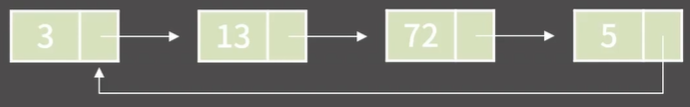
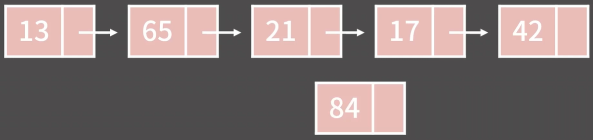
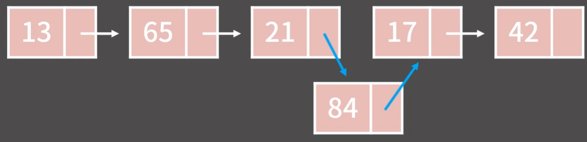
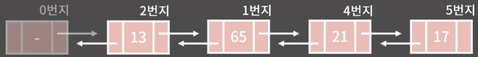

# ✏️0x04강 연결 리스트

> 영상 URL[📹](https://youtu.be/C6MX5u7r72E)

## 📑Contents

* 0x00 정의와 성질
* 0x01 기능과 구현
* 0x02 STL list
* 0x03 연습문제

## 0x00 정의와 성질

* 영은, 현지, 재현, 상혁 학생 4명을 기억하고 싶음.

* 배열

  

* 연결 리스트

  

### 연결 리스트의 성질


1. k번째 원소를 확인/변경하기 위해 O(k)가 필요함.
2. 임의의 위치에 원소를 추가/임의 위치의 원소 제거는 O(1)
3. 원소들이 메모리 상에 연속해있지 않아 Cache hit rate가 낮지만 할당이 다소 쉬움

### 연결 리스트의 종류

* 단일 연결 리스트(Singly Linked List)
  
* 이중 연결 리스트(Doubly Linked List)
  

* 원형 연결 리스트(Circular Linked List)
  

### 배열과 연결리스트의 비교

|                                        | 배열                                   | 연결 리스트                                                  |
| -------------------------------------- | -------------------------------------- | ------------------------------------------------------------ |
| k번째 원소의 접근                      | O(1)                                   | O(k)                                                         |
| 임의 위치에 원소 추가/제거             | O(N)                                   | O(1)                                                         |
| 메모리 상의 배치                       | 연속                                   | 불연속                                                       |
| 추가적으로 필요한 공간<br />(Overhead) | -<br />길이 정보를 저장할 int 값 한 개 | O(N)<br />이전과 다음 원소를 기억할 주소값<br /> N에 비례하는 만큼 메모리 사 |

### 임의의 위치에 있는 원소를 확인/변경, O(N)


* 만약 네번째 주소의 원소의 값을 알고 싶다면,
  * 첫번째 원소의 주소값만 알고 있기에 첫번째 원소에 기록된 주소값을 보고 두번째 원소로 
  * 두번째 원소에 기록된 주소값을 보고 세번째 원소로
  * 세번째 원소에 기록된 주소값을 보고 네번째 원소를 확인함.

### 임의의 위치에 원소를 추가, O(1)



* 21과 84에서 다음 원소의 주소만 바꾸면 됨.
  
* 단, 21과 84의 주소값을 알때만 O(1)이고 만약 세번째 원소 뒤에 84라는 원소를 추가해야할 경우엔 O(1)이라고 말할 수 없음

### 임의 위치의 원소를 제거, O(1)


* 65 다음에 올 주소를 17로 바꾸면 됨.
  

```python
'''
임의의 위치에 있는 원소를 확인/변경 = O(N)
임의의 위치에 원소를 추가/임의 위치의 원소 제거 = O(1)
'''
```

### 연결 리스트의 구현

* 정석 연결 리스트

```c++
struct NODE {
    struct NODE *prev, *next;
    int data;
};
```

* 간편한 연결 리스트

```c++
const int MX = 1000005;
int dat[MX], pre[MX], nxt[MX];
int unused = 1;

fill(pre, pre+MX, -1);
fill(nxt, nxt+MX, -1);
```


* 더미노드의 추가
  

|      |  0   |  1   |  2   |  3   |  4   |  5   | 6<br />unused |  7   |  8   |  9   |
| :--: | :--: | :--: | :--: | :--: | :--: | :--: | :-----------: | :--: | :--: | :--: |
| dat  |  -1  |  65  |  13  |      |  21  |  17  |               |      |      |      |
| pre  |  -1  |  2   |  0   |      |  1   |  4   |               |      |      |      |
| nxt  |  2   |  4   |  1   |      |  5   |      |               |      |      |      |

