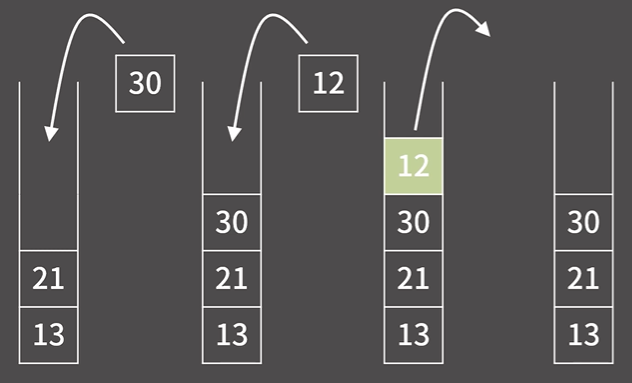
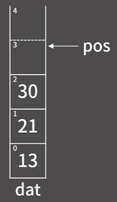
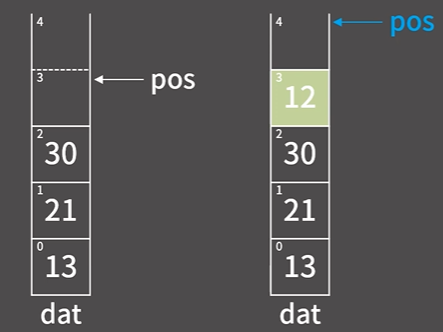
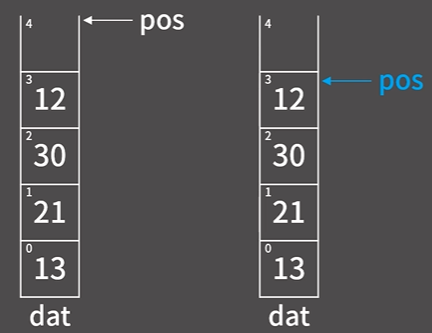
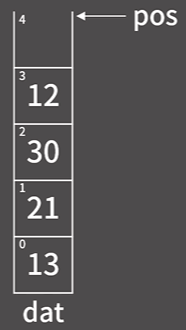

# ✏️0x05강 스

> 영상 URL[📹](https://youtu.be/0DsyCXIN7Wg)

## 📑Contents<a id='contents'></a>

* 0x00 정의와 성질[👉🏻](#0x00)
* 0x01 기능과 구현[👉🏻](#0x01)
* 0x02 STL Stack
* 0x03 연습문제[👉🏻](#0x03)

## 0x00 정의와 성질[📑](#contents)<a id='0x00'></a>



* **FILO(First In Last Out)** : 먼저 들어간 원소가 나중에 나오게 됨
* queue, deque, stack -> **restricted structure**

### 스택의 성질

1. 원소의 추가 `O(1)`
2. 원소의 제거 `O(1)`
3. 제일 상단의 원소 확인 `O(1)`
4. 제일 상단이 아닌 나머지 원소들의 확인/변경이 원칙적으로 **불가능**

## 0x01 기능과 구현[📑](#contents)<a id='0x01'></a>

### 구현



```c++
const int MX = 1000005;
int dat[MX];
int pos = 0;
```

### push 함수



```c++
void push(int x) {
    dat[pos+1] = x;
}
```

### pop 함수



```c++
void pop(){
    pos--;
}
```

### top함수



```c++
void top(){
    return dat[pos-1];
}
```

### python으로 스택 구현하기[✏️](0x05_stack_test.py)


## 0x02 STL Stack


## 0x03 연습문제[📑](#contents)<a id='0x03'></a>

