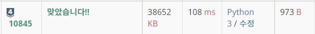

# ✏️0x06강 큐

> 영상 URL[📹](https://youtu.be/D_fwSy5tRAY)

## 📑Contents<a id='contents'></a>

* 0x00 정의와 성질[👉🏻](#0x00)
* 0x01 기능과 구현[👉🏻](#0x01)
* 0x02 STL Queue
* 0x03 연습문제[👉🏻](#0x03)

## 0x00 정의와 성질[📑](#contents)<a id='0x00'></a>


* 먼저 들어간 원소가 먼저 나오는 자료 구조 FIFO(First In First Out)

### 큐의 성질

1. 원소의 추가가 `O(1)`
2. 원소의 제거가 `O(1)`
3. 제일 앞/뒤의 원소 확인이 `O(1)`
4. 제일 앞/뒤가 아닌 나머지 원소들의 확인/변경이 원칙적으로 **불가능**

* 인덱스로 접근하는 기능이 없음.

## 0x01 기능과 구현[📑](#contents)<a id='0x01'></a>

### 구현


```c++
const int MX = 1000005;
int dat[MX];
int head = 0, tail = 0;
```


* 큐는 점점 밀리는 구조로 구현
* 큐를 배열로 구현할 경우 앞에 계속해서 쓸모없는 공간이 생기게 됨. 이를 해결하기 위해 큐에 원소가 들어갈 배열을 원형으로 만들면 됨. -> `원형 큐`

### push 함수


* 22를 추가할 경우 tail에 22를 집어넣고 tail을 1 증가시킴


```c++
void push(int x) {
    dat[tail + 1] = x;
}
```

### pop 함수


* pop을 진행할 경우 head를 진행하면 됨.

```c++
void pop(){
    head++;
}
```

### front/back 함수


* front 함수는 큐에 가장 먼저 있는 수 back 함수는 큐의 가장 마지막에 있는 수를 반환하면 됨.

```c++
int front(){
    return dat[head];
}

int back(){
    return dat[tail-1];
}
```

### python으로 큐 구현하기[✏️](0x06_queue_test.py)

* 구현

  ```python
  mx = 1000005
  dat = [0]*mx
  head, tail = 0, 0
  ```

* `push()`

  ```py
  def push(x : int):
      global tail
      dat[tail] = x
      tail += 1

* `pop()`

  ```py
  def pop():
      global head
      head += 1
  ```

* `front()`/`back()`

  ```python
  def front() -> int:
      return dat[head]
  
  def back() -> int:
      return dat[tail-1]
  ```

## 0x02 STL queue


## 0x03 연습문제[📑](#contents)<a id='0x03'></a>

### 백준 10845번 : 큐 [문제⌨️](https://www.acmicpc.net/problem/10845)

> 풀이[✏️](../acmicpc/10845/10845.md)

```python
import sys

mx = 1000005
dat = [0] * mx
head, tail = 0, 0

def push(x : int):
    global tail
    dat[tail] = x
    tail += 1

def pop() -> int:
    global head
    if tail != head:
        head += 1
        return dat[head - 1]
    else:
        return -1

def size() -> int:
    return tail - head

def empty() -> int:
    if tail != head:
        return 0
    else:
        return 1

def front() -> int:
    if tail != head:
        return dat[head]
    else:
        return -1

def back() -> int:
    if tail != head:
        return dat[tail - 1]
    else:
        return -1

input = sys.stdin.readline

for _ in range(int(input())):
    command = input().split()
    if command[0] == 'push':
        push(int(command[1]))
    elif command[0] == 'pop':
        print(pop())
    elif command[0] == 'size':
        print(size())
    elif command[0] == 'empty':
        print(empty())
    elif command[0] == 'front':
        print(front())
    else:
        print(back())
```

###  성공😊



* 큐와 그에 따른 기능을 구현하여 풀이

