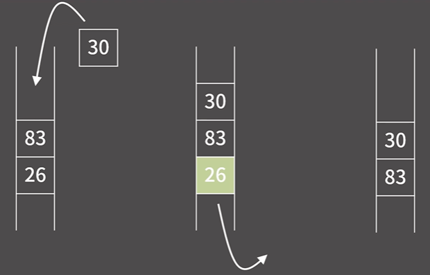

# ✏️0x05강 스택

> 영상 URL[📹](https://youtu.be/0DsyCXIN7Wg)

## 📑Contents<a id='contents'></a>

* 0x00 정의와 성질[👉🏻](#0x00)
* 0x01 기능과 구현[👉🏻](#0x01)
* 0x02 STL Queue
* 0x03 연습문제[👉🏻](#0x03)

## 0x00 정의와 성질[📑](#contents)<a id='0x00'></a>



* 먼저 들어간 원소가 먼저 나오는 자료 구조 FIFO(First In First Out)

### 큐의 성질

1. 원소의 추가가 `O(1)`
2. 원소의 제거가 `O(1)`
3. 제일 앞/뒤의 원소 확인이 `O(1)`
4. 제일 앞/뒤가 아닌 나머지 원소들의 확인/변경이 원칙적으로 **불가능**

* 인덱스로 접근하는 기능이 없음.

## 0x01 기능과 구현[📑](#contents)<a id='0x01'></a>

### 구현


```c++
const int MX = 1000005;
int dat[MX];
int head = 0, tail = 0;
```


* 큐는 점점 밀리는 구조로 구현
* 큐를 배열로 구현할 경우 앞에 계속해서 쓸모없는 공간이 생기게 됨. 이를 해결하기 위해 큐에 원소가 들어갈 배열을 원형으로 만들면 됨. -> `원형 큐`