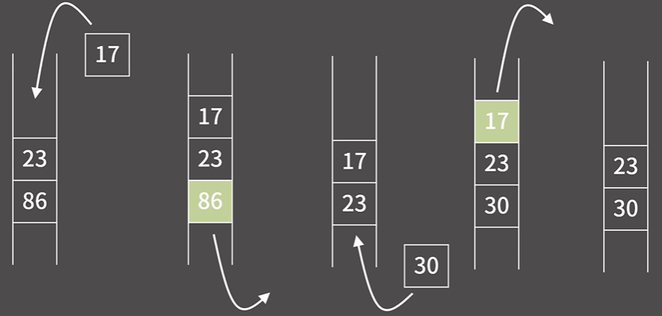
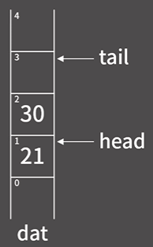
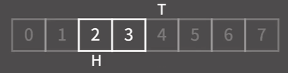
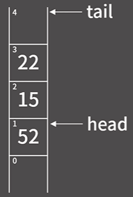
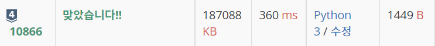

# ✏️0x07강 덱

> 영상 URL[📹](https://youtu.be/0mEzJ4S1d8o)

## 📑Contents<a id='contents'></a>

* 0x00 정의와 성질[👉🏻](#0x00)
* 0x01 기능과 구현[👉🏻](#0x01)
* 0x02 STL Deque
* 0x03 연습문제[👉🏻](#0x03)

## 0x00 정의와 성질[📑](#contents)<a id='0x00'></a>



* 덱은 양쪽 끝에서 자료의 **삽입**과 **삭제**가 가능

### 덱의 성질

1. 원소의 추가가 `O(1)`
2. 원소의 제거가 `O(1)`
3. 제일 앞/뒤의 원소 확인이 `O(1)`
4. 제일 앞/뒤가 아닌 나머지 원소들의 확인/변경이 원칙적으로 **불가능**

## 0x00 정의와 성질[📑](#contents)<a id='0x00'></a>

### 구현



```c++
const int MX = 10000005;
int dat[2*MX+1];
int head = MX, tail = MX;
```


* 큐에서는 점점 오른쪽으로 이동하는 모양이었지만 덱은 양쪽 삽입이 가능하기에 여의봉처럼 양쪽에서 확장되어야 함.
* 시작 지점을 배열의 중간으로 두어야 함.
  

* head와 tail이 어디를 가르키고 있는지 잘 살펴보아야 함.

  

### push_front 함수

```c++
void push_front(int x){
    dat[--head] = x;
}
```

### push_back 함수

```c++
void push_back(int x){
    dat[tail++] = x;
}
```

### pop_front 함수

```c++
void pop_front() {
    head++;
}
```

### pop_back 함수

```c++
void pop_back() {
    tail--;
}
```

### front 함수

```c++
int front() {
    return dat[head];
}
```

### back 함수

```c++
int back(){
    return dat[tail-1];
}
```

### python으로 덱 구현하기[✏️](0x07_deque_test.py)

* 구현 : 큐와 달리 `head`, `tail`이 중앙에서 시작함

  ```python
  mx = 1000005
  dat = [0] * (2*mx+1) # 기존 mx값보다 2배 긴 배열 정의
  head, tail = mx, mx
  ```

* `push_front()`, `push_back()`

  ```python
  def push_front(x : int):
      global head
      head -= 1
      dat[head] = x
  
  def push_back(x : int):
      global tail
      dat[tail] = x
      tail +=1
  ```

* `pop_front()`, `pop_back()`

  ```python
  def pop_front():
      head += 1
  
  def pop_back():
      tail -= 1
  ```

* `front()`, `back()`

  ```python
  def front():
      return dat[head]
  
  def back():
      return dat[tail-1]
  ```

## 0x02 STL Deque


## 0x03 연습문제

### 백준 10845번 : 큐 [문제⌨️](https://www.acmicpc.net/problem/10866)

> 풀이[✏️](../acmicpc/re_10866/re_10866.md)

```python
import sys

input = sys.stdin.readline

mx = 10000005
dat = [0]*(2*mx+1)
head, tail = mx, mx

def push_front(x : int):
    global head
    head -= 1
    dat[head] = x

def push_back(x : int):
    global tail
    dat[tail] = x
    tail += 1

def pop_front() -> int:
    global head, tail
    if head == tail:
        return -1
    else:
        head += 1
        return dat[head-1]

def pop_back() -> int:
    global head, tail

    if head == tail:
        return -1
    else:
        tail -= 1
        return dat[tail]

def size() -> int:
    global head, tail

    return tail - head

def empty() -> int:
    global head, tail

    if head == tail:
        return 1
    else:
        return 0
def front() -> int:
    global head, tail

    if head == tail:
        return -1
    else:
        return dat[head]

def back() -> int:
    global head, tail

    if head == tail:
        return -1
    else:
        return dat[tail-1]

for _ in range(int(input())):
    command = input().split()
    if command[0] == 'push_back':
        push_back(command[1])
    elif command[0] == 'push_front':
        push_front(command[1])
    elif command[0] == 'pop_front':
        print(pop_front())
    elif command[0] == 'pop_back':
        print(pop_back())
    elif command[0] == 'size':
        print(size())
    elif command[0] == 'empty':
        print(empty())
    elif command[0] == 'front':
        print(front())
    else: # back
        print(back())
```

### 결과



* 바킹독님 방식으로 python코드로 구현하여 풀이