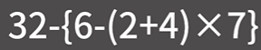
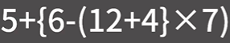
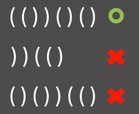
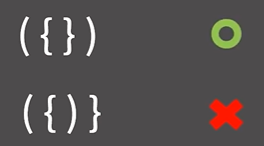

# ✏️0x08강 스택의 활용

> 영상 URL[📹](https://youtu.be/cdjjk-ryPKc)

## 📑Contents<a id='contents'></a>

* 0x00 수식의 괄호 쌍이란?[👉🏻](#0x00)
* 0x01 문제 해결을 위한 관찰[👉🏻](#0x01)
* 0x02 문제 해결 방법[👉🏻](#0x02)
* 0x03 연습문제[👉🏻](#0x03)

## 0x00 정의와 성질[📑](#contents)<a id='0x00'></a>



* **수식의 괄호 쌍**은 수식의 괄호 쌍을 이야기 함. -> 위의 수식은 정상적임. `{()}`



* 정상적이지 않음. `{(})`

## 0x01 문제 해결을 위한 관찰[📑](#contents)<a id='0x01'></a>



* 첫번째 것만 올바름. -> 제일 보편적인 방법은 제일 안쪽에 있는 것부터 사라짐.



* 괄호의 종류가 두 개 이상일때는 단순히 여는 괄호랑 닫는 괄호의 갯수를 세는 것 만으로는 맞지 않음.
* 하지만 붙어있는 소괄호 혹은 중괄호는 지우는 방법은 여전히 잘 동작함.
* 이것을 `배열`로 구현하게 되면 최대 n번 중간에 있는 원소의 삭제가 발생하기 때문에 `O(N<sup>2</sup>)`
* 연결 리스트로 구현하게 될 경우 `O(N)`
* 스택을 이용하면 훨씬더 간단하게 가능함.

```python
'''
문자열을 앞에서부터 읽어나갈때, 닫는 괄호는 남아있는 괄호 중에서 가장 최근에 들어온 여는 괄호와 짝을 지어 없애버리는 명령이라고 생각해도 된다.
'''
```

https://youtu.be/cdjjk-ryPKc?t=250

## 0x02 문제 해결 방법[📑](#contents)<a id='0x02'></a>


## 0x03 연습문제[📑](#contents)<a id='0x03'></a>


