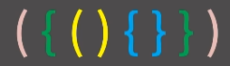
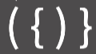
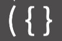

# ✏️0x08강 스택의 활용

> 영상 URL[📹](https://youtu.be/cdjjk-ryPKc)

## 📑Contents<a id='contents'></a>

* 0x00 수식의 괄호 쌍이란?[👉🏻](#0x00)
* 0x01 문제 해결을 위한 관찰[👉🏻](#0x01)
* 0x02 문제 해결 방법[👉🏻](#0x02)
* 0x03 연습문제[👉🏻](#0x03)

## 0x00 정의와 성질[📑](#contents)<a id='0x00'></a>


* **수식의 괄호 쌍**은 수식의 괄호 쌍을 이야기 함. -> 위의 수식은 정상적임. `{()}`


* 정상적이지 않음. `{(})`

## 0x01 문제 해결을 위한 관찰[📑](#contents)<a id='0x01'></a>


* 첫번째 것만 올바름. -> 제일 보편적인 방법은 제일 안쪽에 있는 것부터 사라짐.


* 괄호의 종류가 두 개 이상일때는 단순히 여는 괄호랑 닫는 괄호의 갯수를 세는 것 만으로는 맞지 않음.
* 하지만 붙어있는 소괄호 혹은 중괄호는 지우는 방법은 여전히 잘 동작함.
* 이것을 `배열`로 구현하게 되면 최대 n번 중간에 있는 원소의 삭제가 발생하기 때문에 `O(N<sup>2</sup>)`
* 연결 리스트로 구현하게 될 경우 `O(N)`
* 스택을 이용하면 훨씬더 간단하게 가능함.

```python
'''
문자열을 앞에서부터 읽어나갈때, 닫는 괄호는 남아있는 괄호 중에서 가장 최근에 들어온 여는 괄호와 짝을 지어 없애버리는 명령이라고 생각해도 된다.
'''
```

### 올바른 괄호 쌍



* 여는 괄호 입력 : `({(`
* `({()` -> 짝이 생겼으므로 제거 -> `({`
* 다시 여는 괄호 입력`({{` -> `({{}})` : 모두 짝이 맞아 제거

### 올바르지 않은 괄호 쌍1



* 여는 괄호 입력 : `({`
* `({)` -> 여는 괄호는 `{`인데 닫는 괄호는 `)` -> 짝을 지어줄 수 없음

### 올바르지 않은 괄호 쌍2



* 여는 괄호 입력 : `({`
* `({}` -> 닫는 괄호로 중괄호는 제거했지만 소괄호가 남음 : 올바르지 않은 괄호

### 올바르지 않은 괄호 쌍3


* 여는 괄호 입력 : `(`
* `()` -> 닫는 괄호로 제거 -> `}` 입력 : 올바르지 않은 괄호 쌍

## 0x02 문제 해결 방법[📑](#contents)<a id='0x02'></a>

* 가장 최근의 것이 먼저 나오기때문에 **FIFO**구조

```python
'''
1. 여는 괄호가 나오면 스택에 추가
2. 닫는 괄호가 나왔을 경우,
	2-1. 스택이 비어있으면 올바르지 않은 괄호 쌍
    2-2. 스택의 top이 짝이 맞지 않은 괄호일 경우 올바르지 않은 괄호 쌍
    2-3. 스택의 top이 짝이 맞는 괄호일 경우 pop
3. 모든 과정을 끝낸 후 스택에 괄호가 남아있으면 올바르지 않은 괄호 쌍, 남아있지 않으면 올바른 괄호 쌍
'''
```

## 0x03 연습문제[📑](#contents)<a id='0x03'></a>

### 백준 4949번 : 균형잡힌 세상 [문제⌨️](https://www.acmicpc.net/problem/4949)

> 풀이[✏️](../acmicpc/4949/4949.md)

```python
import sys

input = sys.stdin.readline

bracket = {'(':')', '[':']'}

while True:
    sentence = input().rstrip()
    if sentence == '.': # while문 종료 조건
        break
    stack = [] # 스택 정의
    flag = True # flag 정의
    for letter in sentence: # 문장에서 문자 하나씩 확인
        if letter in '([': # 여는 괄호일 경우 스택에 집어넣기 
            stack.append(letter)
        elif letter in ')]': # 닫는 괄호일 경우 검사
            if not stack: # 스택이 비어 있다면 괄호쌍 성립하지 않음 -> 종료
                flag = False
                break
            elif stack:
                if bracket[stack[-1]] != letter: # 가장 위의 여는괄호랑 쌍을 이루지 않으면 괄호 쌍 성립하지 않음 -> 종료
                    flag = False
                    break
                elif bracket[stack[-1]] == letter: # 가장 위의 여는괄호와 쌍을 이루면 여는 괄호 삭제
                    stack.pop()
    if stack: # while문을 마치고 스택이 남아있다면 괄호 쌍을 성립하지 않음
        flag = False
    if flag:# 괄호 쌍 성립 여부 출력
        print('yes')
    else:
        print('no')
```

