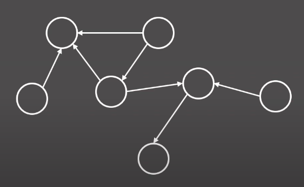

# ✏️0x09강 BFS

> 영상 URL[📹](https://youtu.be/ftOmGdm95XI)

## 📑Contents

* 0x00 알고리즘 설명[👉🏻](#0x00)
* 0x01 예시[👉🏻](#0x01)
* 0x02 응용 1 - 거리 측정[👉🏻](#0x02)
* 0x03 응용 2 - 시작점이 여러 개일 때[👉🏻](#0x03)
* 0x04 응용 3 - 시작점이 두 종류일 때[👉🏻](#0x04)
* 0x05 응용 4 - 1차원에서의 BFS[👉🏻](#0x05)

## 0x00 알고리즘 설명[📑](#contents)

### BFS(Breadth First Search)

: 다차원 배열에서 각 칸을 방문할 때 너비를 우선으로 방문하는 알고리즘

* **그래프(graph)**에서 모든 노드를 방문하기 위한 자료구조
  * **그래프(graph)** : 정점과 간선으로 이루어진 자료 구조
* https://youtu.be/ftOmGdm95XI?t=184

## 0x01 예시[📑](#contents)

## 0x02 응용 1 - 거리 측정[📑](#contents)

## 0x03 응용 2 - 시작점이 여러 개일 때[📑](#contents)

## 0x04 응용 3 - 시작점이 두 종류일 때[📑](#contents)

## 0x05 응용 4 - 1차원에서의 BFS[📑](#contents)