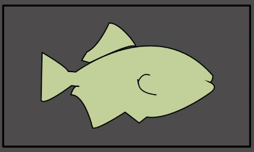

# ✏️0x09강 BFS

> 영상 URL[📹](https://youtu.be/ftOmGdm95XI)

## 📑Contents<a id='contents'></a>

* 0x00 알고리즘 설명[👉🏻](#0x00)
* 0x01 예시[👉🏻](#0x01)
* 0x02 응용 1 - 거리 측정[👉🏻](#0x02)
* 0x03 응용 2 - 시작점이 여러 개일 때[👉🏻](#0x03)
* 0x04 응용 3 - 시작점이 두 종류일 때[👉🏻](#0x04)
* 0x05 응용 4 - 1차원에서의 BFS[👉🏻](#0x05)

## 0x00 알고리즘 설명[📑](#contents)<a id='0x00'></a>



### BFS(Breadth First Search)

: 다차원 배열에서 각 칸을 방문할 때 너비를 우선으로 방문하는 알고리즘


* **그래프(graph)**에서 모든 노드를 방문하기 위한 자료구조
  * **그래프(graph)** : 정점과 간선으로 이루어진 자료 구조

## 0x01 예시[📑](#contents)<a id='0x01'></a>

* (0, 0)과 상하좌우로 연결되는 모든 파란색 칸을 확인하는 것
  

* BFS 알고리즘에서는 좌표를 담을 큐(Queue)가 필요. (0, 0)을 방문했다는 표시를 표에 남기고 큐에 해당 좌표를 넣음.
  

* 큐에 (0, 0)의 좌표를 `pop()`하면서 좌표의 상하좌우를 확인
  

  * (0, 1), (1, 0)은 아직 파란칸이면서 아직 방문하지 않음. 큐에 두 좌표를 넣음.

  

* 큐의 front인 (0,1)을 pop하면서 상하좌우를 확인

  

  * (0, 2)만 파란색칸이면서 아직 방문하지 않은 칸이므로 방문했다는 표시를 남기고 큐에 넣음

  

* 이 과정 반복

  

```python
'''
1. 시작하는 칸을 큐에 넣고 방문했다는 표시를 남김
2. 큐에서 원소를 꺼내어 그 칸에 상하좌우로 인접한 칸에 대해 3번을 진행
3. 해당 칸을 이전에 방문했다면 아무 것도 하지 않고, 처음으로 방문했다면 방문했다는 표시를 남기고 해당 칸을 큐에 삽입
4. 큐가 빌 때까지 2번을 반복

모든 칸이 큐에 1번씩 들어가므로 시간복잡도는 칸이 N개일때 O(N)
'''
```

* 큐에서 원소를 빼고 상하좌우의 칸을 확인하는 방식으로 원소를 구함

### 구현

```c++
#include <bits/stdc++.h>
using namespace std;
#define X first
#define Y second // pair에서 first, second를 줄여서 쓰기 위해서 사용
int board[502][502] =
{{1,1,1,0,1,0,0,0,0,0},
 {1,0,0,0,1,0,0,0,0,0},
 {1,1,1,0,1,0,0,0,0,0},
 {1,1,0,0,1,0,0,0,0,0},
 {0,1,0,0,0,0,0,0,0,0},
 {0,0,0,0,0,0,0,0,0,0},
 {0,0,0,0,0,0,0,0,0,0} }; // 1이 파란 칸, 0이 빨간 칸에 대응
bool vis[502][502]; // 해당 칸을 방문했는지 여부를 저장
int n = 7, m = 10; // n = 행의 수, m = 열의 수
int dx[4] = {1,0,-1,0};
int dy[4] = {0,1,0,-1}; // 상하좌우 네 방향을 의미
int main(void){
  ios::sync_with_stdio(0);
  cin.tie(0);
  queue<pair<int,int> > Q;
  vis[0][0] = 1; // (0, 0)을 방문했다고 명시
  Q.push({0,0}); // 큐에 시작점인 (0, 0)을 삽입.
  while(!Q.empty()){
    pair<int,int> cur = Q.front(); Q.pop();
    cout << '(' << cur.X << ", " << cur.Y << ") -> ";
    for(int dir = 0; dir < 4; dir++){ // 상하좌우 칸을 살펴볼 것이다.
      int nx = cur.X + dx[dir];
      int ny = cur.Y + dy[dir]; // nx, ny에 dir에서 정한 방향의 인접한 칸의 좌표가 들어감
      if(nx < 0 || nx >= n || ny < 0 || ny >= m) continue; // 범위 밖일 경우 넘어감
      if(vis[nx][ny] || board[nx][ny] != 1) continue; // 이미 방문한 칸이거나 파란 칸이 아닐 경우
      vis[nx][ny] = 1; // (nx, ny)를 방문했다고 명시
      Q.push({nx,ny});
    }
  }
}
```

### 많이 하는 실수

1. 시작점에 방문했다는 표시를 남기지 않는다.
2. 큐에 넣을때 방문했다는 표시를 하는 대신 큐에서 빼낼 때 방문했다는 표시를 남겼다.
3. 이웃한 원소가 범위를 벗어났는지에 대한 체크를 잘못했다.

### 백준 1926번 : 그림 [문제⌨️](https://www.acmicpc.net/problem/1926)

> 풀이[✏️](../acmicpc/1926/1926.md)

* 상하좌우로 연결된 그림의 크기를 알아내기
* 도화지에 있는 모든 그림을 찾아내기


* 4개의 그림은 이중 for문을 돌면서 BFS의 시작점이 될수 있는 곳을 찾으면 됨.
* (0, 0) -> 크기가 4인 그림을 찾게 됨. 

#### 바킹독님 풀이

```c++
// http://boj.kr/2edfa3c97260480d81e3133d389c119f
#include <bits/stdc++.h>
using namespace std;
#define X first
#define Y second // pair에서 first, second를 줄여서 쓰기 위해서 사용
int board[502][502]; // 1이 파란 칸, 0이 빨간 칸에 대응
bool vis[502][502]; // 해당 칸을 방문했는지 여부를 저장
int n,m;
int dx[4] = {1,0,-1,0};
int dy[4] = {0,1,0,-1}; // 상하좌우 네 방향을 의미
int main(){
  ios::sync_with_stdio(0);
  cin.tie(0);
  cin >> n >> m;
  for(int i = 0; i < n; i++)
    for(int j = 0; j < m; j++)
      cin >> board[i][j];
  int mx = 0; // 그림의 최댓값
  int num = 0; // 그림의 수
  for(int i = 0; i < n; i++){
    for(int j = 0; j < m; j++){ // (i, j)를 시작점으로 하고 싶은 상황
      if(board[i][j] == 0 || vis[i][j]) continue; // 해당 칸이 색칠이 안된 부분(0)이거나 이미 (i, j)를 방문했을 경우 넘어감
      // (i,j)는 새로운 그림에 속해있는 시작점
      num++; // 그림의 수 1 증가
      queue<pair<int,int> > Q;
      vis[i][j] = 1; // (i,j)로 BFS를 시작하기 위한 준비
      Q.push({i,j});
      int area = 0; // 그림의 넓이
      while(!Q.empty()){
        area++; // 큐에 들어있는 원소를 하나 뺄 때 마다 넓이를 1 증가시킴
        pair<int,int> cur = Q.front(); Q.pop();
        for(int dir = 0; dir < 4; dir++){ // 상하좌우 칸을 살펴볼 것이다.
          int nx = cur.X + dx[dir];
          int ny = cur.Y + dy[dir]; // nx, ny에 dir에서 정한 방향의 인접한 칸의 좌표가 들어감
          if(nx < 0 || nx >= n || ny < 0 || ny >= m) continue; // 범위 밖일 경우 넘어감
          if(vis[nx][ny] || board[nx][ny] != 1) continue; // 이미 방문한 칸이거나 파란 칸이 아닐 경우
          vis[nx][ny] = 1; // (nx, ny)를 방문했다고 명시
          Q.push({nx,ny});
        }
      }
      // (i, j)를 시작점으로 하는 BFS가 종료됨
      mx = max(mx, area); // area가 mx보다 클 경우 mx에 area를 대입. max는 STL에 정의된 함수
    }
  }
  cout << num << '\n' << mx;
}
```


## 0x02 응용 1 - 거리 측정[📑](#contents)<a id='0x02'></a>


## 0x03 응용 2 - 시작점이 여러 개일 때[📑](#contents)<a id='0x03'></a>


## 0x04 응용 3 - 시작점이 두 종류일 때[📑](#contents)<a id='0x04'></a>


## 0x05 응용 4 - 1차원에서의 BFS[📑](#contents)<a id='0x05'></a>