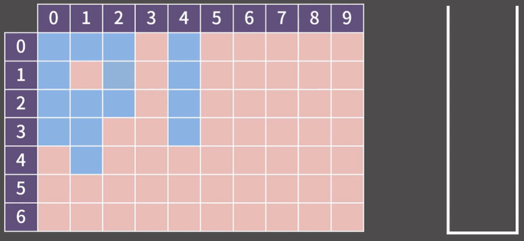
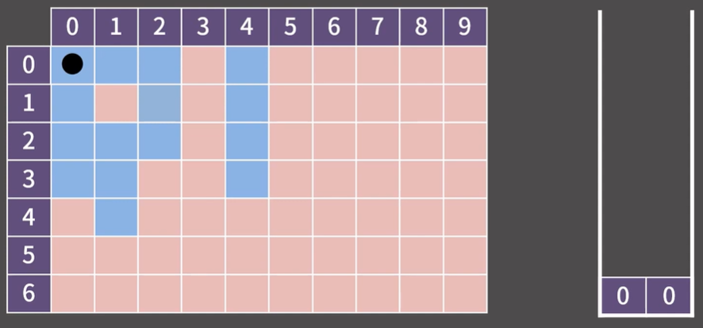
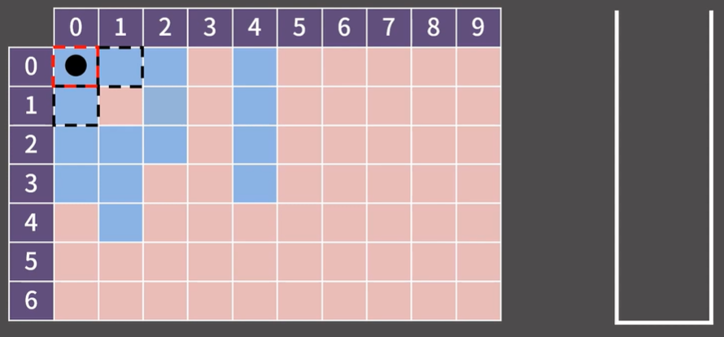
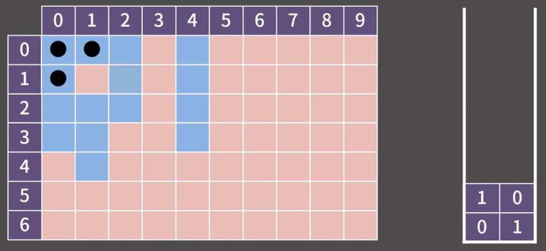
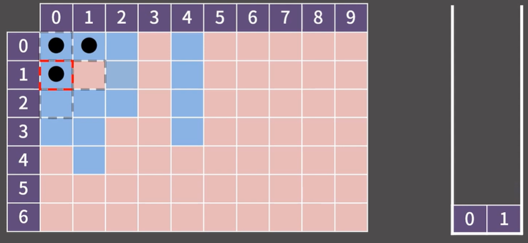
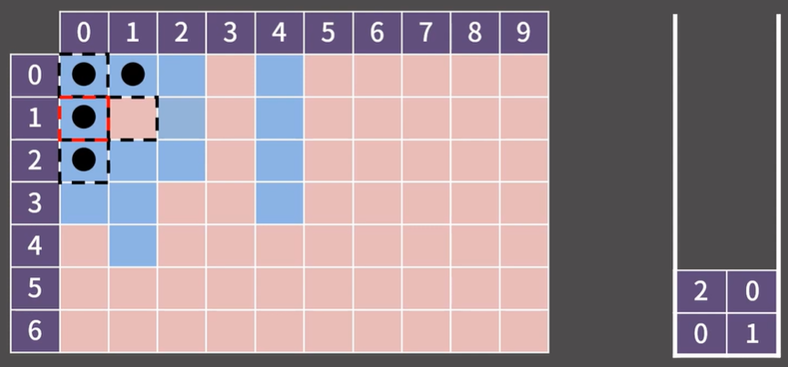
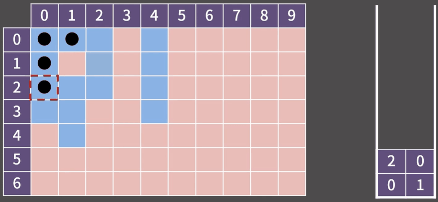
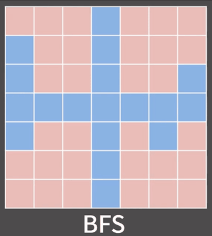
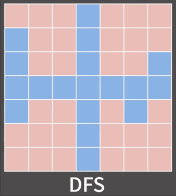
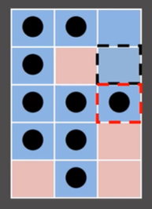

# ✏️0x0A강 DFS

> 영상 URL[📹](https://youtu.be/93jy2yUYfVE)

## 📑Contents<a id='contents'></a>

* 0x00 알고리즘 설명[👉🏻](#0x00)
* 0x01 예시[👉🏻](#0x01)
* 0x02 BFS vs DFS[👉🏻](#0x02)

## 0x00 알고리즘 설명[📑](#contents)<a id='0x00'></a>

| DFS(Depth First Search)                                      | BFS(Breadth First Search)                                    |
| ------------------------------------------------------------ | ------------------------------------------------------------ |
| 다차원 배열에서 각 칸을 방문할 때 깊이를 우선으로 방문하는 알고리즘 | 다차원 배열에서 각 칸을 방문할 때 너비를 우선으로 방문하는 알고리즘 |

## 0x01 예시[📑](#contents)<a id='0x01'></a>

```python
'''
1. 시작하는 칸을 스택에 넣고 방문했다는 표시를 남김
2. 스택에서 원소를 꺼내어 그 칸과 상하좌우로 인접한 칸에 대해 3번을 진행
3. 해당 칸을 이전에 방문했다면 아무 것도 하지 않고, 처음으로 방문했다면 방문했다는 표시를 남기고 해당 칸을 스택에 삽입
4. 스택이 빌 때 까지 2번을 반복

모든 칸이 스택에 1번씩 들어가므로 시간복잡도는 칸이 N개일 때 O(N).
'''
```

* BFS와 차이점은 큐가 스택으로 바뀐 것

### 예시

* (0, 0)과 상하좌우로 이어진 모든 파란색 칸을 확인

  

* (0, 0)을 방문했다고 하고 스택에 넣음

  

* 스택에서 (0, 0)을 pop해주면서 상하좌우 칸 확인

  

* (0, 1)과 (1, 0)이 아직 방문하지 않은 파란색 칸이므로 스택에 넣고 방문 처리

  

* 스택의 top은 (1, 0)이고 이것을 pop 해줌.

  

* (1, 0)의 상하좌우를 탐색하는데 오직 (2, 0)만 아직 방문을 하지 않았으므로 이를 스택에 넣음

  

* 이후 다음과 같이 됨

  

### 구현

```c++
#include <bits/stdc++.h>
using namespace std;
#define X first
#define Y second // pair에서 first, second를 줄여서 쓰기 위해서 사용
int board[502][502] =
{{1,1,1,0,1,0,0,0,0,0},
 {1,0,0,0,1,0,0,0,0,0},
 {1,1,1,0,1,0,0,0,0,0},
 {1,1,0,0,1,0,0,0,0,0},
 {0,1,0,0,0,0,0,0,0,0},
 {0,0,0,0,0,0,0,0,0,0},
 {0,0,0,0,0,0,0,0,0,0} }; // 1이 파란 칸, 0이 빨간 칸에 대응
bool vis[502][502]; // 해당 칸을 방문했는지 여부를 저장
int n = 7, m = 10; // n = 행의 수, m = 열의 수
int dx[4] = {1,0,-1,0};
int dy[4] = {0,1,0,-1}; // 상하좌우 네 방향을 의미
int main(void){
  ios::sync_with_stdio(0);
  cin.tie(0);
  stack<pair<int,int> > S;
  vis[0][0] = 1; // (0, 0)을 방문했다고 명시
  S.push({0,0}); // 스택에 시작점인 (0, 0)을 삽입.
  while(!S.empty()){
    pair<int,int> cur = S.top(); S.pop();
    cout << '(' << cur.X << ", " << cur.Y << ") -> ";
    for(int dir = 0; dir < 4; dir++){ // 상하좌우 칸을 살펴볼 것이다.
      int nx = cur.X + dx[dir];
      int ny = cur.Y + dy[dir]; // nx, ny에 dir에서 정한 방향의 인접한 칸의 좌표가 들어감
      if(nx < 0 || nx >= n || ny < 0 || ny >= m) continue; // 범위 밖일 경우 넘어감
      if(vis[nx][ny] || board[nx][ny] != 1) continue; // 이미 방문한 칸이거나 파란 칸이 아닐 경우
      vis[nx][ny] = 1; // (nx, ny)를 방문했다고 명시
      S.push({nx,ny});
    }
  }
}
```

## 0x02 BFS vs DFS[📑](#contents)<a id='0x02'></a>

* BFS는 큐를, DFS는 스택을 쓴다는 차이도 있지만 방문순서에도 차이가 존재함.

  * BFS 순서

    

  * DFS 순서

    

* BFS와 DFS는 방문순서의 큰 차이를 볼수 있음.

* BFS에서 유용하게 사용했던 "현재 보는 칸으로 부터 추가되는 인접한은 거리가 현재보는 칸보다 1만큼 더 떨어져 있다"는 DFS에서는 성립하지 않음.

  

* (0, 0)에서 DFS를 시작하는 경우인데 빨간색 칸은 거리가 4인 반면 검정색 칸은 거리가 3임.
* 다차원 배열에는 굳이 BFS 대신 DFS를 사용할 필요가 없음.
* Flood Fill은 굳이 DFS를 쓸 필요없음.
* 거리측정은 BFS만 가능
* 다차원 배열에서 순회하는 문제는 계속 BFS만 보게 됨
* 그래프와 트리 자료구조를 배울때 DFS가 필요.