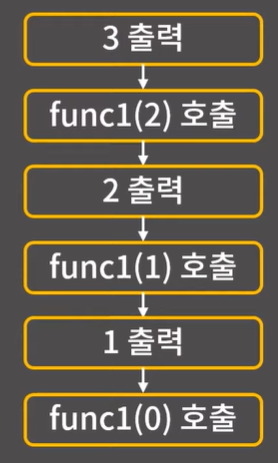
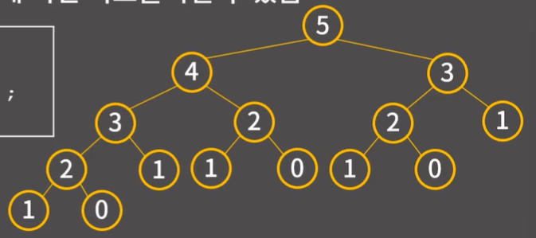
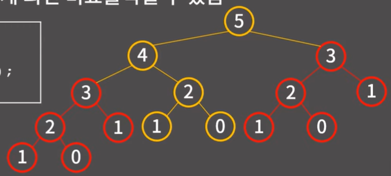
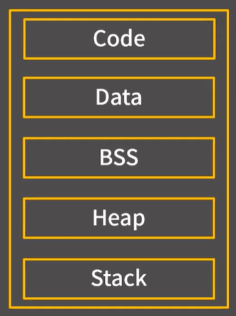

# ✏️0x0B강 재귀

> 영상 URL[📹](https://youtu.be/93jy2yUYfVE)

## 📑Contents<a id='contents'></a>

* 0x00 알고리즘 설명[👉🏻](#0x00)
* 0x01 연습 문제 1 - 거듭제곱 [👉🏻](#0x01)
* 0x02 연습 문제 2 - 하노이 탑[👉🏻](#0x02)
* 0x03 연습문제 3 - Z

## 0x00 알고리즘 설명[📑](#contents)<a id='0x00'></a>

### 재귀

: 하나의 함수에서 자기 자신을 다시 호출해 작업을 수행하는 알고리즘

* N부터 1까지 출력하는 함수

  ```c++
  void func1(int n){
      if (n == 0) return;
      cout << n << ' ';
      func(n-1);
  }
  ```

  ```python
  def func1(n : int):
      if n == 0:
          return
      print(n)
      func1(n - 1)
  ```

* 1부터 N까지의 합을 구하는 함수

  ```c++
  int func2(int n){
      if (n == 0) return 0;
      return n + func2(n-1);
  }
  ```

  ```python
  def func1(n : int):
      if n == 0:
          return
      print(n)
      func1(n - 1)
  ```

  

#### 구현을 했다고 끝이 아니라 왜 이렇게 되는지 제대로 짚고 넘어가자!

### 수학적 귀납법

* 귀납적으로 문제를 푼다는 것은 우리가 가진 기존의 상식과 큰 차이가 존재
  * 기존의 방식은 순서에 따라 해야할 일이 정해져 있는 코드를 짜왔음.


* 도미노 비유

  * 1 | 2 | 3 | 4 | ... : 1번 도미노가 쓰러지면 2번 도미노가 쓰러지고 2번 도미노가 쓰러지면 3번 도미노가 쓰러지고...k번 도미노가 쓰러지면 k+1번 도미노도 쓰러짐

  * 수학적 귀납법을 이용한 설명

    ```python
    '''
    1번 도미노가 쓰러진다. - 참
    k번 도미노가 쓰러지면 k+1번 도미노도 쓰러진다. - 참
    => 모든 도미노가 쓰러진다. - 참
    '''
    ```

    -> 앞에 두 가지 명제만 생각해도 **모든 도미노가 쓰러진다.**라는 명제가 참임을 생각할수 있어야 함.

  * **절차지향적인 사고**를 탈피

* N부터 1까지 출력하는 함수

  * 절차지향적인 사고

    

  * 귀납적인 사고

    ```python
    '''
    func1(1)이 1을 출력한다.
    
    func1(k)가 k, k-1, k-2 ... 1을 출력하면
    func1(k+1)은 k+1, k, k-1 ... 1을 출력한다.
    '''
    ```

    

### 재귀 함수의 조건

특정 입력에 대해서는 자기 자신을 호출하지 않고 종료되어야 함(Base condition) 모든 입력은 base condition으로 수렴해야 함

```c++
void func1(int n){
    if (n == 0) return; 
    cout << n << ' ';
    func(n-1);
}
```

* n이 0일때, 자기 자신을 호출하지 않고 종료함.
* 모든 입력은 n = 0으로 수렴하게 됨.
* 이렇게 하지 않으면 무한히 돌아가 Runtime Error를 맞이 하게 됨.

### 재귀에 대한 정보 1

```python
'''
1. 함수의 인자로 어떤 것을 받고 어디까지 계산한 후 자기 자신에게 넘겨줄지 명확하게 정해야 함
2. 모든 재귀함수는 반복문만으로 동일한 동작을 하는 함수를 만들 수 있음
3. 재귀는 반복문으로 구현했을 때에 비해 코드가 간결하지만 메모리/시간에서는 손해를 봄
'''
```

### 재귀에 대한 정보2

* 한 함수가 자기 자신을 여러번 호출하게 되면 비효율적일 수 있음

  ```c++
  int fibo(int n){
      if (n <= 1) return 1;
      return fibo(n-1)+fibo(n-2);
  }
  ```

  * 이 재귀함수의 시간 복잡도는 O(1.617<sup>n</sup>) n = 100 정도만 되어도 일반 컴퓨터로 2만년 넘게 걸리게 됨.

  * n에 대한 지수 함수 만큼 걸림.

  * 다음의 예시

    

    * 이미 계산한 것을 또 계산하는 것이 빈번하게 나타남

  * 빨간 원의 부분이 반복

    

  * 이런 문제는 재귀 대신 DP로 풀기

### 재귀에 대한 정보 3

* 재귀함수가 자기 자신을 부를 때 스택 영역에 계속 누적이 됨.

  

* 문제를 풀때 스택 메모리 제한이 있을 수 있음.

  | 플랫폼                  | 메모리 제한      |
  | ----------------------- | ---------------- |
  | Visual Studio 2017/2019 | 1MB              |
  | GCC/MingW               | 1MB              |
  | LINUX                   | 8MB-10MB         |
  | BOJ                     | 메모리 제한 없음 |
  | SW Expery Academy       | 1MB              |

* 본인의 풀이가 재귀를 깊게 들어가는 문제이면 재귀 대신 반복문으로 문제를 풀어야 함.

* 구글 검색을 통해 스택 메모리 제한 해제 해두기!

## 0x01 연습 문제 1 - 거듭제곱[📑](#contents)<a id='0x01'></a>

### 백준 1629번 : 곱셈 [문제⌨️](https://www.acmicpc.net/problem/1629)

> 풀이[✏️](../acmicpc/1629/1629.md)

### a<sup>b</sup> mod m

* 아래 코드의 결과는 0이 나옴. 왜냐하면 `int` Overflow 때문이다.

    ```c++
    int func1(int a, int b, int m){
        int val = 1;
        while(b--) val *= a;
        return val % m;
    }
    ```

* 6<sup>100</sup>은 `int`의 범위를 벗어남
* 이를 해결하기 위해서는 곱하는 중간중간 계속 n으로 나눠서 나머지만 챙기면 됨.

<u>a * b * c의 1의 자리 10으로 나눈 나머지는 1의 자리를 구한 후 곱하면 됨.</u>

* `int` Overflow 를 고려한 코드

    ```c++
    using ll = long long;
    ll func1(ll a, ll, b, ll, m){
        ll val = 1;
        while(b--) val = val * a % m;
        return val;
    }
    ```

* b가 최대 20억이라 `O(b)`로 해결할 수 없을때는 어떻게 해야할까?

  * a<sup>n</sup> * a<sup>n</sup> = a<sup>2n</sup>

  * 12<sup>58</sup> ≡ 4(mod 67) -> 12<sup>116</sup> ≡ 16(mod 67) -> 귀납법 추론

```python
'''
1승을 계산할 수 있다.
k승을 계산했으면 2k승과 2k+1승도 O(1)에 계산할 수 았다.
'''
```

* c++ 풀이

    ```c++
    #include <bits/stdc++.h>
    using namespace std;

    using ll = long long;

    ll POW(ll a, ll b, ll m){
      if(b==1) return a % m;
      ll val = POW(a, b/2, m);
      val = val * val % m;
      if(b%2 == 0) return val;
      return val * a % m;
    }

    int main(void){
      ios::sync_with_stdio(0);
      cin.tie(0);
      ll a,b,c;
      cin >> a >> b >> c;
      cout << POW(a,b,c);
    }
    ```

* python 풀이

    ```python
    import sys
    
    input = sys.stdin.readline
    
    a, b, c = map(int, input().split())
    
    def solution(a : int, b : int, c : int) -> int:
        if b == 1:
            return a % c
        val = solution(a, b//2, c)
        val = val * val % c
        if b % 2 == 0:
            return val
        return val * a % c
    
    print(solution(a, b, c))
    ```


## 0x02 연습 문제 2 - 하노이 탑[📑](#contents)<a id='0x02'></a>


## 0x03 연습문제 3 - Z[📑](#contents)<a id='0x03'></a>

