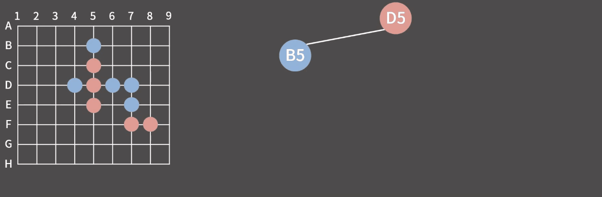
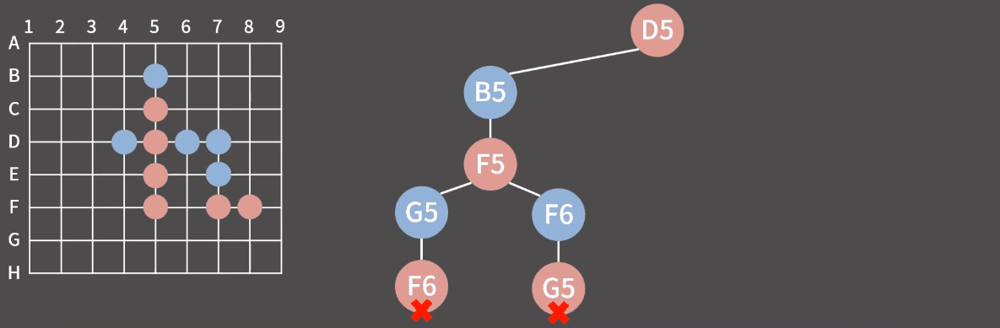
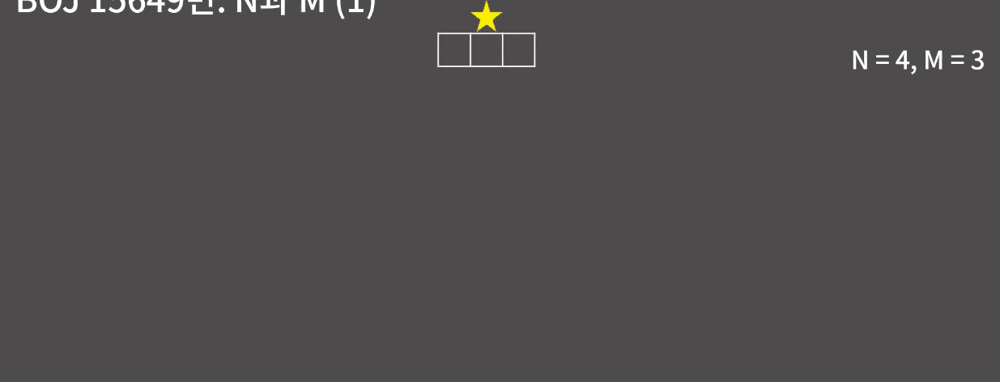
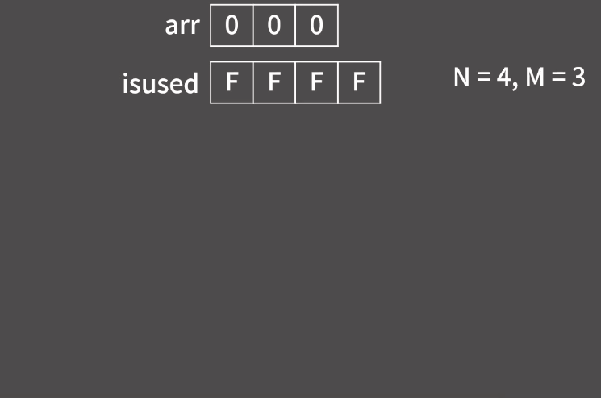

# ✏️0x0C강 백트래킹

> 영상 URL[📹](https://youtu.be/Enz2csssTCs)

## 📑Contents<a id='contents'></a>

* 0x00 알고리즘 설명[👉🏻](#0x00)
* 0x01 연습 문제 1 - N과 M [👉🏻](#0x01)
* 0x02 연습 문제 2 - N-Queen[👉🏻](#0x02)
* 0x03 연습문제 3 - 부분수열의 합[👉🏻](#0x02)
* 0x04 STL next_permutation

## 0x00 알고리즘 설명[📑](#contents)<a id='0x00'></a>

### 백트래킹

: 현재 상태에서 가능한 모든 후보군을 따라 들어가며 탐색하는 알고리즘

### 오목을 둔다고 가정

* B5에 둔다고 했을때

  

  

* F5에 둔다고 했을때

  

이렇게 생긴 트리를 `상태공간트리`라고 부름.

## 0x01 연습 문제 1 - N과 M[📑](#contents)<a id='0x01'></a>

### 백준 15649번 : N과 M(1) [문제⌨️](https://www.acmicpc.net/problem/15649)

> 풀이[✏️](../acmicpc/15649/15649.md)

* N과 M 문제를 **상태공간트리**로 나타내면 다음과 같다.

  

* 바킹독님 풀이

  ```c++
  #include <bits/stdc++.h>
  using namespace std;
  
  int n,m;
  int arr[10];
  bool isused[10];
  
  void func(int k){ // 현재 k개까지 수를 택했음.
    if(k == m){ // m개를 모두 택했으면
      for(int i = 0; i < m; i++)
        cout << arr[i] << ' '; // arr에 기록해둔 수를 출력
      cout << '\n';
      return;
    }
  
    for(int i = 1; i <= n; i++){ // 1부터 n까지의 수에 대해
      if(!isused[i]){ // 아직 i가 사용되지 않았으면
        arr[k] = i; // k번째 수를 i로 정함
        isused[i] = 1; // i를 사용되었다고 표시
        func(k+1); // 다음 수를 정하러 한 단계 더 들어감
        isused[i] = 0; // k번째 수를 i로 정한 모든 경우에 대해 다 확인했으니 i를 이제 사용되지않았다고 명시함.
      }
    }
  }
  
  int main(void){
    ios::sync_with_stdio(0);
    cin.tie(0);
    cin >> n >> m;
    func(0);
  }
  ```

* 코드의 이해

  

* python 코드로 구현[📝](0x0C_15649.py)

  ```python
  import sys
  
  input = sys.stdin.readline
  
  n, m = map(int, input().split())
  arr = list(range(1, n+1))
  isused = [0] * n
  
  def func(k : int):
      if k == m :
          for i in range(m):
              print(arr[i], end=' ')
          print()
          return
      for i in range(1, n + 1):
          if not isused[i-1]:
              arr[k] = i
              isused[i- 1] = 1
              func(k + 1)
              isused[i-1] = 0
  
  func(0)
  ```

## 0x02 연습 문제 2 - N-Queen[📑](#contents)<a id='0x02'></a>


## 0x03 연습문제 3 - 부분수열의 합[📑](#contents)<a id='0x03'></a>


## 0x04 STL next_permutation