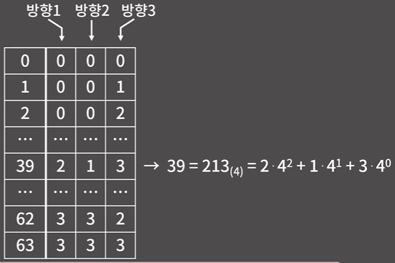
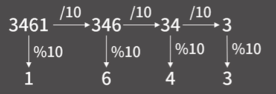
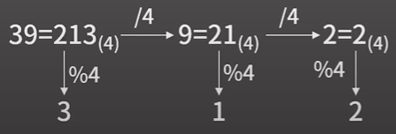
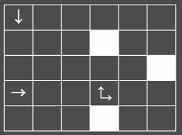
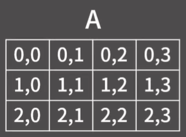
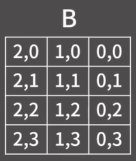
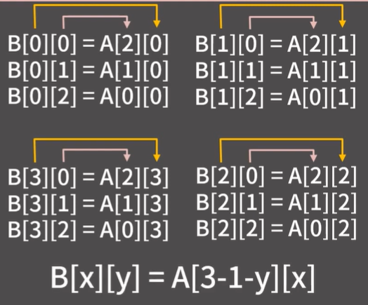

# ✏️0x0D강 시뮬레이션

> 영상 URL[📹](https://youtu.be/jZwf4OPlhtk)

## 📑Contents<a id='contents'></a>

* 0x00 연습 문제 1 - 감시 [👉🏻](#0x00)
* 0x01 연습 문제 2 - 스티커 붙이기 [👉🏻](#0x01)
* 0x02 연습 문제 3 - 2048 (Easy) [👉🏻](#0x02)
* 0x03 연습 문제 4 - 치킨 배달 [👉🏻](#0x03)

## 0x00 연습 문제 1 - 감시[📑](#contents)<a id='0x00'></a>

### 백준 15683번 : 감시 [문제⌨️](https://www.acmicpc.net/problem/15683)

> 풀이[✏️](../acmicpc/15683/15683.md)

#### 구현 해볼 사항

1. 각 cctv의 방향 정하기
2. 정한 방향에 대해서 사각 지대의 크기를 구하기

#### 1. 각 CCTV의 방향 정하기

* 가능한 방향의 종류가 4개 -> 4진법을 사용하면 됨.

  

  * 10진수 3461을 자리 수를 추출하는 방법

    

  * 10진수 39를 4진수 자리수로 나타내는 방법

    

* 바킹독님 구현

    ```c++
    for(int tmp = 0; tmp < 64; tmp++){
        int brute = tmp;
        for(int i = 0; i < 3; i++){
            cout << brute%4;
            brute /= 4;
        }
        cout << '\n';
    }
    ```

* python 구현

    ```python
    for tmp in range(64):
        brute = tmp
        for i in range(3):
            print(brute % 4, end='')
            brute //= 4
        print()
    ```

* CCTV가 K개 일때, 0부터 4<sup>k-1</sup>까지에 대해 위의 코드처럼 작성

    * `tmp`를 바로 나누지 않고 `brute`라는 임시 값에 담고 나누는지 고민해볼 것!
    * 2번 CCTV는 가능한 방향은 2개, 5번 CCTV는 가능한 방향은 1개

* 바킹독님은 중복되는 계산을 짬 -> 굳이 CCTV의 종류를 나누지 않음.

#### 1. 정한 방향에 대해서 사각지대의 크기를 구하기



* 화살표를 따라가면서 벽을 만날때까지 쭉 진행하면서 마크를 남김

* 바킹독님 코드

  ```c++
  // http://boj.kr/c961e6bf6107428caf200c11c964f9e1
  #include <bits/stdc++.h>
  using namespace std;
  #define X first
  #define Y second
  
  int dx[4] = {1,0,-1,0};
  int dy[4] = {0,1,0,-1}; // 남쪽, 동쪽, 북쪽, 서쪽 순서
  int n, m;
  int board1[10][10]; // 최초에 입력받은 board를 저장할 변수
  int board2[10][10]; // 사각 지대의 개수를 세기 위해 사용할 변수
  vector<pair<int,int> > cctv; // cctv의 좌표를 저장할 변수
  
  bool OOB(int a, int b){ // Out Of Bounds 확인
    return a < 0 || a >= n || b < 0 || b >= m;
  }
  
  // (x,y)에서 dir 방향으로 진행하면서 벽을 만날 때 까지 지나치는 모든 빈칸을 7로 바꿔버림
  void upd(int x, int y, int dir){
    dir %= 4;
    while(1){
      x += dx[dir];
      y += dy[dir];
      if(OOB(x,y) || board2[x][y] == 6) return; // 범위를 벗어났거나 벽을 만나면 함수를 탈출
      if(board2[x][y] != 0) continue; // 해당 칸이 빈칸이 아닐 경우(=cctv가 있을 경우) 넘어감
      board2[x][y] = 7; // 빈칸을 7로 덮음
    }
  }
  
  int main(void) {
    ios::sync_with_stdio(0);
    cin.tie(0);
    cin >> n >> m;
    int mn = 0; // 사각 지대의 최소 크기 (=답)
    for(int i = 0; i < n; i++){
      for(int j = 0; j < m; j++){
        cin >> board1[i][j];
        if(board1[i][j] != 0 && board1[i][j] != 6)
          cctv.push_back({i,j});
        if(board1[i][j] == 0) mn++;
      }
    }
    // 1 << (2*cctv.size())는 4의 cctv.size()승을 의미.
    for(int tmp = 0; tmp < (1<<(2*cctv.size())); tmp++){ // tmp를 4진법으로 뒀을 때 각 자리수를 cctv의 방향으로 생각할 것이다.
      for(int i = 0; i < n; i++)
        for(int j = 0; j < m; j++)
          board2[i][j] = board1[i][j];
      int brute = tmp;    
      for(int i = 0; i < cctv.size(); i++){
        int dir = brute % 4;
        brute /= 4;
        int x = cctv[i].X;
        int y = cctv[i].Y; // tie(x, y) = cctv[i];로 쓰면 1줄로 줄일 수 있음
        if(board1[x][y] == 1){
          upd(x,y,dir);
        }
        else if(board1[x][y] == 2){
          upd(x,y,dir);
          upd(x,y,dir+2);
        }
        else if(board1[x][y] == 3){
          upd(x,y,dir);
          upd(x,y,dir+1);
        }
        else if(board1[x][y] == 4){
          upd(x,y,dir);
          upd(x,y,dir+1);
          upd(x,y,dir+2);
        }
        else{ // board1[x][y] == 5
          upd(x,y,dir);
          upd(x,y,dir+1);
          upd(x,y,dir+2);
          upd(x,y,dir+3);
        }
      }
      int val = 0;
      for(int i = 0; i < n; i++)
        for(int j = 0; j < m; j++)
          val += (board2[i][j]==0);
      mn = min(mn, val);
    }
    cout << mn;
  }
  ```

### 시간복잡도


* 각 CCTV의 방향을 정했을때, upd함수가 최대 몇번 호출되는지 확인 : 5번 CCTV가 8개 일 때, **4*8번** 호출
* upd 함수는 한 줄을 따라 올라가며 해당 칸이 0인지 확인하는 과정을 거치기 때문에 upd함수의 계산량 : M, N의 최대 크기 **8**
* NM개의 칸을 살펴보며 빈칸의 개수를 세니깐 N = 8, M = 8 : **64칸**
* 이 전체 과정을 모든 방향 마다 다 해주어야 하니 **4<sup>8</sup>**을 곱함

* 연산량이 제한 시간 내에 통과

### python으로 구현

```python
import sys

input = sys.stdin.readline

n, m = map(int, input().split())
office_info = [list(map(int, input().split())) for _ in range(n)]
board = [[0] * m for _ in range(n)]

dx, dy = [1, 0, -1, 0], [0, 1, 0, -1]

def OOB(a : int, b : int):
    return a < 0 or a >= n or b < 0 or b >= m

def upd(x : int, y : int, dir : int):
    dir %= 4
    while True:
        x += dx[dir]
        y += dy[dir]
        if OOB(x, y) or board[x][y] ==6:
            return
        if board[x][y] != 0:
            continue
        board[x][y] = 7

n, m = map(int, input().split())
office_info = [list(map(int, input().split())) for _ in range(n)]
board = [[0] * m for _ in range(n)]


mn = 0
coordinate = []
for i in range(n):
    for j in range(m):
        if office_info[i][j] != 0 and office_info[i][j] != 6:
            coordinate.append((i, j))
        if office_info[i][j] == 0:
            mn += 1

for tmp in range(1<<(2*len(coordinate))):
    for i in range(n):
        for j in range(m):
            board[i][j] = office_info[i][j]
    brute = tmp
    for i in range(len(coordinate)):
        dir = brute % 4
        brute //= 4
        x, y = coordinate[i][0], coordinate[i][1]
        if office_info[x][y] == 1:
            upd(x, y, dir)
        elif office_info[x][y] == 2:
            upd(x, y, dir)
            upd(x, y, dir + 2)
        elif office_info[x][y] == 3:
            upd(x, y, dir)
            upd(x, y, dir+1)
        elif office_info[x][y] == 4:
            upd(x, y, dir)
            upd(x, y, dir + 1)
            upd(x, y, dir + 2)
        else:
            upd(x, y, dir)
            upd(x, y, dir + 1)
            upd(x, y, dir + 2)
            upd(x, y, dir + 3)
        val = 0
        for i in range(n):
            for j in range(m):
                if board[i][j] == 0:
                    val += 1
        mn = min(mn, val)

print(mn)
```

## 0x01 연습 문제 2 - 스티커 붙이기 [👉🏻](#0x01)<a id='0x01'></a>

### 백준 18808번 : 스티커 붙이기 [문제⌨️](https://www.acmicpc.net/problem/18808)

> 풀이[✏️](../acmicpc/18808/18808.md)

* 스티커를 붙이는 과정 1부터 4까지 그대로 따라가면 됨.
* 과정 요약
  1. 스티커를 특정 영역에 붙일 수 있는지 확인하고 붙이기
  2. 스티커를 회전하기

#### 1. 스티커를 특정 영역에 붙일 수 있는지 확인하고 붙이기

```c++
bool pastable(int x, int y){
    for(int i = 0; i < r; i++){
        for (int j = 0; j < c; j++){
            if (note[x+i][y+j] == 1 && paper[i][j] == 1)
                return false;
        }
    }
    for (int i = 0; i < r; i++){
        for (int j = 0; j < c; j++){
            if(paper[i][j] == 1)
                note[x+i][y+j] = 1;
        }
    }
    return true
}
```

* 클린 코드의 관점에서는 **특정 영역에 붙일 수 있는지 확인하는 파트**와 **실제 붙이는 파트**가 서로 분리된 함수로 설정하는 것이 더 좋음
* 이 파트를 함수로 떼어내는 대신 `main`에 넣는 방법도 있지만 함수로 빼는게 구조적으로 더 좋음

#### 2. 스티커를 회전하기

* 크기가 3*4인 배열 A이 있음

  \

* 배열 A를 돌리면 다음과 같이 됨.

  

* 수에서 규칙을 찾으면 다음과 같음.

  

```c++
void rotate(){
    int tmp[12][12];
    
    for (int i = 0; i < r; i++)
        for (int j = 0; j < c; j++)
            tmp[i][j] = paper[i][j]
            
    for (int i = 0; i < c; i++)
        for (int j =0; j < r; j++)
            paper[i][j] = tmp[r-1-j][i];
    swap(r, c);
}
```

#### 시간복잡도


* 각 모눈종이에 대해 노트북에 놓을 수 있는지 확인하는 위치의 개수
* 모눈종이를 특정 위치에 놓을 수 있는지 확인하기 위해 필요한 연산
* 스티커의 개수
* 최악의 경우를 산정할 경우에도 2초 내로 널널하게 산정 가능

```c++
#include <bits/stdc++.h>
using namespace std;

int n, m, k;
int note[42][42];
int r, c;
int paper[12][12];

// paper를 90도 회전하는 함수
void rotate(){
  int tmp[12][12];
  
  for(int i = 0; i < r; i++)
    for(int j = 0; j < c; j++)
      tmp[i][j] = paper[i][j];
  
  for(int i = 0; i < c; i++)
    for(int j = 0; j < r; j++)
      paper[i][j] = tmp[r-1-j][i];

  swap(r, c);
}

// note의 (x,y)에 모눈종이의 (0,0)이 올라가게 스티커를 붙일 수 있는지 판단하는 함수. 가능할 경우 note를 갱신한 후 true를 반환.
bool pastable(int x, int y){
  for(int i = 0; i < r; i++){
    for(int j = 0; j < c; j++){
      if(note[x+i][y+j] == 1 && paper[i][j] == 1)
        return false;
    }
  }
  for(int i = 0; i < r; i++){
    for(int j = 0; j < c; j++){
      if(paper[i][j] == 1)
        note[x+i][y+j] = 1;
    }
  }
  return true;
}

int main(void) {
  ios::sync_with_stdio(0);
  cin.tie(0);
  cin >> n >> m >> k;
  while(k--){
    cin >> r >> c;
    for(int i = 0; i < r; i++)
      for(int j = 0; j < c; j++)
        cin >> paper[i][j];
    
    for(int rot = 0; rot < 4; rot++){
      bool is_paste = false; // 해당 스티커를 붙였는가?
      for(int x = 0; x <= n-r; x++){
        if(is_paste) break;
        for(int y = 0; y <= m-c; y++){
          if(pastable(x, y)){
            is_paste = true;
            break;
          }
        }
      }
      if(is_paste) break;
      rotate();
    }
  }
  int cnt = 0;
  for(int i = 0; i < n; i++)
    for(int j = 0; j < m; j++)
      cnt += note[i][j];
  cout << cnt << '\n';
}
```


## 0x02 연습 문제 3 - 2048 (Easy) [👉🏻](#0x02)<a id='0x02'></a>


## 0x03 연습 문제 4 - 치킨 배달 [👉🏻](#0x03)<a id='0x03'></a>

