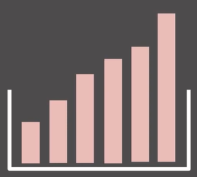
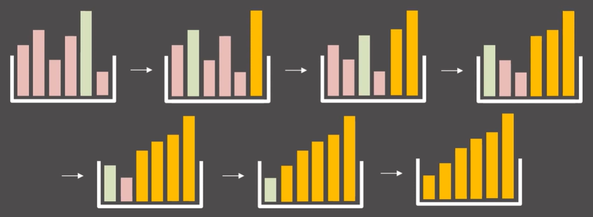
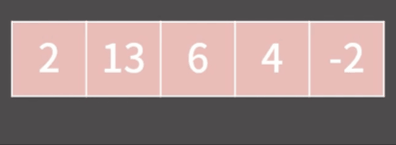
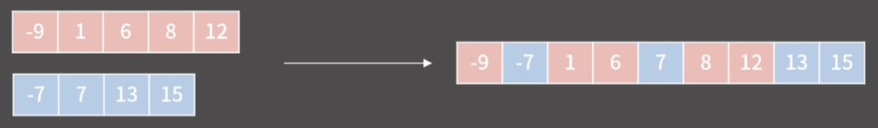
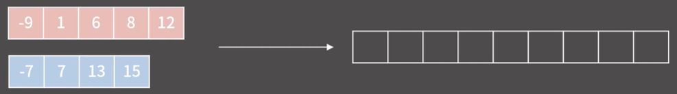
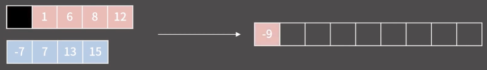
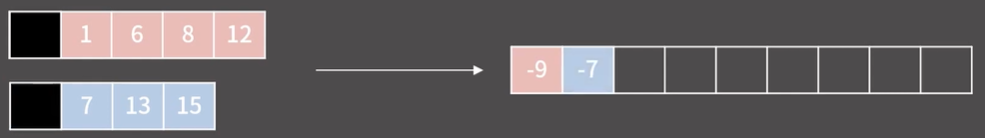

# ✏️0x0E강 정렬 1

> 영상 URL[📹](https://youtu.be/59fZkZO0Bo4)

## 📑Contents<a id='contents'></a>

* 0x00 기초 정렬 [👉🏻](#0x00)
* 0x01 Merge Sort [👉🏻](#0x01)
* 0x02 Quick Sort [👉🏻](#0x02)

## 0x00 기초 정렬 [📑](#contents)<a id='0x00'></a>

* 책꽃이에 책이 중구난방으로 꽃혀있다고 가정

  

* 책을 순서대로 꽂음

  

* 제일 큰것부터 제일 오른쪽으로 제일 작은 것은 제일 왼쪽으로 보내는 방식으로 하게 됨.

  

* 시간복잡도는 다음과 같음

  N + (N - 1) + (N-2) + ... + 1 = (N<sup>2</sup> + N) / 2 = O(N<sup>2</sup>)

* 실제 배열 구현

  ```c++
  int arr[10] = {3, 2, 7, 116, 62, 235, 1, 23, 55, 77};
  int n = 10;
  for (int i = n-1; i > 0; i--){
      int mxidx = 0;
      for (int j = 1; j <= i; j++){
          if (arr[mxidx] < arr[j]) mxidx = j;
      }
      swap(arr[mxidx], arr[i])
  }
  ```

* `max_element()`함수 이용

  ```c++
  int arr[10] = {3, 2, 7, 116, 62, 235, 1, 23, 55, 77};
  int n = 10;
  for (int i = n-1; i > 0; i--){
      swap(*max_element(arr, arr + i + 1), arr[i])
  }
  ```

#### 버블 정렬



* 가장 구현하기 쉬운 정렬
* 앞에서부터 인접한 두원소를 보면서 앞의 원소가 뒤의 원소가 클 경우 자리를 바꾸는 방식

* 자연스럽게 제일 큰 값이 오른쪽에 정렬

* 구현

  ```c++
  int arr = {-2, 2, 4, 6, 13};
  int n = 5;
  for (int i = 0; i < n; i++){
      for (int j = 0; j < n-1-i; j++){
          if (arr[j] > arr[j+1]) swap(arr[j], arr[j+1])
      }
  }
  ```

* O(N<sup>2</sup>) (10초에서 1분)에 수행할 수 있음.

## 0x01 Merge Sort [📑](#contents)<a id='0x01'></a>

### Merge Sort

* 재귀적으로 수열을 나워 정렬한 후 합치는 정렬법

* 시간복잡도 : O(NlogN) (1분 정도의 시간 소요)

* 길이가 N, M 두 정렬된 리스트를 합쳐서 길이 N+M의 정렬된 리스트를 만드는 방법을 알아야 함.

* 가장 쉬운 예 -> 버블 정렬로 구현

  

* 여기서 가장 앞에 와야 하는 수는 무엇일까?

  

  * 두 리스트의 가장 작은 원소인 -9와 -7을 비교하면 됨.

* -9가 와야 한다는 것을 O(N+M)이 아닌 O(1)에 알수 있음.

  

* -9 다음에 나오는 수 역시 1과 -7만 비교하면 됨.

  

* 나머지 중에 가장 앞에 있는 수를 비교하면 됨.

### 11728번 : 배열합치기


## 0x02 Quick Sort [📑](#contents)<a id='0x02'></a>