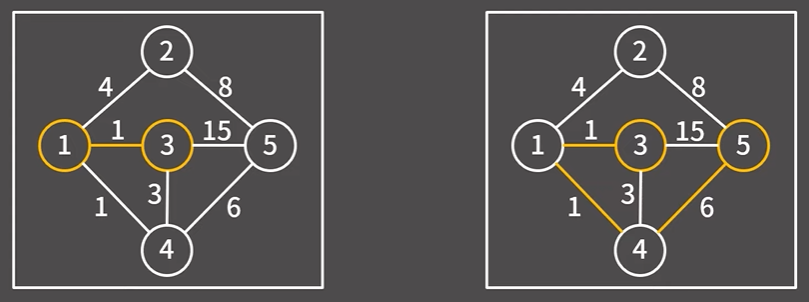
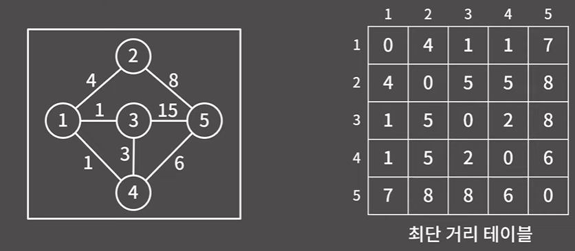
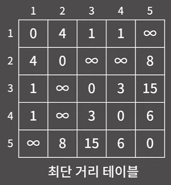
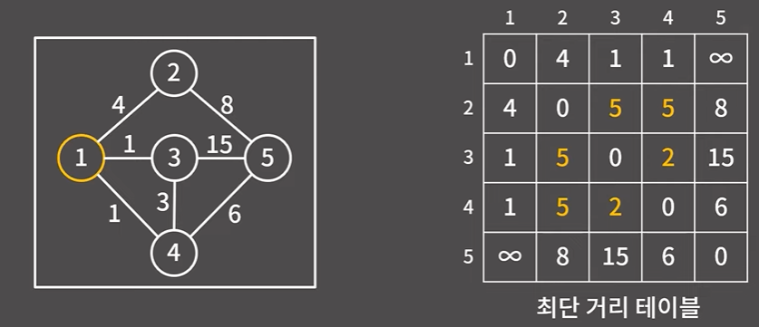
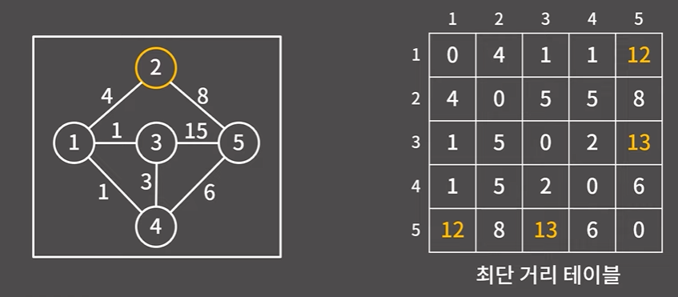
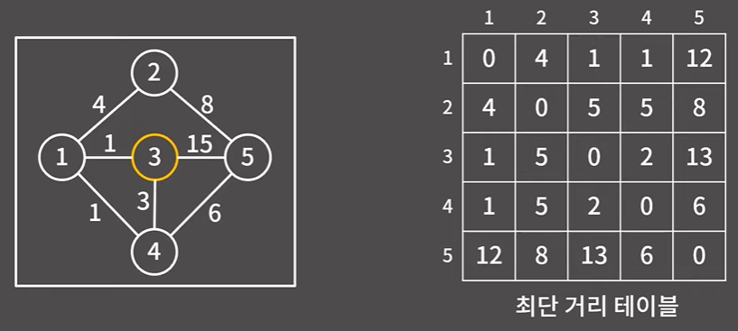
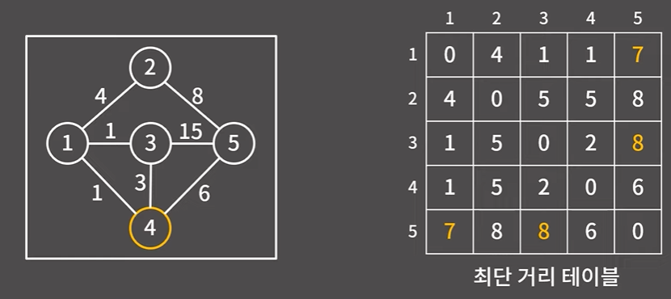
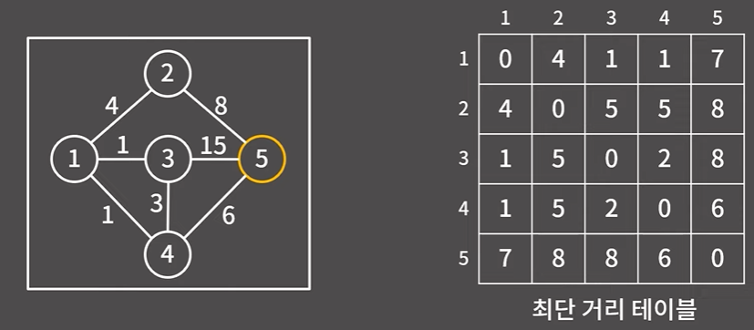

# ✏️0x0E강 정렬 1

> 영상 URL[📹](https://youtu.be/59fZkZO0Bo4)

## 📑Contents

* 0x00 알고리즘 설명 [👉🏻](#0x00)
* 0x01 구현 [👉🏻](#0x01)
* 0x02 경로 복원 방법 [👉🏻](#0x02)

## 0x00 알고리즘 설명 [📑](#contents)

* 주어진 그래프에서 간선 옆에 적힌 값들은 **간선의 거리**(**비용**이라고도 부름)를 말함.
* 왼쪽 그림에서 3에서 1로 혹은 1에서 3으로 가는 최단 거리는 1
* 오른쪽 그림에서 3에서 5로 가는 최단거리는 얼핏 15로 보이나 3-1-4-5순으로 경로를 가게 되면 8로 최단 거리는 8

### `플로이드 알고리즘` = `모든 정점 쌍 사이의 최단 거리`를 구하는 알고리즘

* 테이블에서 당장 채울수 있는 것만 빈테이블에 채우게 되면 다음과 같음.
  

  * 자기 자신으로 가는 것은 거리가 0
  * 간선 1개로 바로 넘어갈 수 있는 것은 간선의 거리로 바로 채움
  * 바로 넘어갈 수 없는 노드는 `무한`으로 처리

* 플로이드 알고리즘은 현재 테이블에서 노드 특정 노드 번호를 거치는 방법과 대조하여 최소값을 테이블에 입력(다음은 노드1을 거치는 거리와 비교하여 최소값을 입력)

  

  * `D[s][t]` >`D[s][1] + D[1][t]` 인 경우를 입력  

* 다음은 노드2를 거치는 거리와 비교하여 최소값을 입력

  

* 노드3

  

* 노드4

  

* 노드5

  

### 시간복잡도 : `O(v^3)`

## 0x01 구현 [📑](#contents)

## 0x02 경로 복원 방법 [📑](#contents)