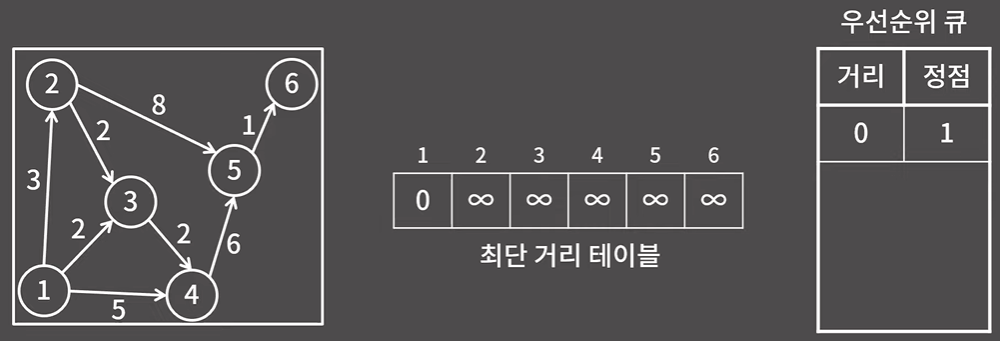

# ✏️0x1D강 다익스트라 알고리즘

> 영상 URL[📹](https://youtu.be/o9BnvwgPT-o)

## 📑Contents<a id='contents'></a>

* 0x00 알고리즘 설명 [👉🏻](#0x00)
* 0x01 구현 [👉🏻](#0x01)
* 0x02 경로 복원 방법 [👉🏻](#0x02)

## 0x00 알고리즘 설명 [📑](#contents)<a id='0x00'></a>

### 다익스트라 알고리즘 = 하나의 시작점으로부터 다른 모든 정점까지의 최단 거리를 구하는 알고리즘

* 1번 정점에서 다른 정점으로 가는 최단 거리를 표에 적음

  

* **플로이드 알고리즘은 음수인 간선이 있을때는 괜찮지만, 음수인 사이클이 있을때에만 문제가 발생**하는 반면 **다익스트라 알고리즘은 음수의 가중치를 가지는 간선이 있으면 아예 사용을 할 수가 없음.**
  * 만약 대회까지 염두에 두고 있다면, **벨만포드 알고리즘**을 공부하도록

> 길 찾기 알고리즘의 대표적인 알고리즘의 예시로 **A*(A-star)알고리즘이라는 것을 들어본 분들도 있을 것임. 
> → 근사치를 찾는 알고리즘

## 0x01 구현 [📑](#contents)<a id='0x01'></a>

* 테이블은 `무한대`로 초기화함 자기 자신과의 거리는 `0`

#### 다익스트라 알고리즘은 매 단계마다 도달할 수 있는 정점 중에서 시작점으로부터의 거리가 가장 가까운 정점을 구해서 그 거리를 확정하는 방식으로 동작

* 노드 1에서 갈 수 있는 노드는 2, 3, 4임. 각 노드까지의 거리는 3, 2, 5 이므로 가장 가까운 정점 3으로 가게 됨.

  

* 거리가 확정된 정점은 1, 3임. 정점1, 3을 통해 갈수 있는 정점은 2와 4이고 각 정점에 걸리는 거리는 다음과 같음.

  

* 정점1, 3 중 가장 가까운 거리의 정점은 2이므로 2번 정점까지의 거리를 확정

  

* 거리가 확정된 정점은 1, 2, 3임. 정점1, 2, 3을 통해 갈수 있는 정점은 4와 5이고 각 정점에 걸리는 거리는 다음과 같음.

  

* 정점4, 5 중 가장 가까운 거리의 정점은 4이므로 4번 정점까지의 거리를 확정

  

* 거리가 확정된 정점은 1, 2, 3, 4임. 정점1, 2, 3, 4을 통해 갈수 있는 정점은 5이고 정점 5까지 걸리는 거리는 10으로 확정

  

* 마지막 정점 6까지 가는 거리 확정

  

**하지만, 매 단계마다 걸리는 확정된 정점에서 갈수 있는 정점을 다 살피게 되면** 시간복잡도는 `O(VE)`가 됨. 하지만, 새 정점을 추가할때 마다 미리 거리를 계산해두고 거기서 최솟값을 찾는 방식으로 하면 시간복잡도는 `O(V^2+E)`가 됨.
→ **일반적으로 V가 E보다 크니** `O(V^2+E)`**가 더 효율적임.**

* 최단거리 테이블에 일단 정점 1에서 갈 수 있는 정점 2, 3, 4의 거리 3, 2, 5를 일단 적어 둠.

  

* 테이블을 d라고 하면 `d[2]` ~ `d[6]`까지의 최솟값을 찾으면 구할 수 있음
  → `d[3]`의 정점의 거리가 가장 작으므로 `d[3]`의 거리 확정

* `d[3]`의 거리를 확정하고 나서 `d[1]`의 거리는 모두 확인했기 때문에 정점3에서 뻗어나가는 정점만 확인하면 됨.
  → `d[3]` + 2 = 4(정점1 - 정점3 - 정점4)는 정점1에서 정점4까지의 거리인 5보다 작기 때문에 `d[4]` 를 4로 갱신

  

* 확정되지 않은 정점 2, 4, 5, 6의 거리를 비교하니 정점2까지의 거리가 최소이므로 정점2의 거리 확정

  

* `d[2]`의 거리를 확정하고 나서 `d[1]`, `d[3]`의 거리는 모두 확인했기 때문에 정점2에서 뻗어나가는 정점만 확인하면 됨.

  * 정점3은 이미 확정되었으므로 정점5만 확인하면 됨.
    → `d[2]` + 8 = 11(정점1 - 정점3 - 정점4)은 현재 `d[5]`는 `무한대`보다 작으므로 11로 갱신

  

* 바킹독님 구현

  ```c++
  // {비용, 간선 번호}
  vector<pair<int, int>> adf[20005];
  const int INF = 0x3f3f3f3f;
  bool fix[20005];
  int d[20005];
  int V =10;
  void dijkstra_naive(int st){
      fill(d, d+v+1, INF);
      d[st] = 0;
      while(true){
          int idx = -1;
          for (int i = 1; i <= V; i++){
              if(fix[i]) continue;
              if(idx == -1) idx = i;
              else if(d[i] < d[idx]) idx = i;
          }
          if(idx == -1 || d[idx]) idx = i;
          if(idx == -1 || d[idx] == INF) // 더 이상 선택할 정점이 없으면
              break;
          fix[idx] = -1; // 정점 idx 고정
          for(auto nxt : adj[idx])
              d[nxt.Y] = min(d[nxt.Y], d[idx] + nxt.X);
      }
  }
  ```

### 정점1에서 다른 정점으로 가는 방법 중에 정점3이 가장 최단 거리라고 확정할 수 있을까?


* 그래프에 그려진 거리를 무시하고 정점1에서 정점3까지의 거리보다 정점2를 거쳐서 정점3으로 가는 것이 더 짧다고 하면 정점1에서 최단거리 정점은 아마 정점2가 선택되었을 것.
* 이 논리는 다익스트라 알고리즘에서 음수 간선을 처리할수 없다는 것을 이해할 수 있음.

**다익스트라 알고리즘에서 매번 가장 가까운 정점을 뽑아내야함.** 
→ 원소의 추가가 가능하고 최솟값의 확인/삭제가 효율적인 자료구조 **힙**이나 **우선순위 큐**

### 우선순위 큐를 이용한 다익스트라 알고리즘

```python
'''
1. 우선순위 큐에 (0, 시작점)을 추가
2. 우선순위 큐에서 거리가 가장 작은 원소를 선택, 해당 거리가 최단 거리 테이블에 있는 값과 다를 경우 넘어감
3. 원소가 가리키는 정점을 v라고 할 때, v와 이웃한 정점들에 대해 최단 거리 테이블 값보다 v를 거쳐가는 것이 더 작은 값을 가질 경우 최단 거리 테이블의 값을 갱신하고 우선순위 큐에 (거리, 이웃한 정점의 번호)를 추가
4. 우선순위 큐가 빌 때까지 2, 3번 과정을 반복
'''
```

* 초기 세팅
  

* 우선순위 큐에서 가장 거리가 작은 원소 (0, 1)을 선택

  * 최단 거리 테이블 d에서 `d[1]` = 0인지 확인 일치하면 과정 진행
  * 정점1에서 갈수 있는 정점2, 3, 4 그리고 거리는 각각 3, 2, 5 
    → 원래 최단 거리 테이블에 있는 `무한대`보다 3, 2, 5가 작으므로 테이블d 갱신
  * 힙에 (거리, 정점) 쌍인 (3, 2), (2, 3), (5, 4)를 추가

  

* 우선순위 큐가 비어져 있지 않기 때문에 가장 짧은 거리인 (2, 3)을 선택

  * `d[3]`= 2인지 확인 일치하면 과정 진행

  * 최단 거리가 확정된 정점3에서 갈 수 있는 정점4는 정점3을 거쳐서 정점4까지 가는 거리는 `d[3]`+2 = 4

    → 기존에 `d[4]` = 5였으므로, 더 작은 값인 4로 갱신하고 힙에 (4, 4)를 삽입

  

* 우선순위 큐가 비어져 있지 않기 때문에 가장 짧은 거리인 (3, 2)을 선택

  * `d[2]`= 3인지 확인 일치하면 과정 진행

  * 최단 거리가 확정된 정점2에서 갈 수 있는 정점3, 5이 있고 정점2를 거쳐 각 정점으로 가는 거리는 `d[2]`+2 = 5, `d[2]`+8 = 11
    → 다익스트라 알고리즘의 증명으로 이미 확정된 정점3 까지의 최단거리는 확정할 필요가 없으나 우선순위 큐에서는 확정여부를 따로 저장하지 않기 때문에 3번 정점 또한 `d[2] +2` = 5와 `d[3]`을 비교해야 함.

    → 기존에 `d[5]` = `무한대`였으므로, 더 작은 값인 11로 갱신하고 힙에 (11, 5)를 추가

  

* 우선순위 큐가 비어져 있지 않기 때문에 가장 짧은 거리인 (4, 4)를 선택

  * `d[4]`= 4인지 확인 일치하면 과정 진행

  * 최단 거리가 확정된 정점4에서 갈 수 있는 정점5는 정점4을 거쳐서 정점5까지 가는 거리는 `d[4]`+6 = 10

    → 기존에 `d[5]` = 11였으므로, 더 작은 값인 10으로 갱신하고 힙에 (10, 5)를 추가

  

* 우선순위 큐가 비어져 있지 않기 때문에 가장 짧은 거리인 (5, 4)를 선택

  * `d[4]`= 5인지 확인 일치하지 않음
    → 건너뛰기

  

* 우선순위 큐가 비어져 있지 않기 때문에 가장 짧은 거리인 (10, 5)를 선택

  * `d[5]`= 10인지 확인 일치하면 과정 진행
  * `d[6]`에 11갱신하고 우선순위 큐에 (11, 6)을 넣음.

  

* 이후 `d[5]` = 10가 아니기때문에 건너뛰기

* `d[6]` = 11는 더이상 갈수 있는 정점이 없음.

### 시간 복잡도

* 우선순위 큐에 추가될 수 있는 원소의 수를 생각해보면 간선 1개당 최대 1개의 원소가 추가될 수 있기때문에 `O(ElogE)` 혹은  `O(ElogV)` 

## 0x02 경로 복원 방법 [📑](#contents)<a id='0x02'></a>