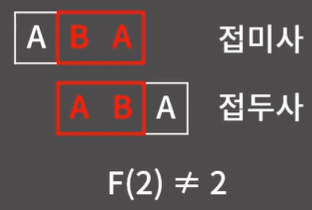
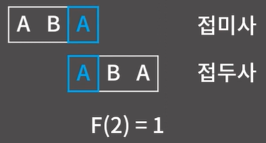
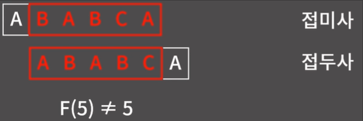
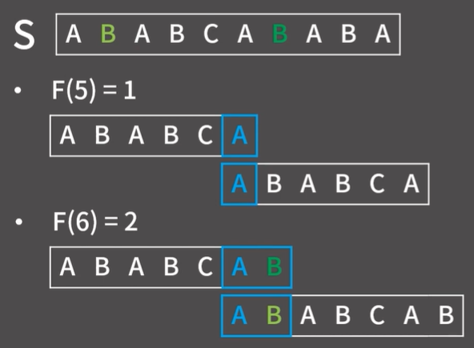
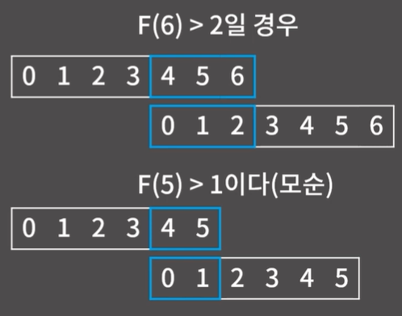
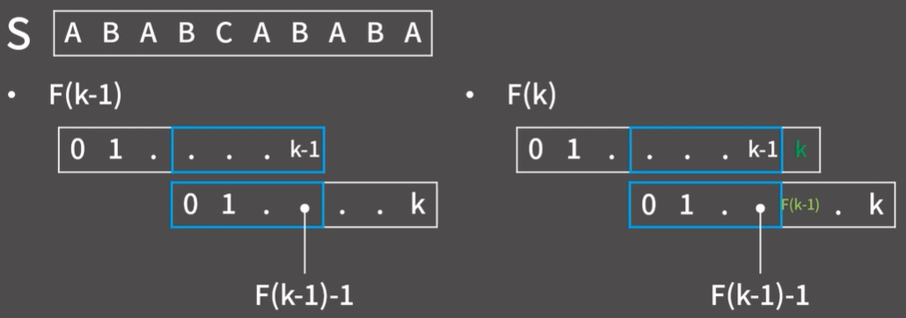

# ✏️0x1E강 KMP

>
> 영상 URL[📹](https://youtu.be/9bkbV-VANQ0)

## 📑Contents<a id='contents'></a>

* 0x00 알고리즘 설명 [👉🏻](#0x00)
* 0x01 실패 함수 [👉🏻](#0x01)
* 0x02 KMP [👉🏻](#0x02)

## 0x00 알고리즘 설명 [📑](#contents)<a id='0x00'></a>

* 본격적으로 들어가기 전 설명의 이해를 돕기위한 원칙

  ```python
  '''
  1. S[a:b] = "S[a] S[a+1] ... S[b-1]"
  2. S = "ABCDEF"일 때 S[2:5] = "CDE", S[3:4] = "D", S[0:2] = "AB"
  3. |S|는 S의 길이, S = "ABCDEF"일 때 |S| = 6
  4. 접두사 = 문자열의 첫 문자를 포함하는 연속한 문자열, S[0:x]
  5. 접미사 = 문자열의 끝 문자를 포함하는 연속한 문자열, S[x:|S|]
  6. A, AB, ABC, ABCD, ABCDE, ABCDEF는 ABCDEF의 접두사
  7. F, EF, DEF, CDEF, BCDEF, ABCDEF는 ABCDEF의 접미사
  '''
  ```

### 패턴 매칭 문제


* 문자열 A안에 문자열 B가 들어있는지 확인하는 알고리즘


* 구현

  ```c++
  bool find(string& A, string& B){
      for(int st = 0; st < (int)(A.size() - B.size()); st++){
          bool match = true;
          for(int i = 0; i < B.size(); i++){
              if(A[st+1] != B[i]){
                  match = false;
                  break;
              }
          }
          if(match) return true;
      }
      return false;
  }
  ```

* 최악의 예시

  

  * 최악의 경우 `O(|A| X |B|)`에 동작
    → 문자열 A의 길이와 문자열 B의 길이가 각각 100만인것 같이 특수할 경우에는 해결할 수 없음.

## 0x01 실패 함수 [📑](#contents)<a id='0x01'></a>

```python
'''
1. KMP : 패턴 매칭 문제를 O(|A|+|B|)에 해결할 수 있는 기적의 알고리즘
2. 굉장히 헷갈림
3. 먼저, KMP에 쓰이는 실패 함수를 알면 KMP를 이해하는데 도움이 됨
'''
```

* 실패 함수 F(x) : 문자열 S[0:x+1]에서 접두사와 접미사가 일치하는 최대 길이

  

* F(2)에 대한 예시

  

  

* F(5) = ?

  

  * F(5) = 1임을 알게됨.
  * F(x)에 대해 최악의 경우 `O(|S|^2)`의 연산이 필요하기 때문에 시간복잡도는 `O(|S|^3)`

**하지만 전체 F를 O(|S|)에 구하는 방법이 존재함** 
→ 다이나믹 프로그래밍과 같이 이전의 F를 활용할 수 있어야 함.



* F(5) = 1임을 앞서 찾아내었기 때문에 F(5)에서 문자열 S 접미사와 접두사가 일치하는 자리 바로 다음의 문자가 일치하는지 확인 
  → 연한 초록, 진한 초록으로 된 B가 일치함을 볼 수 있음

* F(6) > 2 일수는 없는가?

  > 논리적인 생각으로 F(5)가 1인 상태에서 F(6)은 2보다 클 수 없다.

  

F(k) 를 구할때 F(k-1)의ㅣ 값을 이용할 수 있는데, F(k)는 최대 F(k-1)+1임
→ 위의 예시처럼 S[F(k-1)]과 S[k]를 비교해서 두 글자가 일치한다면 바로 F(k) = F(k-1)+1로 확정지을 수 있음.

한편, F(k)를 구할때 왜 S[F(k-1)]과 S[k]이 두 글자를 비교하는지 약간 헷갈릴 수 있음.



### 실패 함수 원리 설명

영상을 통해 다시 이해해보기...[✏️](https://youtu.be/9bkbV-VANQ0?t=630)

### 구현

```c++
vector<int> failure(string& s){
    vector<int> f(s.size());
    int j = 0;
    for(int i = 1; i < s.size(); i++){
        while(j > 0 && s[i] != s[j]) j = f[j-1];
        if(s[i] == s[j]) f[i] = ++j;
    }
    return f;
}
```

## 0x02 KMP [📑](#contents)<a id='0x02'></a>

영상을 통해 다시 이해해보기...[✏️](https://youtu.be/9bkbV-VANQ0?t=1097)

### 백준 16916번 : 부분문자열 [문제⌨️](https://www.acmicpc.net/problem/16916)

> 풀이[✏️](../acmicpc/16916/16916.md)

* 바킹독님 풀이

  ```c++
  #include <bits/stdc++.h>
  using namespace std;
  
  vector<int> failure(string& s){
    vector<int> f(s.size());
    int j = 0;
    for(int i = 1; i < s.size(); i++){
      while(j > 0 && s[i] != s[j]) j = f[j-1];
      if(s[i] == s[j]) f[i] = ++j;
    }
    return f;
  }
  
  int main(void) {
    ios::sync_with_stdio(0);
    cin.tie(0);
  
    string s, p;
    cin >> s >> p;
    vector<int>f = failure(p);
    int j = 0;
    for(int i = 0; i < s.size(); i++){
      while(j > 0 && s[i] != p[j]) j = f[j-1];
      if(s[i] == p[j]) j++;
      if(j == p.size()){
        cout << 1;
        return 0;
      }
    }
    cout << 0;
  }
  ```

* python 풀이

  ```python
  import sys
  
  input = sys.stdin.readline
  
  def failure(s: str) -> list[int]:
      f = [0] * len(s)
      j = 0
      for i in range(1, len(s)):
          while j > 0 and s[i] != s[j]:
              j = f[j - 1]
          if s[i] == s[j]:
              j += 1
              f[i] = j
      return f
  
  s = input().rstrip()
  p = input().rstrip()
  
  f = failure(p)
  j = 0
  for i in range(len(s)):
      while j > 0 and s[i] != p[j]:
          j = f[j - 1]
      if s[i] == p[j]:
          j += 1
      if j == len(p):
          print(1)
          break
  else:
      print(0)
  ```

  


