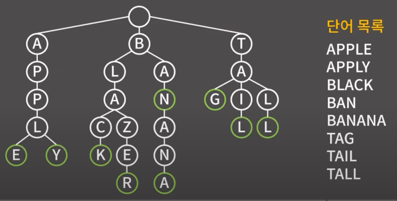
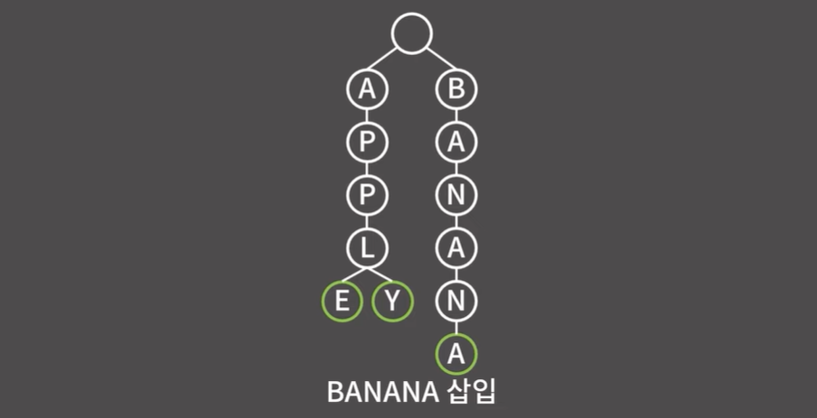
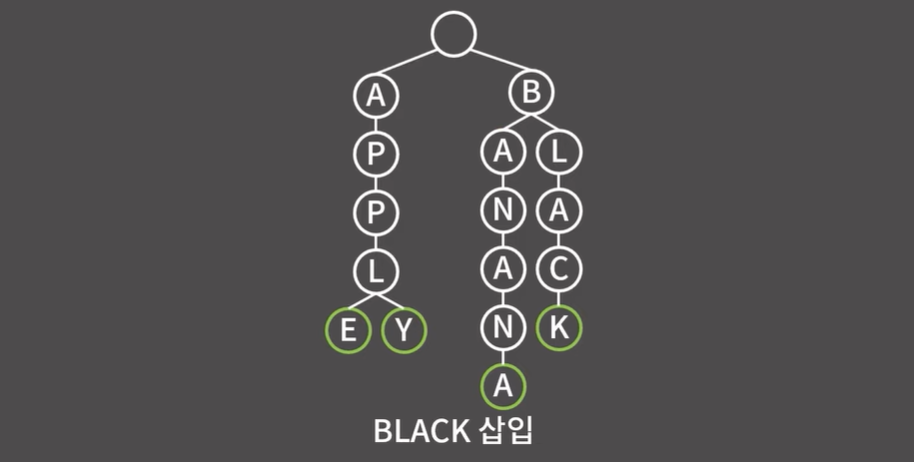
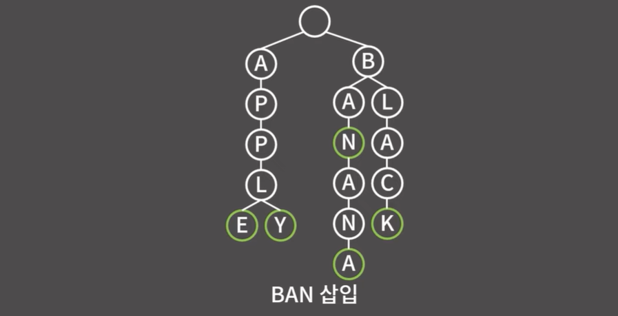
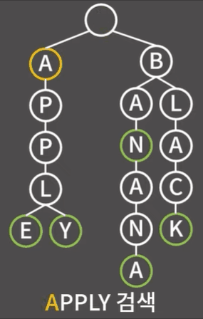
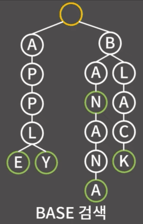
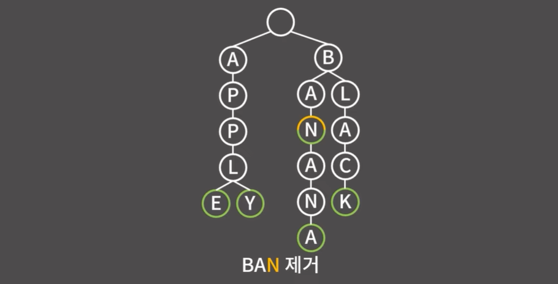
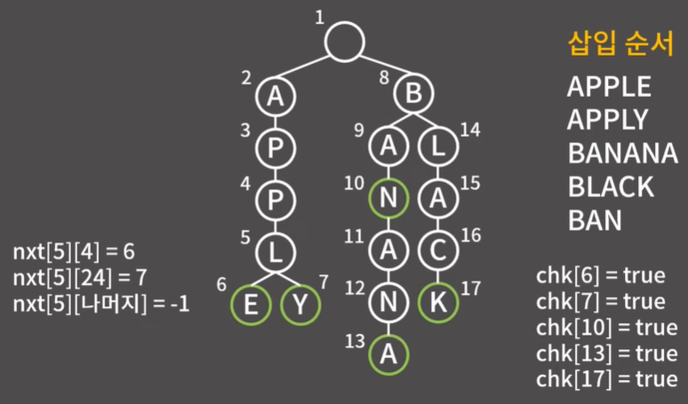

# ✏️0x1F강 트라이

>영상 URL[📹](https://youtu.be/ZmLe4tc5XRI)

## 📑Contents<a id='contents'></a>

* 0x00 정의와 성질 [👉🏻](#0x00)
* 0x01 기능과 구현 [👉🏻](#0x01)
* 0x02 연습 문제 [👉🏻](#0x02)

## 0x00 정의와 성질 [📑](#contents)<a id='0x00'></a>

### 트라이(Trie) = 문자열을 효율적으로 처리하기 위한 트리 자료구조



* `+`단어 S를 삽입/탐색/삭제할 때 `O(|S|)`
  * 이진 검색 트리로 각 단어의 정점으로 둔다고 하면 단어가 n개 있을때, 삽입, 탐색, 삭제 모두 `O(NlogN)`의 시간 복잡도가 발생한다고 했기 때문에 최악의 경우 `O(|S| X logN)`이 필요
  * 해시로 구현한다고 했을때, 삽입, 탐색, 삭제가 모두 `O(1)`인것 같지만 사실 해시값을 계산할때 `O(|S|)`가 필요하기도하고 문자열 간의 비교도 발생하기 때문에 삽입, 탐색, 삭제도 `O(|S|)`해시는 충돌에 따라 성능의 저하도 발생.
  * 하지만 트라이는 정직하게  `O(|S|)` 유지
* `-`문자열을 그냥 배열에 저장하는 것 보다 최대 '**4X글자의 종류**'배 만큼 더 사용
  (예를 들어 각 단어가 알파벳 대문자로만 구성되어 있을 경우 글자의 종류가 26개 이기 때문 메모리를 104배 더 사용)

이론적인 시간복잡도와는 별개로 실제로는 트라이가 해시, 이진 검색 트리에 비해 훨씬 느림. **일반적인 상황에서는 해시나 이진 검색 트리를 사용하는게 좋으나 트라이의 성질을 사용해야 하는 문제가 여럿 존재**

## 0x01 기능과 구현 [📑](#contents)<a id='0x01'></a>

### Insert(삽입)

* 트라이 알고리즘은 먼저 root만 있는 트리에서 시작, 여기서 APPLE을 삽입하고 싶음.
  

  * 삽입, 탐색, 삭제 모든 연산을 할때 이 모든 연산을 할때 정점을 옮겨다니게 됨.
  * 현재보고 있는 정점을 노란색으로 표시함.

* 현재 보고 있는 정점 root에는 값이 A인 자식이 없음.

  

  * A를 현재 보고 있는 정점의 자식에 추가하고 현재 보고 있는 정점을 root에서 A로 옮김.

* 현재 보고 있는 정점 A에는 P라는 자식이 없음.

  

  * P를 현재 보고 있는 정점의 자식에 추가하고 현재 보고 있는 정점을 A에서 P로 옮김.

* 이와 같은 과정을 계속 진행

  

  * 삽입이 끝난 후에는 마지막 글자에 별도의 표시를 해줌.(초록색으로)

* APPLY를 삽입

  

  * root의 자식에 A가 있으므로 A로 넘어감.

* P, P, L에 대해서도 동일한 상황이기 때문에 넘어감.

  

* 현재 보고 있는 정점의 자식 중에 Y는 없기때문에 정점Y를 추가하고 이동

  

* BANANA를 삽입

  

* BLACK을 삽입

  

* BAN을 삽입

  

  * 이 경우 기존에 있던 정점만 그대로 타고 가게 됨.

**트라이에서 단어를 삽입한 후에 초록색으로 나타낸 별도의 표시를 해주는 이유는 BAN과 BANANA를 보면 알 수 있음.**  → 표시를 안해줄 경우 BAN과 BANANA를 구분해줄수 없게 됨.

###  Fetch(검색)

* APPLY 검색

  

* 트라이에 없는 단어인 BASE 검색

  

* 트라이에 없는 단어인 APP 검색

  * 이 경우엔 A - P - P순으로 찾으나 단어의 끝이라는 초록색 표시가 없으므로 없는 단어 처리 됨.

### Erase(제거)

* BAN을 제거

  

  * 해당 위치까지 잘 B - A - N을 타고 이동
  * 이후 끝 표시를 없앰
  * 여기서 유의해야 할 부분은 정점이 제거되지는 않음

**따라서 삭제가 많아지는 경우 트라이는 끝 부분은 제거하고 정점은 남아 있으므로 메모리 소요가 심하여 적합하지 않음.**

### 구현

* 바킹독님 구현

  ```c++
  const int ROOT = 1;
  int unused = 2;
  const int MX = 10000 * 500 + 5; //최대 등장 가능한 글자의 수
  bool chk[MS];
  int nxt[MX][26];
  
  for (int i = 0; i < MX; i++)
      fill(nxt[i], nxt[i] + 26, -1);
  int c2i(char c){
      return c - 'A';
  }
  ```

  * MX의 경우 조건상으로 길이가 최대 500인 문자열이 10000개가 들어오는 문제일 경우 10000*500으로 둘 수 있음. 정점의 시작 번호가 0이 아니라 1이기 때문에 대충 +5정도의 여유를 둠.

  * chk는 앞서 초록색으로 보여줬던 정점의 문자열 끝인지를 여부를 저장하는 배열

  * nxt는 각 정점에서 자식정점의 번호를 의미

  * `nxt[MX][26]`으로 선언했는데 만약 문자의 종류가 50개라면 `nxt[MX][50]`으로 선언해야 함.

  * 매 순간마다 이동해야하는 자식 정점의 번호를 `O(1)`에 알 수 있지만, 단점으로는 각 정점마다 26칸을 할당하고 있어야 하기 때문에 메모리를 상당히 많이 사용해야 함.

    → 트라이의 성질을 설명할때 '4 X 글자의 종류 배' 만큼 더 사용한다는게 이 이유임.
    **배열에 문자열을 그냥 저장하면 char 1칸이니 1바이트만 사용하는 반면 지금 이 구조에서는 자식 정점의 번호를 저장하기 위해 각 글자마다 int 26개를 필요하니 4 X 26이 필요

  * nxt는 -1로 초기화 함. 정점을 돌아다니다가 -1을 만나면 해당 자식 정점이 없다는 사실을 알 수 있음.

  * c2i 함수는 글자를 받아 배열의 인덱스로 쓸수 있게 변환하는 함수
    대문자만 등장하는 경우만을 생각해 A-0, B-1, ... , Z-25에 대응시키는 함수인데 대문자와 소문자 혹은 대문자 소문자 숫자 모두 나오는 경우엔 이 함수를 상황에 맞게 바꿔야 함.



* 삽입을 하면서 정점이 새로 생기는 순으로 번호를 부여 받음.
  * 정점5에는 정점6 - E, 정점7 - Y 자식으로 있음.
    → A = 0, B= 1...E = 4이고 Y = 24이니 `nxt[5][4]`=6,  `nxt[5][24]`=7 이고 다른 자식 정점은 없어서 나머지 인덱스에 대해서는 `nxt[5][...]`= -1임
  * chk배열은 문자가 끝인 경우만 true이므로 `chk[6]`, `chk[7]`, `chk[10]`, `chk[13]`, `chk[17]`인 경우 모두 true 나머지는 false

* insert 함수

  ```c++
  void insert(string& s){
      int cur = ROOT;
      for (auto c : s){
          if(nxt[cur][c2i(c)] == -1)
              nxt[cur][c2i(c)] = unused++;
          cur = nxt[cur][c2i(c)];
      }
      chk[cur] = true;
  }
  ```

  * cur : 주황색으로 표시했던 현재 정점(초기값은 ROOT)
  * for문을 통해 글자 하나씩 따라가며 자식 정점으로 이동
  * `nxt[cur][c2i(c)] == -1`이면 자식 정점이 없다는 것을 의미
  * unused는 값을 1을 증가시킴 이후 `cur = nxt[cur][c2i(c)]`를 통해 값을 이동
  * 이동을 마친 후에는 `chk[cur]`를 true로 바꾸어 줌.

* find 함수

  ```c++
  bool find(string& s){
      int cur = ROOT;
      for(auto c : s){
          if(nxt[cur][c2i(c)] == -1)
  	        return false;
          cur = nxt[cur][c2i(c)];
      }
      return chk[cur];
  }
  ```

  * insert처럼 자식 정점으로 찾아 내려감
  * 하지만,  insert와 다르게 존재하지 않는 자식 정점을 만나면 바로 false를 반환
  * 마지막 글자에 대응되는 정점에 도달한 후에는 chk[cur]을 반환

* erase 함수

  ```c++
  void erase(string& s){
      int cur = ROOT;
      for(auto c : s){
          if(nxt[cur][c2i(c)] == -1)
              return;
          cur = nxt[cur][c2i(c)];
      }
      chk[cur] = false;
  }
  ```

  * 자식 정점으로 계속 이동, 만약 존재하지 않는 자식 정점을 만나면 string s가 트라이에 없다는 의미이니 return을 통해 그대로 함수를 종료하고 마지막 글자에 대응되는 정점에 도달했다면 chk[cur]을 false로 변환

  * 만약 반드시 트라이에 존재하는 문자열에 대해서만 erase함수가 호출된다는 조건이 있을 경우 다음 을 생략할 수 있음.

    ```c++
    if(nxt[cur][c2i(c)] == -1)
        return;
    ```

### 메모리 절약 방법

| 자식 저장 방법     | 코드                            | 시간복잡도           | 공간복잡도   | 시간 (백준 14425 기준) | 메모리(백준 14425 기준) |
| ------------------ | ------------------------------- | -------------------- | ------------ | ---------------------- | ----------------------- |
| 고정된 크기의 배열 | nxt[MX][26]                     | **O(/|S/|)**         | **O(26*MX)** | 472ms                  | 514ms                   |
| 동적 배열          | verctor<pair<char, int>>nxt[MX] | **O(25 x /|S/|)**      | **O[MX]**    | 2018ms                 | 280ms                   |
| 연결 리스트        | list<pair<char, int>>nxt[MX]    | **O(26 x /|S/|)**      | **O[MX]**    | 3732ms                 | 280ms                   |
| 이진 검색 트리     | map<char, int> nxt[MX]          | **O(log(26) x /|S/|)** | **O[MX]**    | 688ms                  | 474ms                   |
| 해시               | unordered_map<char, int>nxt[MX] | **O(/|S/|)**         | **O[MX]**    | 1584ms                 | 979ms                   |

* 앞서 각 정점에서 특정 문자에 대응되는 자식 정점을 `O(1)`에 찾을 수 있도록 하기 위해 자식 정점의 인덱스를 `nxt[MX][26]`배열에 저장 → 이렇게 되면 필요한 메모리의 양이 너무 커지는 문제가 생기게 됨.
* 한글 혹은 한자어 같이 문자의 종류가 엄청 많은 경우에는 `nxt[MX][10000]`과 같은 배열을 잡는게 현실적으로 불가능함. → 이럴 경우에 자식 정점을 `O[1]`보다 느리게 찾더라도 메모리를 절약하는 방법을 사용
* 동적 배열 사용 : 자식 정점이 E, Y 2개가 있고 각각 6번과 7번이라면 동적 배열에 ('E', 6), ('Y', 7)을 담는 방법
  * 이렇게 하면 자식 정점을 찾기 위해 최악의 경우 매 순간마다 26번의 탐색을 해야하기 때문에 시간복잡도는 `O(26*|S|)`로 늘어나지만 공간복잡도는 `O(MX)`로 줄어듭니다. 
  * 연결 리스트를 사용해도 동일
* 이진 검색 트리나 해시 사용 : 자식 정점을 이진 검색 트리나 해시로 관리하면 시간복잡도는 각각 `O(log(26)*|S|)` 혹은 `O(|S|)`가 되고 공간복잡도는 그대로 `O(MX)`이지만 이진 검색 트리나 해시 자료 구조의 오버헤드가 더 크기 때문에 실제로 사용하는 메모리는 동적 배열이나 연결 리스트에 비해 더 클 것으로 예상 가능

#### 트라이 문제가 나왔을 경우 자식을 그냥 고정된 배열로 푸는게 제일 좋음. 

#### 하지만 출제자가 메모리 제한을 매우 낮게 설정해서 사용되는 메모리 양을 따져보니 고정된 크기의 배열을 이용할 경우 무조건 메모리 초과가 발생한다면 자식을 동적 배열, 즉 vector를 써서 관리하는 방식으로 선회를 할 수 있음.

## 0x02 연습 문제 [📑](#contents)<a id='0x02'></a>

### 백준 14425번 : 문자열 집합 [문제⌨️](https://www.acmicpc.net/problem/14425)

> 풀이[✏️](../acmicpc/14425/14425.md)

* 바킹독님 풀이

  ```c++
  ```

  
