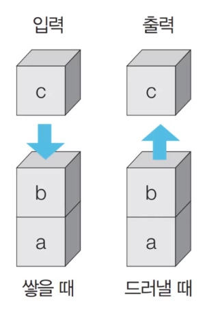
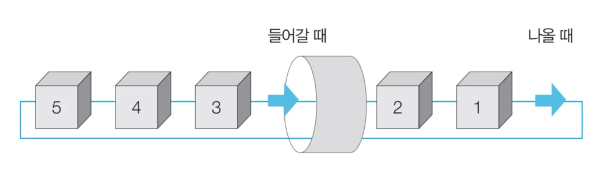
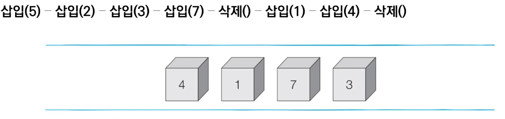

# 1_가장 기본이 되는 자료 구조 : 스택과 큐 [↩](../dongbinna_algorithm)

## contents📑<a id="contents"></a>

1. [stack](#stack)
2. [queue](#queue)

## 1_1`스택`:stack[📑](#contents)<a id="stack"></a>



* 먼저 들어 온 데이터가 나중에 나가는 형식(선입후출)의 자료 구조
* 입구와 출구가 동일한 형태로 `스택`을 시각화할 수 있습니다.


```python
stack = []

# 삽입 - 삽입 - 삽입 - 삽입 - 삭제 - 삽입 - 삽입- 삭제 
stack.append(5)
stack.append(2)
stack.append(3)
stack.append(7)
stack.pop()
stack.append(1)
stack.append(4)
stack.pop()


print(stack[::-1]) # 최상단 원소부터 출력
print(stack) # 최하단 원소부터 출력

최상단 원소부터 출력 : [1, 3, 2, 5]
최하단 원소부터 출력 : [5, 2, 3, 1]
```

## 1_2`큐`:queue[📑](#contents)<a id="queue"></a>



* 먼저 들어 온 데이터가 먼저 나가는 형식(선입선출)의 자료구조입니다.
* 큐는 입구와 출구가 모듀 뚫려 있는 터널과 같은 형태로 시각화 할 수 있습니니다.



```python
from collections import deque

# 큐(queue) 구현을 위해 deque 라이브러리 사용
queue = deque()

# 삽입 - 삽입 - 삽입 - 삽입 - 삭제 - 삽입 - 삽입 - 삭제
queue.append(5) 
queue.append(2)
queue.append(3)
queue.append(7)
queue.popleft()
queue.append(1)
queue.append(4)
queue.popleft()

print(queue) # 먼저 들어온 순서대로 출력
queue.reverse()
print(queue) # 나중에 들어온 원소부터 출력

먼저 들어온 순서대로 출력	 : deque([3, 7, 1, 4])
나중에 들어온 원소부터 출력	: deque([4, 1, 7, 3])
```

