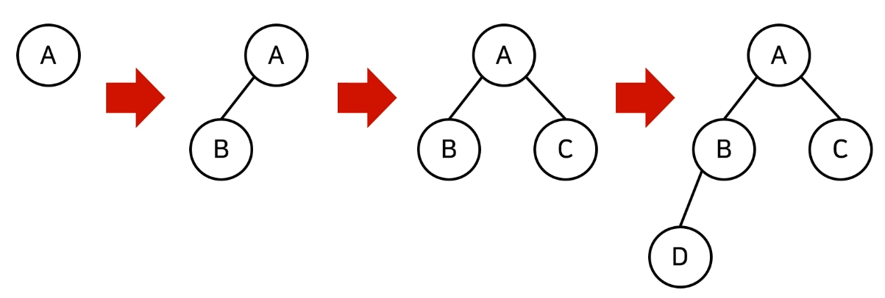
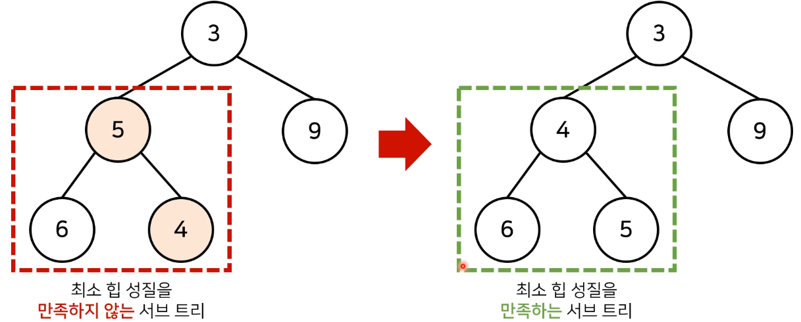
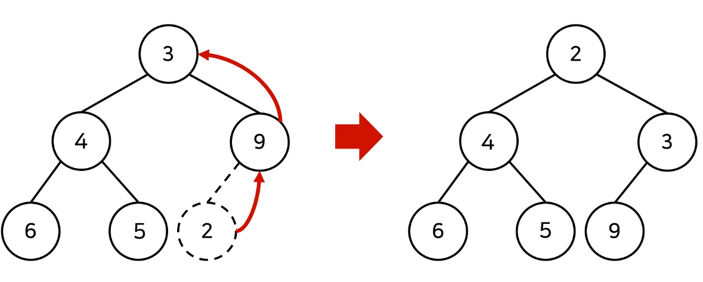
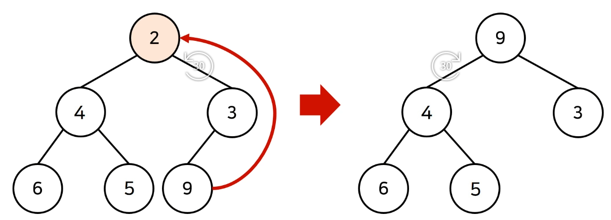
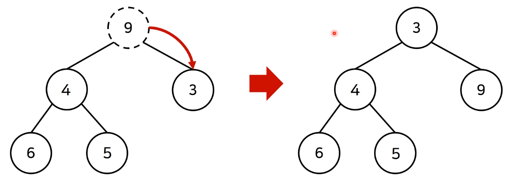

# 2_우선순위에 따라 데이터를 꺼내는 자료구조[↩](../dongbinna_algorithm)

## contents📑<a id="contents"></a>

1. [우선순위 큐](#2_1우선순위-큐)
2. [힙의 특징](#2_2힙(Heap)의-특징)
3. [완전 이진 트리](#완전 이진 트리)
4. [최소 힙 구성 함수: MIn-Heapify()](#최소 힙 구성 함수)

## 2_1우선순위 큐[📑](#contents)<a id="2_1우선순위-큐"></a>

* 우선순위 큐는 우선순위가 가장 높은 데이터를 가장 먼저 삭제하는 자료구조입니다.
* 우선순위 큐는 데이터를 우선순위에 따라 처리하고 싶을때 사용합니다.
  * 예시) 물건 데이터를 자료구조에 넣었다가 가치가 높은 물건 부터 꺼내서 확인해야 하는 경우

| 자료구조                   | 추출되는 데이터             |
| -------------------------- | --------------------------- |
| 스택(Stack)                | 가장 나중에 삽입된 데이터   |
| 큐(Queue)                  | 가장 먼저 삽입된 데이터     |
| 우선순위 큐(Priorty Queue) | 가장 우선순위가 높은 데이터 |

* 우선순위 큐를 구현하는 방법은 다양합니다.
  1) 단순히 <u>리스트를 이용하여 구현</u>할 수 있습니다.
  2) <u>힙(Heap)을 이용하여 구현</u>할 수 있습니다.
* 데이터의 개수가 N개일 때, 구현 방식에 따라서 시간 복잡도를 비교한 내용은 다음과 같습니다.

| 우선순위 큐 구현 방식 | 삽입 시간 | 삭제시간 |
| --------------------- | --------- | -------- |
| 리스트                | O(1)      | O(N)     |
| 힙(Heap)              | O(logN)   | O(logN)  |

* 단순히 N개의 데이터를 힙에 넣었다가 모두 꺼내는 작업은 정렬과 동일합니다.**(힙 정렬)**
  * 이 경우 시간 복잡도는 **O(NlogN)**입니다.

## 2_2힙(Heap)의 특징[📑](#contents)<a id="2_2힙(Heap)의-특징"></a>

* 힙은 완전 이진 트리 자료구조의 일종입니다.
* 힙에서는 항상 루트 노드(root node)를 제거합니다.
* 최소 힙(min heap)
  * 루트노드가 가장 작은 값을 가집니다.
  * 따라서 값이 작은 데이터가 우선적으로 제거됩니다.


* 최대 힙(max heap)
  * 루트 노드가 가장 큰 값을 가집니다.
  * 따라서 값이 큰 데이터가 우선적으로 제거됩니다.

## 2_3완전이진트리(Complete Binary Tree)[📑](#contents)<a id="완전 이진 트리"></a>

* **완전 이진 트리**란 루트(root)노드부터 시작하여 왼쪽 자식노드, 오른쪽 자식 노드 순서대로 데이터가 차례대로 삽입되는 트리(tree)를 의미합니다.



## 2_4최소 힙 구성 함수:MIn-Heapify()[📑](#contents)<a id="최소 힙 구성 함수"></a>

* (상향식)부모 노드로 거슬러 올라가며, 부모보다 자신의 값이 더 작은 경우에 위치를 교체합니다.



* 새로운 원소가 삽입되었을때 O(logN)의 시간 복잡도로 힙 성질을 유지하도록 할 수 있습니다.



* 원소가 제거되었을때 O(logN)의 시간 복잡도로 힙 성질을 유지하도록 할 수 있습니다.
  * 원소를 제거할때 가장 마지막 노드가 루트 노드의 위치에 오도록 합니다.



* 원소가 제거되었을때 O(logN)의 시간 복잡도로 힙 성질을 유지하도록 할 수 있습니다.
  * 이후에 루트 노드에서부터 하향식으로(더 작은 자식 노드로)Heapify()를 진행합니다.



```python
import sys
import heapq
input = sys.stdin.readline

def heapsort(iterable):
    h = []
    result =[]
    # 모든 원소를 차례대로 힙에 삽입
    for value in iterable:
        heapq.heappush(h, value)
    #힙에 삽입된 모든 원소를 차례대로 꺼내어 담기
    for i in range(len(h)):
        result.append(heapq.heappop(h))
    return result

n = int(input())
arr = []

for i in range(n):
    arr.append(int(input()))

res = heapsort(arr)

for i in range(n):
    print(res[i])
```

