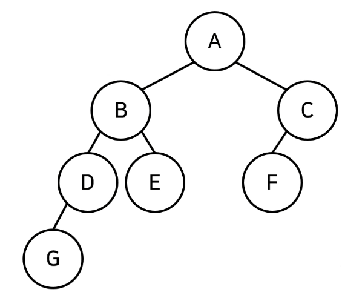
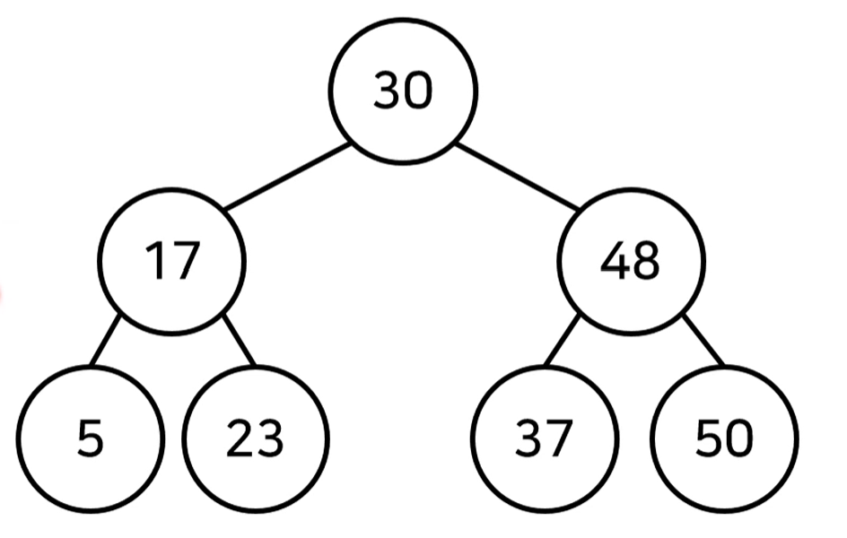
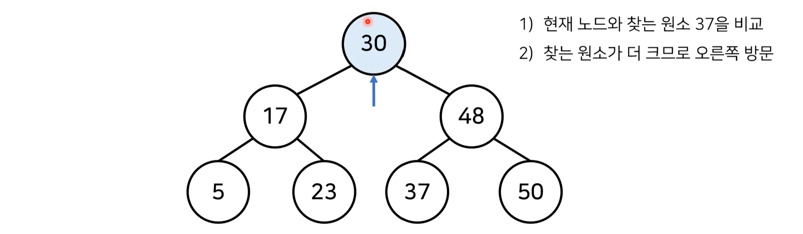
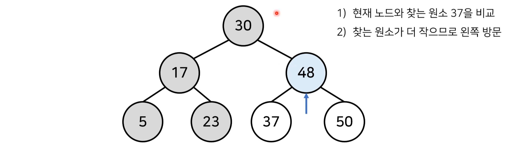
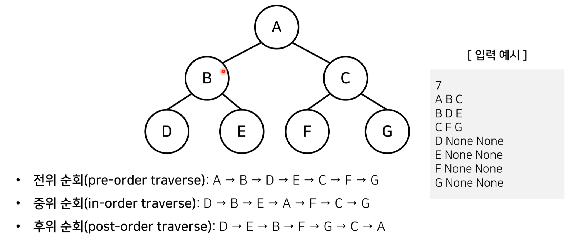

# 3_활용도가 높은 자료구조: 트리 자료 구조[↩](../README.md)

## content📑

1. [트리(Tree)](##3_1-트리(Tree)📑)
2. [이진탐색트리](##3_2-이진탐색트리(Binary-Search-Tree)📑)
3. [트리의 순회](##3_3-트리의 순회(Tree-Travesal)📑)
## 3_1 트리(Tree)[📑](##content📑)

* 트리는 가계도와 같은 **계층적인 구조**를 표현할 때 사용할 수 있는 자료구조입니다.



* **[ 트리 관련 용어 ]**
  * 루트노드(root node) : 부모가 없는 최상위 노드
  * 단말 노드(leaf node) : 자식이 없는 노드
  * 크기(size) : 트리에 포함된 모든 노드의 개수
  * 깊이(depth) : 루트 노드부터의 거리
  * 높이(height) : 깊이 중 최댓값
  * 차수(degree) : 각 노드의 (자식 방향) 간선 개수

* 기본적으로 트리의 크기가 N일때, 전체 간선의 개수는 N-1개 입니다.

## 3_2 이진탐색트리(Binary Search Tree)[📑](##content📑)



* 이진 탐색이 동작할 수 있도록 고안된 효율적인 탐색이 가능한 자료구조의 일종입니다.
* 이진 탐색 트리의 특징 : 왼쪽 자식 노드 < 부모노트 < 오른쪽 자식 노드
  * 부모노드보다 왼쪽 자식 노드가 작습니다.
  * 부모노드보다 오른쪽 자식 노드가 큽니다.


### 데이터를 조회하는 과정

* 이진 탐색 트리가 이미 구성되어 있다고 가정하고 데이터를 조회하는 과정을 살펴봅시다.
* 찾고자 하는 원소 : 37
* [Step1] 루트 노트부터 방문하여 탐색을 진행합니다.



* [Step2] 현재 노드와 값을 비교합니다.



* [Step3] 현재 노드와 값을 비교합니다.


## 3_3 트리의 순회(Tree Travesal)[📑](##content📑)

* 트리 자료구조에 포함된 노드를 특정한 방법으로 한 번씩 방문하는 방법을 의미합니다.
  * 트리의 정보를 시각적으로 확인할 수 있습니다.
* **대표적인 트리 순회** 방법은 다음과 같습니다.
  * **전위 순회(Pre-order traverse)**:루트를 먼저 방문합니다.
  * **중위 순회(in-order traverse)**: 왼쪽 자식을 방문한 뒤에 루트를 방문합니다.
  * **후위 순회(post-order traverse)**: 오른쪽 자식을 방문한 뒤에 루트를 방문합니다.



```python
class Node:
    def __init__(self, data, left_node, right_node):
        self.data = data
        self.left_node = left_node
        self.right_node = right_node

# 전위 순회 
def pre_order(node):
    print(node.data, end=' ')
    if node.left_node != None:
        pre_order(tree[node.left_node])
    if node.right_node != None:
        pre_order(tree[node.right_node])

# 중위 순회
def in_order(node):
    if node.ledt_node != None:
        in_order(tree[node.left_node])
    print(node.data, end=' ')
    if node.right_node != None:
        in_order(tree[node.right_node])

# 후위 순회
def post_order(node):
    if node.left_node != None:
        post_order(tree[node.left_node])
    if node.right_node != None:
        post_order(tree[node.right_node])
    print(node.data, end=' ')

n = int(input())
tree = {}

for i in range(n):
    data, left_node, right_node = input().split()
    if left_node == "None":
        left_node = None
    if right_node == "None":
        right_node = None
    tree[data] = Node(data, left_node, right_node)
    
#입력
7
A B C
B D E
C F G
D None None
E None None
F None None
G None None
    
#결과   
A B D E C F G 
D B E A F C G 
D E B F G C A
```

