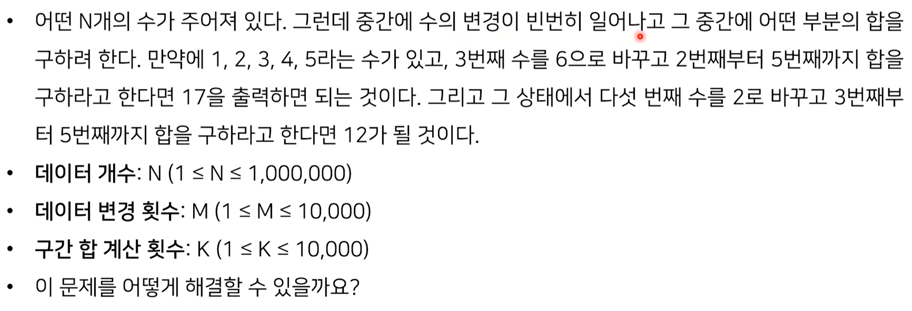
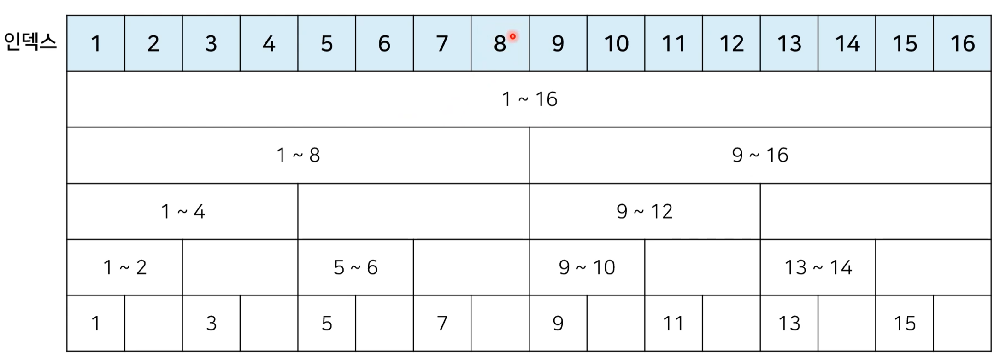
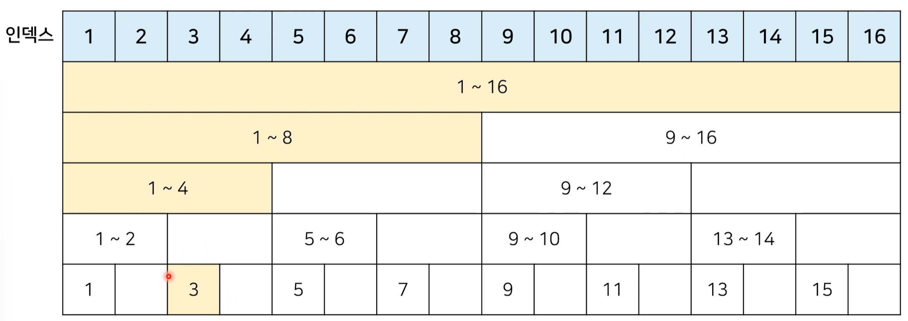
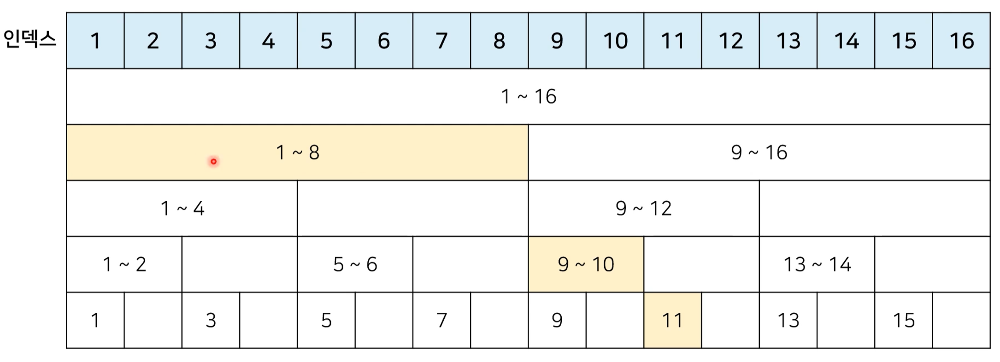

# 4_특수한 목적의 자료구조: 바이너리 인덱스 트리[↩](../README.md)

## content📑

1. [트리(Tree)](##4_1-데이터-업데이트가-가능한-상황에서의-구간-합(Interval-Sum)문제📑)
2. [이진탐색트리](##4_2-바이너리-인덱스-트리(Binary-Indexed-Tree)📑)
## 4_1 데이터 업데이트가 가능한 상황에서의 구간 합(Interval Sum)문제[📑](##content📑)

* BOJ '구간 합 구하기' 문제 : https://www.acmicpc.net/problem/2042



## 4_2 바이너리 인덱스 트리(Binary Indexed Tree)

* **바이너리 인덱스 트리(binary indexed tree)**는 2진법 인덱스 구조를 활용해 구간 합 문제를 효과적으로 해결해 줄 수 있는 자료구조를 의미합니다.
  * 펜윅 트리(fenwick tree)라고도 합니다.
* 정수에 따른 2진수 표기

| 정수 | 2진수 표기                          |
| ---- | ----------------------------------- |
| 7    | 00000000 00000000 00000000 00000111 |
| -7   | 11111111 11111111 11111111 11111001 |

* 0이 아닌 마지막 비트를 찾는 방법
  * 특정한 숫자 K의 0이 아닌 마지막 비트를 찾기 위해서 K & -K를 계산하면 됩니다.
* K & -K 계산 결과 예시

| 정수 K | 2진수 표기                          | K & -K |
| ------ | ----------------------------------- | ------ |
| 0      | 00000000 00000000 00000000 00000000 | 0      |
| 1      | 00000000 00000000 00000000 00000001 | 1      |
| 2      | 00000000 00000000 00000000 00000010 | 2      |
| 3      | 00000000 00000000 00000000 00000011 | 1      |
| 4      | 00000000 00000000 00000000 00000100 | 4      |
| 5      | 00000000 00000000 00000000 00000101 | 1      |
| 6      | 00000000 00000000 00000000 00000110 | 2      |
| 7      | 00000000 00000000 00000000 00000111 | 1      |
| 8      | 00000000 00000000 00000000 00001000 | 8      |

```python
n = 8

for i in range(n +1):
    print(i, "의 마지막 비트:", (i & -i))

## <결과>
0 의 마지막 비트: 0
1 의 마지막 비트: 1
2 의 마지막 비트: 2
3 의 마지막 비트: 1
4 의 마지막 비트: 4
5 의 마지막 비트: 1
6 의 마지막 비트: 2
7 의 마지막 비트: 1
8 의 마지막 비트: 8
```

* **트리 구조 만들기**: 0이 아닌 마지막 비트 = 내가 저장하고 있는 값들의 개수



* **특정 값을 변경할 때**: 0이 아닌 마지막 비트만큼 더하면서 구간들의 값을 변경(예시=3rd)



* **1부터 N까지의 합(누적 합) 구하기** : 0이 아닌 마지막 비트만큼 빼면서 구간들의 값의 합 계산(예시 = 11th)



```python
# 구간 합 구하기 https://www.acmicpc.net/problem/2042

import sys
input = sys.stdin.readline

# 데이터의 개수(n), 변경횟수(m), 구간 합 계산 횟수(k)
n, m, k = map(int, input().split())

# 전체 데이터의 개수는 최대 1,000,000 개
arr = [0] * (n + 1)
tree = [0] * (n + 1)

# i번째 수까지의 누적 합을 계산하는 함수
def prefix_sum(i):
    result = 0
    while i > 0:
        result += tree[i]
        #0 이 아닌 마지막 비트만큼 빼가면서 이동
        i -= (i & -i)
    return result

# i번째 수를 dif 만큼 더하는 함수
def update(i, dif):
    while i <= n:
        tree[i] += dif
        i += (i & -i)

#start부터 end 까지의 구간 합을 계산하는 함수
def interval_sum(start, end):
    return prefix_sum(end) - prefix_sum(start-1)

for i in range(1, n+1):
    x = int(input())
    arr[i] = x
    update(i, x)

for i in range(m + k):
    a, b, c = map(int, input().split())
    # 업데이트(updata) 연산인 경우
    if a == 1:
        update(b, c -arr[b]) #바뀐 크기(dif)만큼 적용
        arr[b] = c
    # 구간 합(interval sum) 연산인 경우
    else:
        print(interval_sum(b,c))
        
# 입력
5 2 2
1
2
3
4
5
1 3 6
2 2 5
1 5 2
2 3 5

# 출력
17
12
```

