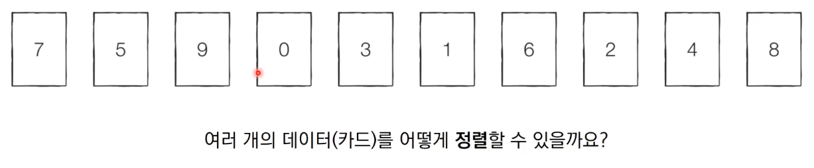
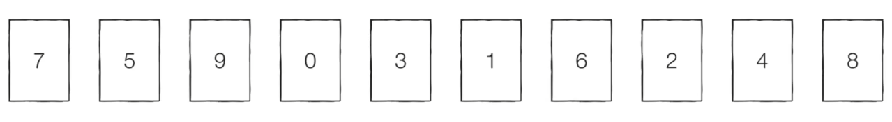
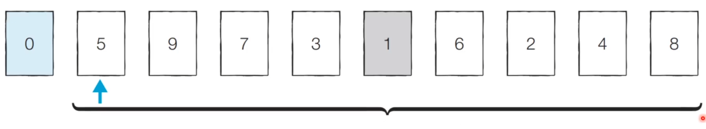
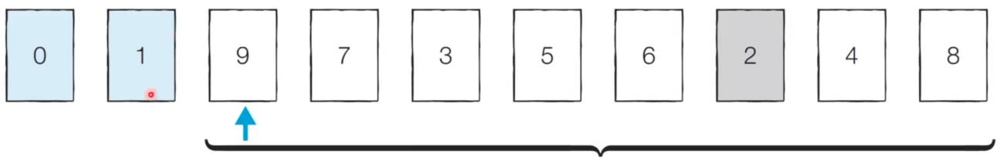
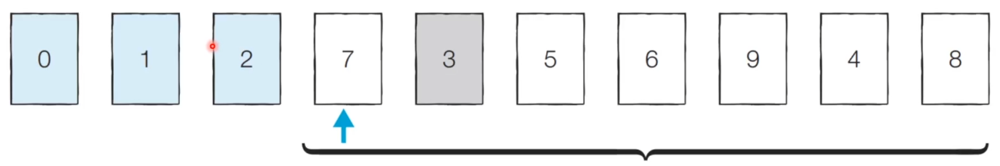
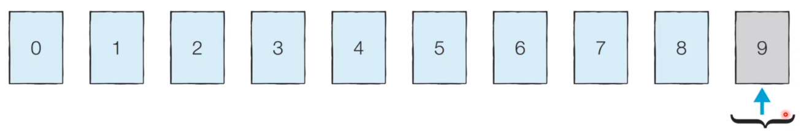
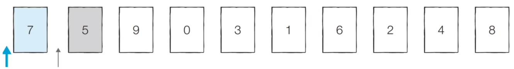

# 5_간단하면서 기본적인 정렬 알고리즘: 선택 정렬과 삽입 정렬[↩](../README.md)

## content📑

1. [트리(Tree)](##4_1-데이터-업데이트가-가능한-상황에서의-구간-합(Interval-Sum)문제📑)
2. [이진탐색트리](##4_2-바이너리-인덱스-트리(Binary-Indexed-Tree)📑)
## 5_1 정렬 알고리즘[📑](##content📑)

* **정렬(Sorting)**이란 <u>데이터를 특정한 기준에 따라 순서대로 나열하는 것</u>을 말합니다.
* 일반적으로 문제 상황에 따라서 적절한 정렬 알고리즘이 공식처럼 사용됩니다.



## 5_2 선택 정렬

* 처리되지 않은 데이터 중에서 **가장 작은 데이터를 <u>선택</u>해 맨 앞에 있는 데이터와 바꾸는 것**을 반복합니다.

* 정렬할 데이터를 준비합니다.



* [Step 1] 처리되지 않은 데이터 중 가장 작은 '1'을 선택해 가장 앞의 '5'와 바꿉니다.



* [Step 2] 처리되지 않은 데이터 중 가장 작은 '2'를 선택해 가장 앞의 '9'와 바꿉니다.



* [Step 3] 처리되지 않은 데이터 중 가장 작은 '3'을 선택해 가장 앞의 '7'과 바꿉니다.



* 이러한 과정을 반복하면 다음과 같이 정렬이 완료됩니다.



* 선택 정렬 소스코드 - python

```python
array = [7, 5, 9, 0, 3, 1, 6, 2, 4, 8]

for i in range(len(array)):
    min_index = i # 가장 작은 원소의 인덱스
    for j in range(i + 1, len(array)):
        if array[min_index] > array[j]:
            min_index = j
    array[i], array[min_index] = array[min_index], array[i] # 스와프

print(array)

# 결과
[0, 1, 2, 3, 4, 5, 6, 7, 8, 9]
```

### 선택 정렬의 시간 복잡도

* 선택 정렬은 N번 만큼 가장 작은 수를 찾아서 맨 앞으로 보내야 합니다.
* 구현 방식에 따라서 사소한 오차는 있을 수 있지만, 전체 연산 횟수는 다음과 같습니다.


* 이는 (N^2 + N - 2) / 2로 표현할 수 있는데, 빅오 표기법에 따라서 O(N^2)이라고 작성합니다.

## 5_2 삽입 정렬

* 처리되지 않은 데이터를 하나씩 골라 **적절한 위치에 삽입**합니다.
* 선택 정렬에 비해 구현 난이도가 높은 편이지만, 일반적으로 더 효율적으로 동작합니다.

* [Step 0] 첫 번재 데이터 '7'은 그 자체로 정렬이 되어 있다고 판단하고, 두 번째 데이터인 '5'가 어떤 위치로 들어갈지 판단합니다. '7'의 왼쪽으로 들어가거나 오른쪽으로 들어가거나 두 경우만 존재합니다.


