# 6_더 빠른 정렬 알고리즘: 퀵 정렬과 계수 정렬[↩](../dongbinna_algorithm)

## contents📑<a id="contents"></a>

1. [퀵 정렬](#퀵-정렬)
2. [계수 정렬](#계수-정렬)
## 6_1 퀵 정렬[📑](#contents)<a id="퀵-정렬"></a>

* <u>기준 데이터를 설정</u>하고 그 **기준보다 큰 데이터와 작은 데이터의 위치를 바꾸는 방법**입니다.
* 일반적인 상황에서 가장 많이 사용되는 정렬 알고리즘 중 하나입니다.
* 병합 정렬과 더불어 대부분의 프로그래밍 언어의 정렬 라이브러리의 근간이 되는 알고리즘입니다.
* 가장 기본적인 퀵 정렬은 **첫번째 데이터를 기준 데이터(Pivot)로 설정**합니다.

### 퀵 정렬 동작 예시

* [Step0] 현재 피벗의 값은 '5'입니다. 왼쪽에서부터'5'보다 큰데이터를 선택하므로 '9'가 선택되고, 오른쪽에서 부터 '5'보다 작은 데티어를 선택하므로'2'가 선택됩니다. 이제 이 두 데이터의 위치를 서로 변경합니다.

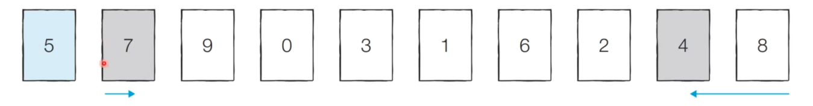

* [Step1] 현재 피벗의 값은 '5'입니다. 왼쪽에서부터 '5'보다 큰 데이터를 선택하므로 '9'가 선택되고, 오른쪽부터 '5'보다 작은 데이터를 선택하므로 '2'가 선택됩니다. 이제 이 두 데이터의 위치를 서로 변경합니다.

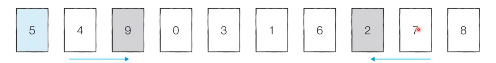

* [Step2] 현재 피벗의 값은 '5'입니다. 왼쪽에서부터 '5'보다 큰 데이터를 선택하므로 '6'이 선택되고, 오른쪽에서부터 '5'보다 작은 데이터를 선택하므로 '1'이 선택됩니다. 단, 이처럼 **위치가 엇갈리는 경우 '피벗'과 '작은 데이터'의 위치를 서로 변경**합니다.

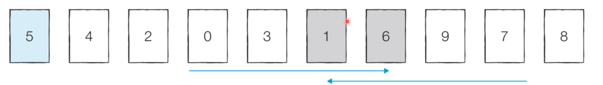

* [분할 완료] 이제'5'의 왼쪽에 있는 데이터는 모두 5보다 작고, 오른쪽에 있는 데이터는 모두 '5'보다 크다는 특징이 있습니다. 이렇게 <u>피벗을 기준으로 데이터 묶음을 나누는 작업</u>을 **분할(Divide)**이라고 합니다.

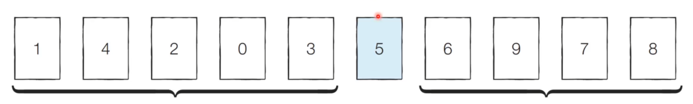

* [왼쪽 데이터 묶음 정렬] 왼쪽에 있는 데이터에 대해서 마찬가지로 정렬을 수행합니다.


* [오른쪽 데이터 묶음 정렬] 오른쪽에 있는 데이터에 대해서 마찬가지로 정렬을 수행합니다.
  * 이러한 과정을 반복하면 전체 데이터에 대해서 정렬이 수행됩니다.

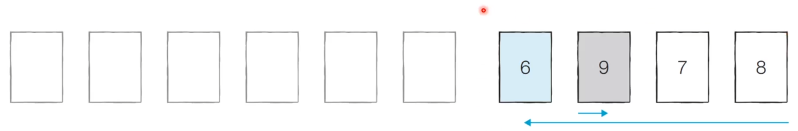

### 퀵 정렬이 빠른 이유: 직관적인 이해

* 이상적인 경우 분할이 절반씩 일어난다면 전체 연산 횟수로 O(NlogN)를 기대할 수 있습니다.
  * 너비*높이  = N * logN = NlogN

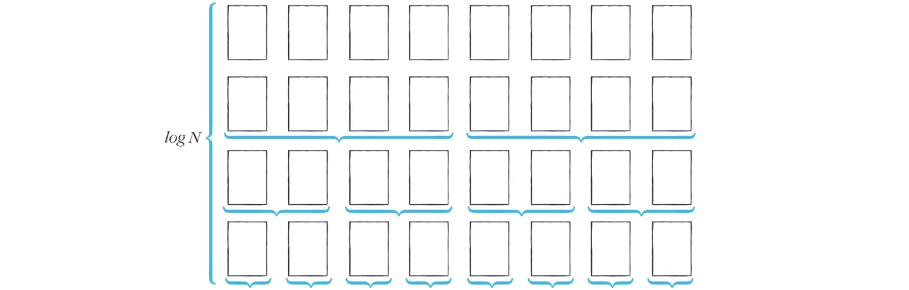

### 퀵 정렬의 시간 복잡도

* 퀵 정렬은 평균의 경우 O(NlogN)의 시간 복잡도를 가집니다.
* 하지만 최악의 경우 O(N^2)의 시간 복잡도를 가집니다.
  * 첫 번째 원소를 피벗으로 삼을때, 이미 정렬된 배열에 대해서 퀵 정렬을 수행한다면 어떻게 될까요?


단, 표준 라이브러리를 이용할 경우엔 NlogN을 항상 보장함.

* 퀵정렬 소스코드: 일반적인 방식 - python

```python
array = [5, 7, 9, 0, 3, 1, 6, 2, 4, 8]

def quick_sort(array, start, end):
    if start >= end:    # 원소가 1개인 경우 종료
        return
    pivot = start       # 피벗은 첫번째 원소
    left = start + 1
    right = end
    while (left <= right):
        # 피벗보다 큰 데이터를 찾을때 까지 반복
        while(left <= end and array[left] <=array[pivot]):
            left +=1
        # 피벗보다 작은 데이터를 찾을때까지 반복
        while (right > start and array[right] >= array[pivot]):
            right -= 1
        if(left > right):   # 엇갈렸다면 작은 데이터와 피벗을 교체
            array[right], array[pivot] = array[pivot], array[right]
        else:               # 엇갈리지 않았다면 작은 데이터와 큰 데이터를 교체
            array[left], array[right] = array[right], array[left]
    # 분할 이후 왼쪽 부분 과 오른쪽 부분에서 각각 정렬 수행
    quick_sort(array, start, right - 1)
    quick_sort(array, right + 1, end)

quick_sort(array, 0, len(array) -1)
print(array)

[0, 1, 2, 3, 4, 5, 6, 7, 8, 9]
```

* 퀵 정렬 소스코드 : 파이썬의 장점을 살린 방식

```python
array = [5, 7, 9, 0, 3, 1, 6, 2, 4, 8]


def quick_sort(array):
    # 리스트가 하나 이하의 원소만을 담고 있다면 종료
    if len(array) <= 1:
        return array
    pivot = array[0]    # 피벗은 첫 번째 원소
    tail = array[1:]    # 피벗을 제외한 리스트

    left_side = [x for x in tail if x <= pivot] # 분할된 왼쪽 부분
    right_side = [x for x in tail if x > pivot] # 분할된 오른쪽 부분

    # 분할 이후 왼쪽 부분과 오른쪽 부분에서 각각 정렬 수행하고, 전체 리스트 반환
    return quick_sort(left_side) + [pivot] + quick_sort(right_side)
    
print(quick_sort(array))

[0, 1, 2, 3, 4, 5, 6, 7, 8, 9]
```

## 6_2 계수 정렬[📑](#contents)<a id="계수-정렬"></a>

* 특정한 조건이 부합할때만 사용할 수 있지만 **매우 빠르게 동작하는** 정렬 알고리즘입니다.
  * 계수 정렬은 **데이터의 크기 번위가 제한 되어 정수 형태로 표현할 수 있을 때** 사용가능합니다.
* 데이터의 개수가 N, 데이터(양수) 중 최댓값이 K일때, 최악의 경우 에도 수행시간 **O(N+K)**를 보장합니다.

### 계수 정렬 동작 예시

* [Step0] 가장 작은 데이터로부터 가장 큰 데이터까지의 범위가 모두 담길 수 있도록 리스트를 생성합니다.
* 정렬할 데이터: 7 5 9 0 3 1 6 2 9 4 8 0 5 2

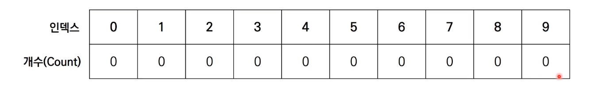

* [Step1] 데이터를 하나씩 확인하며 데이터의 값과 동일한 인덱스의 데이터를 1씩 증가시킵니다.

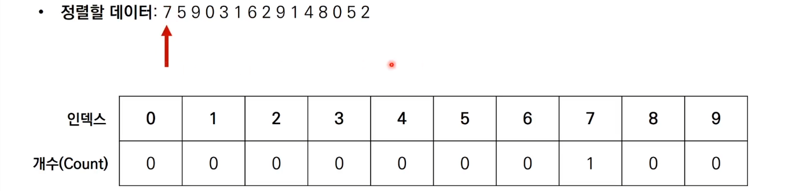


* [Step2] 데이터를 하나씩 확인하며 데이터의 값과 동일한 인덱스의 데이터를 1씩 증가시킵니다.

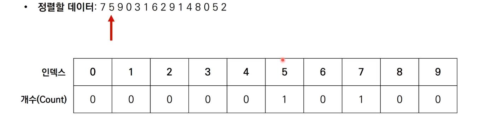

* [Step3] 데이터를 하나씩 확인하며 데이터의 값과 동일한 인덱스의 데이터를 1씩 증가시킵니다.

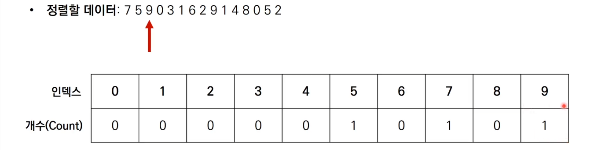

* [Step15] 데이터를 하나씩 확인하며 데이터의 값과 동일한 인덱스의 데이터를 1씩 증가시킵니다.

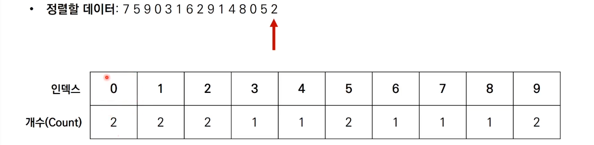

* 결과를 확인할때는 리스트의 첫번째 데이터부터 하나씩 그 값만큼 반복하여 인덱스를 출력합니다.

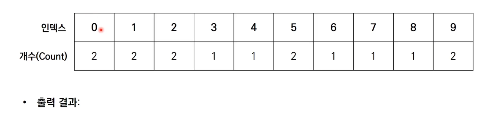

* 출력결과 : 0 0 1 1 2 2 3 4 5 5 6 7 8 9 9

* 계수 정렬 소스코드 - python

```python
# 모든 원소의 값이 0보다 크거나 같다고 가정
array = [7,5,9,0,3,1,5,2,9,1,4,8,0,5,2]
# 모든 범위를 포함하는 리스트 선언(모든 값은 0으로 초기화)
count = [0]*(max(array)+1)

for i in range(len(array)):
    count[array[i]] += 1    # 각 데이터에 해당하는 인덱스의 값 증가

for i in range(len(count)): # 리스트에 기록된 정렬 정보 확인
    for j in range(count[i]):
        print(i, end=' ')   # 띄어쓰기를 구분으로 등장한 횟수 만큼 인덱스 출력
        
0 0 1 1 2 2 3 4 5 5 5 7 8 9 9
```

### 계수 정렬의 시간 복잡도

* 계수 정렬의 시간 복잡도와 공간 복잡도는 모두 O(N+K)입니다.
* 계수 정렬은 때에 따라서 심각한 비효율성을 초래할 수 있습니다.
  * 데이터가 0과 999,999로 단 2개만 존재하는 경우를 생각해봅시다.
* 계수 정렬은 동일한 값을 가지는 데이터가 여러 개 등장할 때 효과적으로 사용할 수 있습니다.
  * 성적의 경우 100점을 맞은 학생이 여러 명일 수 있기때문에 계수 정렬이 효과적입니다.
