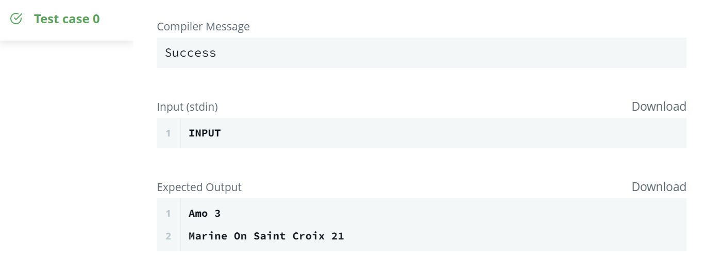

# 📝SQL IM1 : Weather Observation Station 5

> 문제 URL [🔗](https://www.hackerrank.com/challenges/weather-observation-station-5/problem?isFullScreen=true)

Query the two cities in **STATION** with the shortest and longest *CITY* names, as well as their respective lengths (i.e.: number of characters in the name). If there is more than one smallest or largest city, choose the one that comes first when ordered alphabetically.
The **STATION** table is described as follows:


where **LAT_N** is the northern latitude and **LONG_W** is the western longitude.

**Sample Input**

For example, **CITY** has four entries: **DEF, ABC, PQRS** and **WXY**.

## Sample Output

```sql
ABC 3
PQRS 4
```

## Explanation

When ordered alphabetically, the **CITY** names are listed as **ABC, DEF, PQRS,** and **WXY**, with lengths and . The longest name is **PQRS**, but there are options for shortest named city. Choose **ABC**, because it comes first alphabetically.

### **Note**
You can write two separate queries to get the desired output. It need not be a single query.

## ✏️정답

```mysql
(SELECT CITY, LENGTH(CITY) FROM STATION
    WHERE LENGTH(CITY) = (SELECT MIN(LENGTH(CITY)) FROM STATION)
ORDER BY CITY LIMIT 1)
UNION ALL
(SELECT CITY, LENGTH(CITY) FROM STATION
    WHERE LENGTH(CITY) = (SELECT MAX(LENGTH(CITY)) FROM STATION)
ORDER BY CITY LIMIT 1)
```

### 성공😊



* 이 문제는 `STATION` 테이블에서 가장 긴 도시 이름을 가진 도시와 가장 짧은 도시 이름을 가진 도시의 도시 이름과 도시 이름이 가진 글자 수를 추출하는 문제

* 단, 가장 길거나 짦은 도시 이름을 가진 도시의 글자 수가 복수일 경우 알파벳 상 오름차순으로 가장 상위의 도시와 도시 이름의 길이만 출력해야 함.

* 이를 위해 가장 긴 이름의 도시와 도시 이름의 길이, 가장 짧은 이름의 도시와 도시 이름의 길이를 출력하는 쿼리를 다음과 같이 만듦.

  ```mysql
  -- 가장 짧은 이름의 도시 이름
  SELECT CITY, LENGTH(CITY) FROM STATION
      WHERE LENGTH(CITY) = (SELECT MIN(LENGTH(CITY)) FROM STATION)
  ORDER BY CITY LIMIT 1
  ```

  * 서브 쿼리를 사용하여 가장 짧은 길이의 도시 이름을 가진 도시와 도시 이름의 글자 수를 출력
  * `ORDER BY CITY LIMIT 1` 이 코드는 도시 이름을 가진 도시의 글자 수가 복수일 경우 알파벳 상 오름차순으로 가장 상위를 출력하기 위해 사용

* 도시 이름의 글자 수가 가장 짧은 도시와 글자수, 도시 이름의 글자 수가 가장 긴 도시와 글자수를 각각 1개씩 출력해주기 위해 `UNION ALL`로 묶어 줌.

  ```mysql
  (...)
  UNION ALL
  (...)
  ```

  