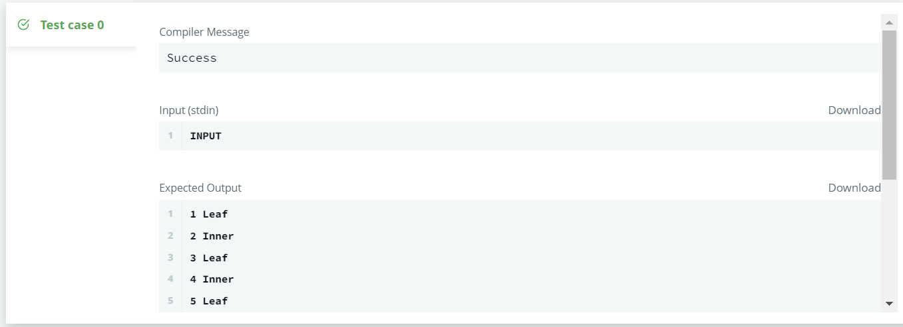

# 📝SQL IM Problem2 : Binary Tree Nodes

> 문제 URL [🔗](https://www.hackerrank.com/challenges/binary-search-tree-1/problem?isFullScreen=true)

You are given a table, *BST*, containing two columns: *N* and *P,* where *N* represents the value of a node in *Binary Tree*, and *P* is the parent of *N*.


Write a query to find the node type of *Binary Tree* ordered by the value of the node. Output one of the following for each node:

- *Root*: If node is root node.
- *Leaf*: If node is leaf node.
- *Inner*: If node is neither root nor leaf node.

**Sample Input**


**Sample Output**

```
1 Leaf
2 Inner
3 Leaf
5 Root
6 Leaf
8 Inner
9 Leaf
```

**Explanation**

The *Binary Tree* below illustrates the sample:


## ✏️정답

```mysql
SELECT distinct(a.N), CASE 
            WHEN b.N is NULL THEN 'Leaf'
            WHEN a.P is NULL THEN 'Root'
            ELSE 'Inner' END
FROM BST a
LEFT JOIN BST b
ON a.N = b.P
ORDER BY a.N
```

### 성공😊



* 이 문제는 `BST` 테이블의 노드의 `Leaf Node`와 `Root Node`를 찾는 문제이다.

* 먼저, 테이블에 담긴 부모노드의 정보를 이용하여 `LEFT JOIN`을 사용하여 자식 노드가 있는지 확인한다.

  ```mysql
  FROM BST a
  LEFT JOIN BST b
  ON a.N = b.P
  ORDER BY a.N
  ```

* 그리고 `CASE`로 `Leaf`, `Root`, `Inner`를 구분해준다.