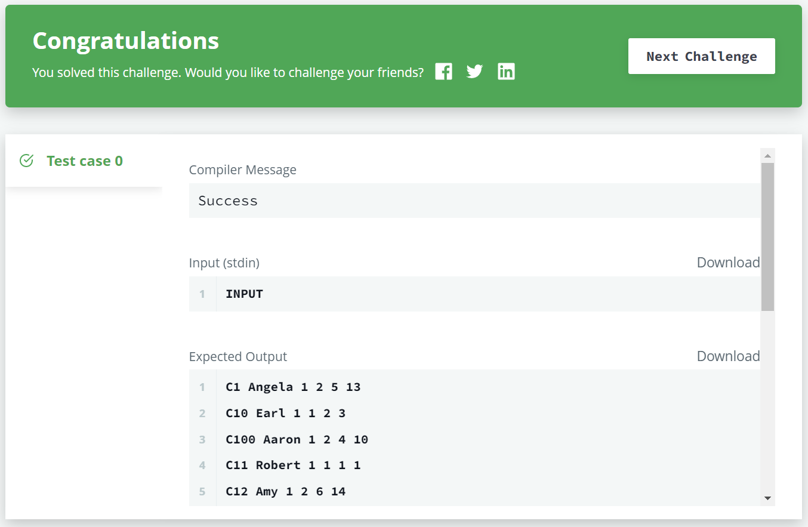
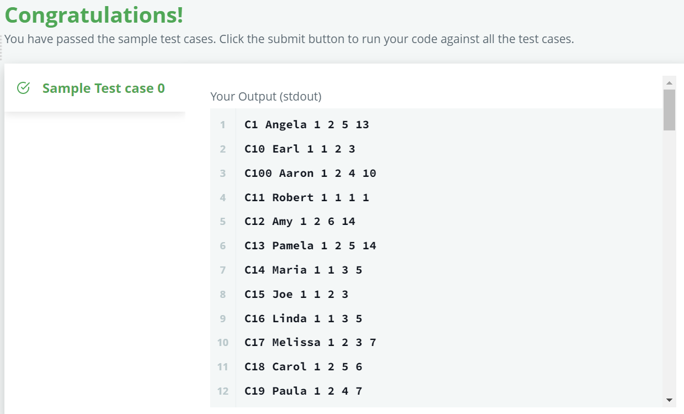

# 📝SQL IM Problem3 : New Companies[↩](../)

> 문제 URL [🔗](https://www.hackerrank.com/challenges/the-company/problem?isFullScreen=true)

Amber's conglomerate corporation just acquired some new companies. Each of the companies follows this hierarchy: 

Given the table schemas below, write a query to print the *company_code*, *founder* name, total number of *lead* managers, total number of *senior* managers, total number of *managers*, and total number of *employees*. Order your output by ascending *company_code*.

**Note:**

- The tables may contain duplicate records.
- The *company_code* is string, so the sorting should not be **numeric**. For example, if the *company_codes* are *C_1*, *C_2*, and *C_10*, then the ascending *company_codes* will be *C_1*, *C_10*, and *C_2*.

------

**Input Format**

The following tables contain company data:

- *Company:* The *company_code* is the code of the company and *founder* is the founder of the company. 
- *Lead_Manager:* The *lead_manager_code* is the code of the lead manager, and the *company_code* is the code of the working company. 
- *Senior_Manager:* The *senior_manager_code* is the code of the senior manager, the *lead_manager_code* is the code of its lead manager, and the *company_code* is the code of the working company. 
- *Manager:* The *manager_code* is the code of the manager, the *senior_manager_code* is the code of its senior manager, the *lead_manager_code* is the code of its lead manager, and the *company_code* is the code of the working company. 
- *Employee:* The *employee_code* is the code of the employee, the *manager_code* is the code of its manager, the *senior_manager_code* is the code of its senior manager, the *lead_manager_code* is the code of its lead manager, and the *company_code* is the code of the working company. 

------

**Sample Input**

*Company* Table:  *Lead_Manager* Table:  *Senior_Manager* Table:  *Manager* Table:  *Employee* Table: 

**Sample Output**

```
C1 Monika 1 2 1 2
C2 Samantha 1 1 2 2
```

**Explanation**

In company *C1*, the only lead manager is *LM1*. There are two senior managers, *SM1* and *SM2*, under *LM1*. There is one manager, *M1*, under senior manager *SM1*. There are two employees, *E1* and *E2*, under manager *M1*.

In company *C2*, the only lead manager is *LM2*. There is one senior manager, *SM3*, under *LM2*. There are two managers, *M2* and *M3*, under senior manager *SM3*. There is one employee, *E3*, under manager *M2*, and another employee, *E4*, under manager, *M3*.

## ✏️정답

### 1차 시도

```mysql
SELECT  c.company_code, 
        ANY_VALUE(c.founder), 
        COUNT(DISTINCT(e.lead_manager_code)), 
        COUNT(DISTINCT(e.senior_manager_code)), 
        COUNT(DISTINCT(e.manager_code)), 
        COUNT(DISTINCT(e.employee_code))
FROM employee e
JOIN company c ON c.company_code = e.company_code
GROUP BY c.company_code
```

### 성공😊



* 이 문제는 `company_code` 별 `founder`와 `lead_manager`, `senior_manager`, `manager`, `employee`의 총계를 출력하는 문제이다.

* `employee` 테이블에 `lead_manager`, `senior_manager`, `manager`, `employee`의 코드가 다 담겨 있으므로 `founder`가 정보가 담긴 `company`테이블과 `JOIN`

* `GROUP BY`이용시 `SELECT`에 집계함수외의 컬럼이 있을 경우 `only full group by`오류 발생

  * `GROUP BY` 에 비집계 컬럼을 다 써줘서 해결할 수 있음.

    ```mysql
    GROUP BY c.company_code, c.founder -- company_code는 고유키
    ```

  * 혹은 비집계 컬럼이지만 컬럼에 표현하고 싶은 컬럼에 `ANY_VALUE()`를 사용

    ```mysql
    SELECT	c.company_code, -- company_code는 고유키
    		ANY_VALUE(c.founder), 
    		... 
    ```

### 2차 시도

```mysql
SELECT	c.company_code, 
		c.founder, 
		COUNT(DISTINCT(l.lead_manager_code)), 
		COUNT(DISTINCT(s.senior_manager_code)), 
		COUNT(DISTINCT(m.manager_code)), 
		COUNT(DISTINCT(e.employee_code))
FROM employee e
JOIN company c ON c.company_code = e.company_code
JOIN Manager m ON m.manager_code = e.manager_code
JOIN Senior_Manager s ON s.senior_manager_code = e.senior_manager_code
JOIN Lead_Manager l ON l.lead_manager_code = e.lead_manager_code
GROUP BY c.company_code, c.founder
```

### 성공😊



## 다른 풀이🤝

> 수민님 풀이

```mysql
SELECT c.company_code, c.founder,
       COUNT(DISTINCT(l.lead_manager_code)), COUNT(DISTINCT(s.senior_manager_code)),
       COUNT(DISTINCT(m.manager_code)), COUNT(DISTINCT(e.employee_code))
FROM company c, lead_manager l, senior_manager s, manager m, employee e
WHERE c.company_code = l.company_code AND
      l.lead_manager_code = s.lead_manager_code AND
      s.senior_manager_code = m.senior_manager_code AND
      m.manager_code = e.manager_code
GROUP BY c.company_code, c.founder 
ORDER BY c.company_code
```

* 다음과 같이 모든 테이블을 다 가져옴.

  ```mysql
  FROM company c, lead_manager l, senior_manager s, manager m, employee e
  ```

* 이후, 코드가 같은 것들만 `WHERE`로 필터링

  ```mysql
  WHERE c.company_code = l.company_code AND
        l.lead_manager_code = s.lead_manager_code AND
        s.senior_manager_code = m.senior_manager_code AND
        m.manager_code = e.manager_code
  ```

  