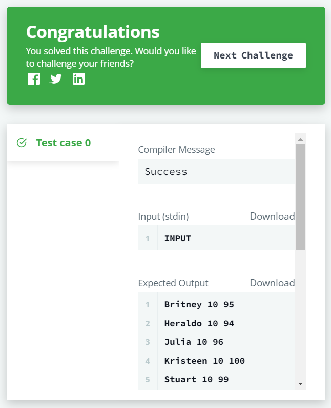

# 📝SQL IM Problem 5 : The Report[↩](../)

> 문제 URL [🔗](https://www.hackerrank.com/challenges/the-report/problem?isFullScreen=true)

You are given two tables: *Students* and *Grades*. *Students* contains three columns *ID*, *Name* and *Marks*.


*Grades* contains the following data:


*Ketty* gives *Eve* a task to generate a report containing three columns: *Name*, *Grade* and *Mark*. *Ketty* doesn't want the NAMES of those students who received a grade lower than *8*. The report must be in descending order by grade -- i.e. higher grades are entered first. If there is more than one student with the same grade (8-10) assigned to them, order those particular students by their name alphabetically. Finally, if the grade is lower than 8, use "NULL" as their name and list them by their grades in descending order. If there is more than one student with the same grade (1-7) assigned to them, order those particular students by their marks in ascending order.

Write a query to help Eve.

**Sample Input**


**Sample Output**

```
Maria 10 99
Jane 9 81
Julia 9 88 
Scarlet 8 78
NULL 7 63
NULL 7 68
```


**Note**

Print "NULL" as the name if the grade is less than 8.

**Explanation**

Consider the following table with the grades assigned to the students:


So, the following students got *8*, *9* or *10* grades:

- *Maria (grade 10)*
- *Jane (grade 9)*
- *Julia (grade 9)*
- *Scarlet (grade 8)*

## ✏️정답

### 1차 시도

```mysql
SELECT IF(GRADE < 8, NULL, NAME), GRADE, MARKS
FROM STUDENTS JOIN GRADES
WHERE MARKS BETWEEN MIN_MARK AND MAX_MARK
ORDER BY GRADE DESC, IF(GRADE < 8, NULL, NAME)
```

### 성공😊



* 이 문제는 *Students*, *Grade* 테이블을 사용하여 학생들의 `mark`에 따른 등급을 매기는 문제임.

* 이 문제에서 쿼리 구현의 핵심은 다음과 같음.

  * 등급 구간이 담긴 *Grade*테이블이 별도로 제공되어 이에 맞게 등급을 매겨야 함.
  * 8등급 보다 작은 등급인 학생들의 이름을 NULL로 바꿔야 함.

* ` JOIN`명령어를 사용하되 `ON`조건을 달지 않아 `CROSS JOIN`을 사용

  > 
  > `CROSS JOIN`(교차 조인) : 두 테이블의 데이터의 모든 조합을 받아옴.

  * 이와 같은 교차 조인의 원리를 이용하여 모든 데이터의 조합 중 등급 구간에 맞는 조합만을 도출

    ```mysql
    WHERE MARKS BETWEEN MIN_MARK AND MAX_MARK
    ```

* IF문을 사용하여 8등급 이하인 학생의 이름을 `NULL`로 대체

  ```mysql
  IF(GRADE < 8, NULL, NAME)
  ```

