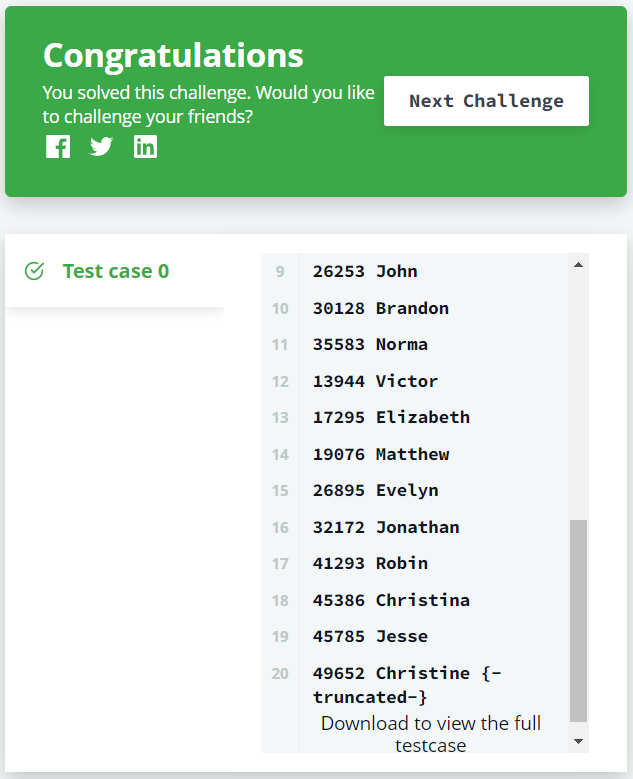

# 📝SQL IM Problem5 : Top Competitors[↩](../)

> 문제 URL [🔗](https://www.hackerrank.com/challenges/full-score/problem?isFullScreen=true)

Julia just finished conducting a coding contest, and she needs your help assembling the leaderboard! Write a query to print the respective *hacker_id* and *name* of hackers who achieved full scores for *more than one* challenge. Order your output in descending order by the total number of challenges in which the hacker earned a full score. If more than one hacker received full scores in same number of challenges, then sort them by ascending *hacker_id*.

------

**Input Format**

The following tables contain contest data:

- *Hackers:* The *hacker_id* is the id of the hacker, and *name* is the name of the hacker. 
- *Difficulty:* The *difficult_level* is the level of difficulty of the challenge, and *score* is the score of the challenge for the difficulty level. 
- *Challenges:* The *challenge_id* is the id of the challenge, the *hacker_id* is the id of the hacker who created the challenge, and *difficulty_level* is the level of difficulty of the challenge. 
- *Submissions:* The *submission_id* is the id of the submission, *hacker_id* is the id of the hacker who made the submission, *challenge_id* is the id of the challenge that the submission belongs to, and *score* is the score of the submission. 

------

**Sample Input**

*Hackers* Table:  *Difficulty* Table:  *Challenges* Table:  *Submissions* Table: 

**Sample Output**

```
90411 Joe
```

**Explanation**

Hacker *86870* got a score of *30* for challenge *71055* with a difficulty level of *2*, so *86870* earned a full score for this challenge.

Hacker *90411* got a score of *30* for challenge *71055* with a difficulty level of *2*, so *90411* earned a full score for this challenge.

Hacker *90411* got a score of *100* for challenge *66730* with a difficulty level of *6*, so *90411* earned a full score for this challenge.

Only hacker *90411* managed to earn a full score for more than one challenge, so we print the their *hacker_id* and *name* as space-separated values.

## ✏️정답

### 1차 시도

```mysql
SELECT
    SUB.id,
    SUB.name
FROM 
    (SELECT 
        S.hacker_id as id,
        ANY_VALUE(H.name) as name,
        COUNT(S.hacker_id) as cnt
    FROM
        SUBMISSIONS S
    INNER JOIN CHALLENGES C ON S.challenge_id = C.challenge_id
    INNER JOIN HACKERS H ON S.hacker_id = H.hacker_id
    INNER JOIN DIFFICULTY D ON C.difficulty_level = D.difficulty_level
    WHERE D.score = S.score
    GROUP BY S.hacker_id
    HAVING COUNT(S.hacker_id) >= 2
    ORDER BY COUNT(S.hacker_id) DESC, S.hacker_id) SUB
```

### 성공😊



* 이 문제는 코딩 콘테스트에서 제출된 풀이 중 문제에서 만점을 맞은 풀이를 2개 이상 갖고 있는 유저를 구하는 문제임.

* 다음은 문제를 풀기 위해 `JOIN`한 테이블

  ```mysql
  FROM
      SUBMISSIONS S
  INNER JOIN CHALLENGES C ON S.challenge_id = C.challenge_id
  INNER JOIN HACKERS H ON S.hacker_id = H.hacker_id
  INNER JOIN DIFFICULTY D ON C.difficulty_level = D.difficulty_level
  ```

  

  * `CHALLENGES` 테이블 : 문제의 난이도 확인
  * `HACKER`  테이블 : id 당 해커의 이름 확인
  * `DIFFICULTY` 테이블 : 제출된 풀이가 만점인지 확인

* 해당 풀이가 만점인지 확인

  ```mysql
  WHERE D.score = S.score
  ```

* 참가자 당 만접 풀이 갯수 확인 및 만점 풀이가 1개 이하인 참가자 제거

  ```mysql
  GROUP BY S.hacker_id
  HAVING COUNT(S.hacker_id) >= 2
  ```

* 만점이 많은 참가자 순서로 정렬, 만점인 풀이의 갯수가 같은 경우 `hacker_id`순으로 정렬

  ```mysql
  ORDER BY COUNT(S.hacker_id) DESC, S.hacker_id
  ```

* 서브쿼리를 FROM에 넣어주어 불필요한 `COUNT(S.hacker_id)`제거

### 2차 시도

```mysql
SELECT S.hacker_id as id, ANY_VALUE(H.name) as name
FROM SUBMISSIONS S
INNER JOIN CHALLENGES C ON S.challenge_id = C.challenge_id
INNER JOIN HACKERS H ON S.hacker_id = H.hacker_id
INNER JOIN DIFFICULTY D ON C.difficulty_level = D.difficulty_level
WHERE D.score = S.score
GROUP BY S.hacker_id
HAVING COUNT(S.hacker_id) >= 2
ORDER BY COUNT(S.hacker_id) DESC, S.hacker_id
```

### 성공😊

* 굳이 서브쿼리를 사용하지 않아도 됨.