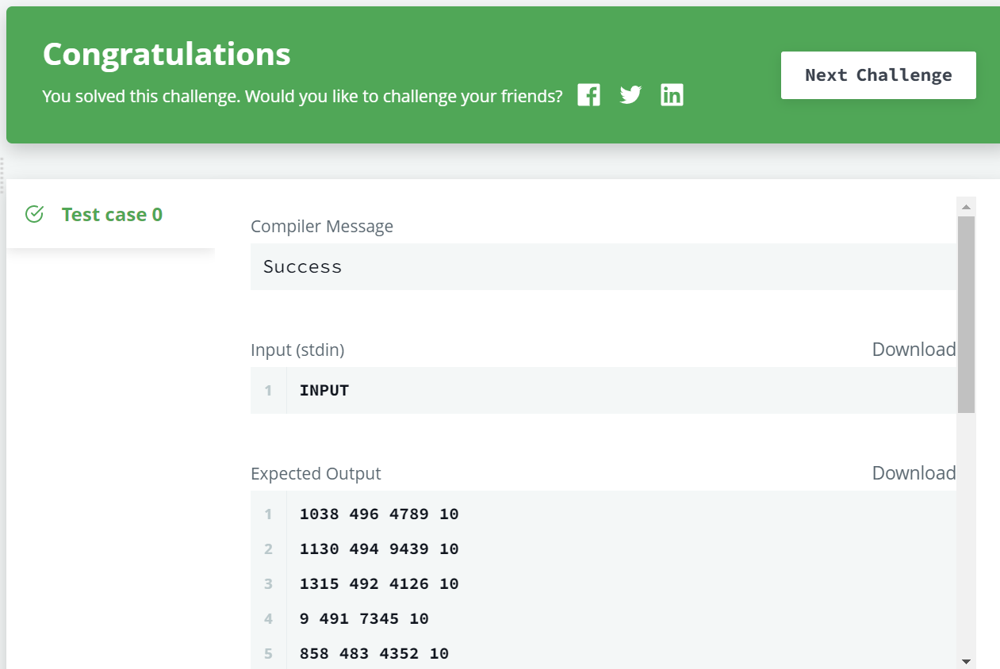

# 📝SQL IM Problem 7 : Ollivander's Inventory[↩](../)

> 문제 URL [🔗](https://www.hackerrank.com/challenges/harry-potter-and-wands/problem?isFullScreen=true)

Harry Potter and his friends are at Ollivander's with Ron, finally replacing Charlie's old broken wand.

Hermione decides the best way to choose is by determining the minimum number of gold galleons needed to buy each *non-evil* wand of high power and age. Write a query to print the *id*, *age*, *coins_needed*, and *power* of the wands that Ron's interested in, sorted in order of descending *power*. If more than one wand has same power, sort the result in order of descending *age*.

**Input Format**

The following tables contain data on the wands in Ollivander's inventory:

- *Wands:* The *id* is the id of the wand, *code* is the code of the wand, *coins_needed* is the total number of gold galleons needed to buy the wand, and *power* denotes the quality of the wand (the higher the power, the better the wand is). 
- *Wands_Property:* The *code* is the code of the wand, *age* is the age of the wand, and *is_evil* denotes whether the wand is good for the dark arts. If the value of *is_evil* is *0*, it means that the wand is not evil. The mapping between *code* and *age* is one-one, meaning that if there are two pairs, and , then and .

------

**Sample Input**

*Wands* Table:  *Wands_Property* Table: 

**Sample Output**

```
9 45 1647 10
12 17 9897 10
1 20 3688 8
15 40 6018 7
19 20 7651 6
11 40 7587 5
10 20 504 5
18 40 3312 3
20 17 5689 3
5 45 6020 2
14 40 5408 1
```

## ✏️정답

### 1차 시도

```mysql
SELECT W.id, P.age, W.coins_needed, W.power
FROM WANDS W
JOIN WANDS_PROPERTY P
ON W.code = P.code
WHERE P.is_evil = 0
AND W.coins_needed = (SELECT MIN(W1.coins_needed)
                      FROM WANDS W1
                      JOIN WANDS_PROPERTY P1 ON W1.code = P1.code
                      WHERE P1.is_evil= 0 
                      AND P1.age = P.age
                      AND W1.power = W.power)
ORDER BY W.power DESC, P.age DESC
```

### 성공😊



* 이 문제는 다음과 같은 조건 만족하도록 지팡이의 리스트를 출력하는 문제

  1. `is_evil`이 0인 것을 출력
  2. `age`와 `power`가 같은 경우 `coin_needed`가 가장 작은 값을 출력
  3. `power`와 `age`순으로 내림차순 정렬

* 1번 조건을 만족하기 위해서 WHERE 절에 다음과 같은 조건을 넣음

  ```mysql
  WHERE P.is_evil = 0
  ```

* 2번 조건을 만족하기 위해 서브 쿼리사용

  ```mysql
  AND W.coins_needed = (SELECT MIN(W1.coins_needed)
                        FROM WANDS W1
                        JOIN WANDS_PROPERTY P1 ON W1.code = P1.code
                        WHERE P1.is_evil= 0 
                        AND P1.age = P.age
                        AND W1.power = W.power)
  ```

* 3번 조건을 만족하기 위해 `ORDER BY` 추가

  ```mysql
  ORDER BY W.power DESC, P.age DESC
  ```

  