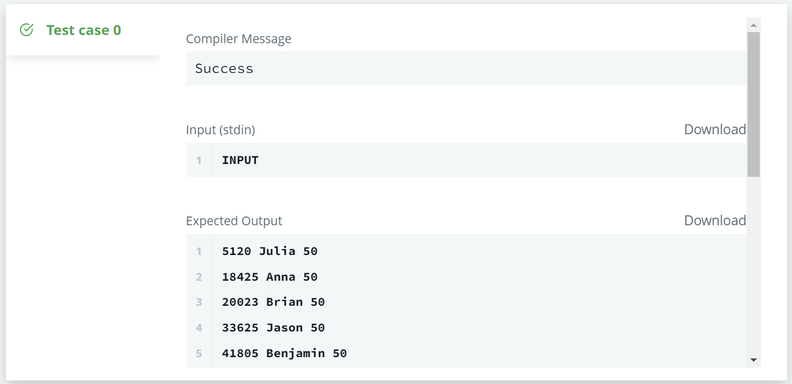

# 📝SQL IM Problem 8 : Challenges[↩](../)

> 문제 URL [🔗](https://www.hackerrank.com/challenges/challenges/problem?isFullScreen=true)

Julia asked her students to create some coding challenges. Write a query to print the *hacker_id*, *name*, and the total number of challenges created by each student. Sort your results by the total number of challenges in descending order. If more than one student created the same number of challenges, then sort the result by *hacker_id*. If more than one student created the same number of challenges and the count is less than the maximum number of challenges created, then exclude those students from the result.

**Input Format**

The following tables contain challenge data:

- *Hackers:* The *hacker_id* is the id of the hacker, and *name* is the name of the hacker. 
- *Challenges:* The *challenge_id* is the id of the challenge, and *hacker_id* is the id of the student who created the challenge. 

------

**Sample Input 0**

*Hackers* Table:  *Challenges* Table: 

**Sample Output 0**

```
21283 Angela 6
88255 Patrick 5
96196 Lisa 1
```

**Sample Input 1**

*Hackers* Table:  *Challenges* Table: 

**Sample Output 1**

```
12299 Rose 6
34856 Angela 6
79345 Frank 4
80491 Patrick 3
81041 Lisa 1
```

**Explanation**

For *Sample Case 0*, we can get the following details:

Students `5077` and `62743` both created `4` challenges, but the maximum number of challenges created is `6` so these students are excluded from the result.

For *Sample Case 1*, we can get the following details:

Students `12299` and `34856` both created `6` challenges. Because `6` is the maximum number of challenges created, these students are included in the result.

## ✏️정답

### 1차 시도

```mysql
WITH cnt AS
    (
    SELECT C.hacker_id, ANY_VALUE(H.name), COUNT(C.challenge_id) Challenges_created
    FROM Challenges C
    JOIN Hackers H ON C.hacker_id = H.hacker_id
    GROUP BY C.hacker_id
    ) 
SELECT * 
FROM cnt c 
WHERE c.Challenges_created = (SELECT 
                                MAX(Challenges_created)
                              FROM cnt c1)
OR c.Challenges_created IN (SELECT 
                                Challenges_created 
                            FROM cnt c2 
                            GROUP BY Challenges_created 
                            HAVING COUNT(Challenges_created) < 2)
ORDER BY c.Challenges_created DESC, c.hacker_id
```

### 성공😊



* 이 문제는 coding challenges에 참가한 각 해커들의 챌린지 갯수를 내림차순 하도록 쿼리를 짜는 문제임. 하지만 다음과 같은 부가적인 조건이 존재함.

  1. 챌린지에 참가한 수가 가장 많은 경우 참가한 수가 중복된 경우 출력
  2. 챌린지에 참가한 수가 가장 많은 경우가 아닌데 참가한 수가 중복된 경우 명단에서 제외

* 이 문제를 용이하게 하기 위해 우선 `WITH`절을 사용하여 이 문제에 필요한 컬럼만을 모아 테이블을 재정의 해줌.

  ```mysql
  WITH cnt AS
      (
      SELECT C.hacker_id, ANY_VALUE(H.name), COUNT(C.challenge_id) Challenges_created
      FROM Challenges C
      JOIN Hackers H ON C.hacker_id = H.hacker_id
      GROUP BY C.hacker_id
      ) 
  ```

* 첫번째 조건을 넣어주기 위해 다음과 같은 조건을 `WHERE` 절에 넣어줌

  ```mysql
  WHERE c.Challenges_created = (SELECT 
                                  MAX(Challenges_created)
                                FROM cnt c1)
  ```

* `2`의 조건을 만족하기 위해 다음과 같은 조건을 `WHERE` 절에 넣어줌

  ```mysql
  OR c.Challenges_created IN (SELECT 
                                  Challenges_created 
                              FROM cnt c2 
                              GROUP BY Challenges_created 
                              HAVING COUNT(Challenges_created) < 2)
  ```

* `ORDER BY`절을 다음과 같이 정의

  ```mysql
  ORDER BY c.Challenges_created DESC, c.hacker_id
  ```

