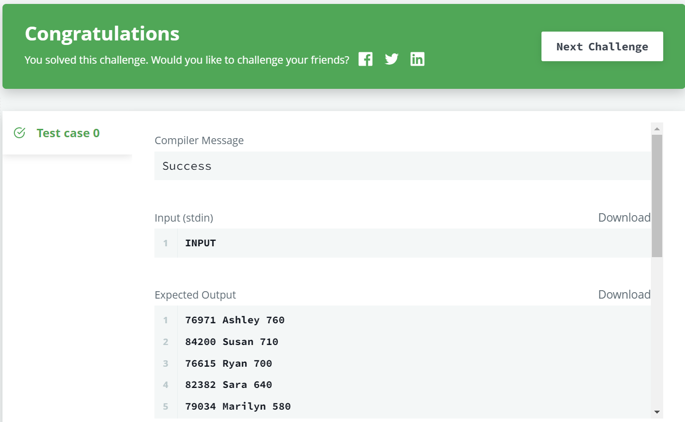

# 📝SQL IM Problem 9 : Contest Leaderboard[↩](../)

> 문제 URL [🔗](https://www.hackerrank.com/challenges/contest-leaderboard/problem?isFullScreen=true)

You did such a great job helping Julia with her last coding contest challenge that she wants you to work on this one, too!

The total score of a hacker is the sum of their maximum scores for all of the challenges. Write a query to print the *hacker_id*, *name*, and total score of the hackers ordered by the descending score. If more than one hacker achieved the same total score, then sort the result by ascending *hacker_id*. Exclude all hackers with a total score of from your result.

**Input Format**

The following tables contain contest data:

- *Hackers:* The *hacker_id* is the id of the hacker, and *name* is the name of the hacker. 
- *Submissions:* The *submission_id* is the id of the submission, *hacker_id* is the id of the hacker who made the submission, *challenge_id* is the id of the challenge for which the submission belongs to, and *score* is the score of the submission. 

**Sample Input**

*Hackers* Table: 

*Submissions* Table: 

**Sample Output**

```
4071 Rose 191
74842 Lisa 174
84072 Bonnie 100
4806 Angela 89
26071 Frank 85
80305 Kimberly 67
49438 Patrick 43
```

## ✏️정답

### 1차 시도

```mysql
SELECT SUB.hacker_id, SUB.name, SUM(SUB.score) FROM (SELECT 
            S.hacker_id,
            S.challenge_id,
            ANY_VALUE(H.name) name,
            MAX(S.score) score
        FROM Submissions S
        JOIN Hackers H ON S.hacker_id = H.hacker_id
        GROUP BY S.hacker_id, S.challenge_id) SUB
GROUP BY SUB.hacker_id
HAVING SUM(SUB.score) != 0
ORDER BY SUM(SUB.score) DESC, SUB.hacker_id
```

### 성공😊



* 이 문제는 **coding contest**의 참가자들의 얻은 득점을 모두 더하는 문제임. 유의해야할 점은 다음과 같음

  1. 한 참가자의 같은 문제에 대한 여러개의 점수는 최고점만 합산.
  2. 모든 점수를 합산한 점수가 0인 참가자는 출력하지 않음.

* `1`번 조건을 만족하기 위해 `FROM`절에 다음과 같은 서브쿼리를 넣음

  ```mysql
  (SELECT 
   S.hacker_id,
   S.challenge_id,
   ANY_VALUE(H.name) name,
   MAX(S.score) score
   FROM Submissions S
   JOIN Hackers H ON S.hacker_id = H.hacker_id
   GROUP BY S.hacker_id, S.challenge_id) SUB
  ```

* 이후 `SUM()`집계함수를 사용하여 유저가 획득한 점수 합산

* `HAVING` 조건을 통해 합산 점수가 0인 참가자 제거
