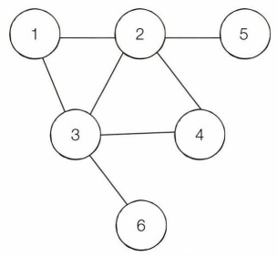

# Q40. 숨바꼭질[↩](../this_is_codingtest)

| 난이도 | 풀이 시간 | 시간 제한 | 메모리 제한 | 기출  |
| ------ | --------- | --------- | ----------- | ----- |
| ●●○    | 40분      | 1초       | 128MB       | USACO |

## 🖋️문제

 동빈이는 숨바꼭질을 하면서 술래로부터 잡히지 않도록 숨을 곳을 찾고 있습니다. 동빈이는 1~N번까지의 헛간 중에서 하나를 골라 숨을 수 있으며, 술래는 항상 1번 헛간에서 출발합니다. 전체 맵 에는 총 M개의 양방향 통로가 존재하며, 하나의 통로는 서로 다른 두 헛간을 연결합니다. 또한 전체 맵은 항상 어떤 헛간에서 다른 어떤 헛간으로 도달이 가능한 형태로 주어집니다. 

 동빈이는 1 번 헛간으로부터 최단 거리가 가장 먼 헛간이 가장 안전하다고 판단하고 있습니다. 이때 최단 거리의 의미는 지나야 하는 길의 최소 개수를 의미합니다. 동빈이가 숨을 헛간의 번호를 출력 하는 프로그램을 작성하세요.

## 입력

* 첫째 줄에는 N과 M이 주어지며, 공백으로 구분합니다. 
  (2 ≤ N ≤ 20.000), (1 < M < 50,000) 
* 이후 M개의 줄에 걸쳐서 서로 연결된 두 헛간 A와 日의 번호가 공백=구분되어 주어집니다. (1 ≤ A, B ≤N)

## 출력

* 첫 번째는 숨어야 하는 헛간 번호를(만약 거리가 같은 헛간이 여러 개면 가장 작은 헛간 번호를 출력합니다), 두 번째는 그 헛간까지의 거리를, 세 번째는 그 헛간과 같은 거리를 갖는 헛간의 개수를 출력해야합니다.

### 입력출력 예

```python
in[0]
6 7
3 6
4 3
3 2
1 3
1 2
2 4
5 2

out[0]
4 2 3
```

---

## 💡풀이

```python

```

### 나동빈님 풀이

* 이 문제는 다익스트라 알고리즘을 이용하여 1 번 노드 (헛간)로부터 다른 모든 노드로의 최단 거리를 계산한 뒤에, 가장 최단 거리가 긴 노드를 찾는 문제임

  * 예를 들어 문제에서의 예제 입력을 그래프 로 나타내면 다음과 같이 표현 가능

  

* 항상 출발 노드는 1번 노드라고 문제에서 명시하였으므로, 다익스트라 알고리즘을 이용하여 1번 노드에서 출발했을 때의 모든 최단 거리를 계산하면 다음과 같은 최단 거리 테이블을 구할 수 있음.

  | 노드1 | 노드2 | 노드3 | 노드4 | 노드5 | 노드6 |
  | ----- | ----- | ----- | ----- | ----- | ----- |
  | 0     | 1     | 1     | 2     | 2     | 2     |

* 따라서 이 예시에서 최단 거리가 가장 긴 노드까지의 최단 거리는 2라는 것을 알 수 있으며, 최단 거리가 2인 노드가 3개인 것을 확인 가능

  * 문제에서는 최단 거리가 같은 헛간이 여러 개이면 가장 작은 헛간 번호를 출력하라고 하였으므로, 이 경우 4번 노드를 출력하면 된다. 즉, 최단 거리 테이블을 구한 이후에는 손쉽게 문제에서 요구하는 답을 도출 가능함

* 또한 문제에서의 거리가 1 이기 때문에 BFS를 이용하여 최단 거리를 계산할 수도 있지만, 여기에서 는 다익스트라 알고리즘을 이용하여 문제를 해결

```python
import heapq
import sys
input = sys.stdin.readline
INF = int(1e9) # 무한을 의미하는 값으로 10억을 설정

# 노드의 개수, 간선의 개수를 입력받기
n, m = map(int, input().split())
# 시작 노드를 1번 헛간으로 설정
start = 1
# 각 노드에 연결되어 있는 노드에 대한 정보를 담는 리스트를 만들기
graph = [[] for i in range(n + 1)]
# 최단 거리 테이블을 모두 무한으로 초기화
distance = [INF] * (n + 1)

# 모든 간선 정보를 입력받기
for _ in range(m):
    a, b = map(int, input().split())
    # a번 노드와 b번 노드의 이동 비용이 1이라는 의미(양방향)
    graph[a].append((b, 1))
    graph[b].append((a, 1))

def dijkstra(start):
    q = []
    # 시작 노드로 가기 위한 최단 경로는 0으로 설정하여, 큐에 삽입
    heapq.heappush(q, (0, start))
    distance[start] = 0
    while q: # 큐가 비어있지 않다면
        # 가장 최단 거리가 짧은 노드에 대한 정보를 꺼내기
        dist, now = heapq.heappop(q)
        # 현재 노드가 이미 처리된 적이 있는 노드라면 무시
        if distance[now] < dist:
            continue
        # 현재 노드와 연결된 다른 인접한 노드들을 확인
        for i in graph[now]:
            cost = dist + i[1]
            # 현재 노드를 거쳐서, 다른 노드로 이동하는 거리가 더 짧은 경우
            if cost < distance[i[0]]:
                distance[i[0]] = cost
                heapq.heappush(q, (cost, i[0]))

# 다익스트라 알고리즘을 수행
dijkstra(start)

# 가장 최단 거리가 먼 노드 번호(동빈이가 숨을 헛간의 번호)
max_node = 0
# 도달할 수 있는 노드 중에서, 가장 최단 거리가 먼 노드와의 최단 거리
max_distance = 0
# 가장 최단 거리가 먼 노드와의 최단 거리와 동일한 최단 거리를 가지는 노드들의 리스트
result = []

for i in range(1, n + 1):
    if max_distance < distance[i]:
        max_node = i
        max_distance = distance[i]
        result = [max_node]
    elif max_distance == distance[i]:
        result.append(i)

print(max_node, max_distance, len(result))

```