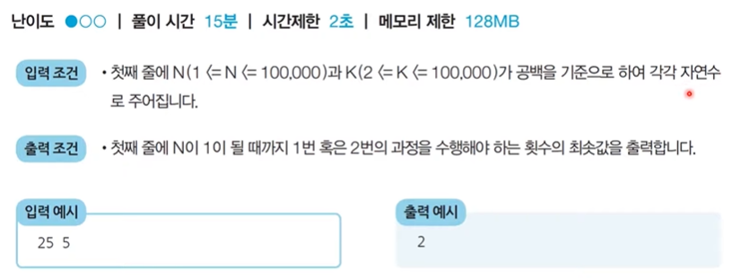
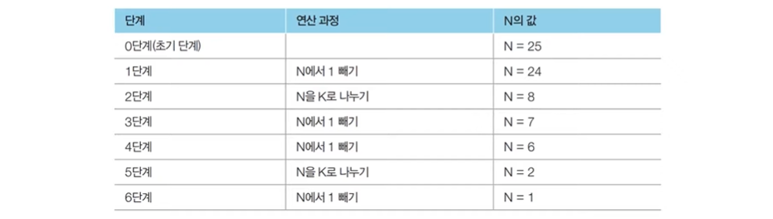

# 3_그리디 [↩](../this_is_codingtest)

## contents📑<a id="contents"></a>

1. 그리디 알고리즘[👉](#3_1)
2. <문제> 거스름 돈: 문제 설명[👉](#3_2)
   * 정당성 분석[👉](#3_2-1)
   * 답안 예시(Python)[👉](#3_2-2)
   * 시간 복잡도 분석[👉](#3_2-3)
3. <문제> 1이 될 때까지 : 문제 설명[👉](#3_3)
   * 문제 해결 아이디어[👉](#3_3-1)
   * 정당성 분석[👉](#3_3-2)
   * 답안 예시[👉](#3_3-3)


## 3_1그리디 알고리즘[📑](#contents)<a id="3_1"></a>

* 그리디 알고리즘(탐욕법)은 **현재 상황에서 지금 당장 좋은 것만 고르는 방법**을 의미합니다.
* 일반적인 그리디 알고리즘은 문제를 풀기 위한 최소한의 아이더어를 떠올릴 수 있는 능력을 요구합니다.
* 그리디 해법은 그 정당성 분석이 중요합니다.
  * 단순히 가장 좋아 보이는 것을 반복적으로 선택해도 최적의 해를 구할 수 있는지 검토합니다.

#### [문제 상황] 루트 노드부터 시작하여 거쳐 가는 노드 값의 합을 최대로 만들고 싶습니다.

* Q. 최적의 해는 무엇인가요?


* Q. 단순히 매 상황에서 가장 큰 값만 고른다면 어떻게 될까요?


#### 단순히 매 상황에서 가장 큰값만 고르는 것이 `그리디` 알고리즘

* 일반적인 상황에서 그리디 알고리즘은 최적의 해를 보장 할 수 없을때가 많습니다.
* 하지만 코딩 테스트에서의 대부분의 그리디 문제는 **탐욕법으로 얻은 해가 최적의 해가 되는 상황에서, 이를 추론**할 수 있어야 풀리도록 출제됩니다.

## 3_2 <문제> 거스름 돈 : 문제 설명[📑](#contents)<a id="3_2"></a>

* 당신은 음식점의 계산을 도와주는 점원입니다. 카운터에는 거스름돈으로 사용할 500원, 100원, 50원, 10원 짜리 동전이 무한히 존재한다고 가정합니다. 손님에게 거슬러 주어야 할 돈이 N원일 때, 거슬러 주어야 할 동전의 최소 개수를 구하세요. 단, 거슬러 줘야할  돈은 N은 항상 10의 배수입니다.


#### 풀이

* 최적의 해를 빠르게 구하기 위해서는 **가장 큰 화폐 단위부터** 돈을 거슬러 주면 됩니다.
* N원을 거슬러 줘야 할 때, 가장 먼저 500원으로 거슬러 줄 수 있을 만큼 거슬러 줍니다.
  * 이후에 100원, 50원, 10원짜리 동전을 차례대로 거슬러 줄 수 있을 만큼 거슬러 주면 됩니다.
* N = 1,260일 때의 예시를 확인해 봅시다.

##### [Step 0] 초기 단계 - 남은 돈 : 1,260원


##### [Step 1] 남은 돈 : 260원


##### [Step 2] 남은 돈 : 60원


##### [Step 3] 남은 돈 : 10원


##### [Step 4] 남은 돈 : 0원


### 정당성 분석[📑](#contents)<a id="3_2-1"></a>

* 가장 큰 화폐 단위부터 돈을 거슬러 주는 것이 최적의 해를 보장하는 이유는 무엇일까요?

  * 가지고 있는 동전 중에서 **큰 단위가 항상 작은 단위의 배수이므로 작은 단위의 동전들을 종합해 다른 해가 나올 수 없기 때문**입니다.
* 만약 800원을 거슬러주어야하는데 화폐 단위가 500원, 400원, 100원이라면 어떻게 될까요?
* 그리디 알고리즘 문제에서는 이처럼 문제 풀이를 위한 최소한의 아이디어를 떠올리고 이것이 정당한지 검토 할 수 있어야 합니다.

### 답안 예시(Python)[📑](#contents)<a id="3_2-2"></a>

```python
n = 1260
count = 0

# 큰 단위의 화폐부터 차례대로 확인하기
array = [500, 100, 50, 10]

for coin in array:
    count += n // coin # 해당 화폐로 거슬러 줄 수 있는 동전의 개수 세기
    n %= coin
print(count)
```

### 시간 복잡도 분석[📑](#contents)<a id="3_2-3"></a>

* 화폐의 종류가 K라고 할 때, 소스코드의 시간 복잡도는 **O(K)**입니다.
* 이 알고리즘의 시간 복잡도는 거슬러줘야 하는 금액과는 무관하며, 동전의 총 종류에만 영향을 받습니다.

## 3_3<문제> 1이 될 때까지 : 문제 설명[📑](#contents)<a id="3_3"></a>

* 어떠한 수 **N이 1 이 될 때까지** 다음의 두 과정 중 하나를 반복적으로 선택하여 수행하려고 한다. 단. 두 번째 연산은 N이 K로 나누어떨어질 때만 선택할 수 있다.
  1. N에서 1 을 뺀다.
  2. N을 K로 나눈다.

* 예를 들어 N이 17, K가 4라고 가정하자. 이때 1 번의 과정을 한 번 수행하면 N은 16이 된다. 이후에 2번의 과정을 두 번 수행하면 N은 1이 된다. 결과적으로 이 경우 전체 과정을 실행한 횟수는 3이 된다. 이는 N을 1 로 만드는 최소 횟수이다.
* N과 K가 주어질 때 N이 1 이 될 때까지 1번 혹은 2번의 **과정을 수행해야 하는 최소 횟수**를 구하는 프로그램을 작성하시오.



### 문제 해결 아이디어[📑](#contents)<a id="3_3-1"></a>

* 주어진 N에 대하여 **최대한 많이 나누기**를 수행하면 됩니다.
* N의 값을 줄일 때 **2이상의 수로 나누는 작업이 1을 빼는 작업보다** 수를 훨씬 많이 줄일 수 있습니다.
* 예를 들어 N = 25, K = 3일때는 다음과 같습니다.



### 정당성 분석[📑](#contents)<a id="3_3-2"></a>

* **가능하면 최대한 많이 나누는 작업**이 최적의 해를 항상 보장할 수 있을까요?
* N이 아무리 큰 수 여도, K로 계속 나눈다면 기하급수적으로 빠르게 줄일 수 있습니다.
* 다시 말해 K가 2 이상이기만 하면, K로 나누는 것이 1을 빼는 것보다 항상 빠르게 N을 줄일 수 있습니다.
  * 또한, N은 항상 1에 도달하게 됩니다.(최적의 해 성립)

### 답안 예시(Python) [📑](#contents)<a id="3_3-3"></a>

```python
# N, K을 공백을 기준으로 구분하여 입력 받기
n, k = map(int, input().split())

result = 0

while True:
    # N이 K로 나누어 떨어지는 수가 될 때까지 빼기
    target = (n // k ) * k
    result += (n - target)
    n = target
    # N이 K보다 작을때, (더이상 나눌 수 없을때) 반복문 탈출
    if n < k:
        break
    # K로 나누기
    result += 1
    n //= k
    
# 마지막으로 남은 수에 대하여 1씩 빼기
result += (n-1)
print(result)
```

