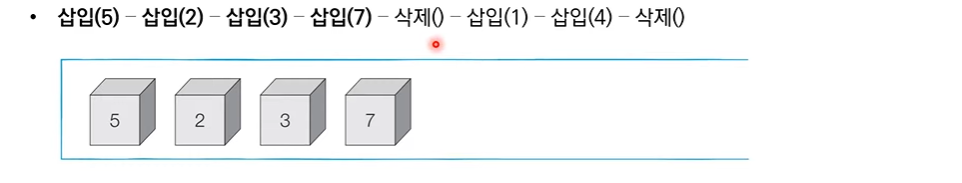
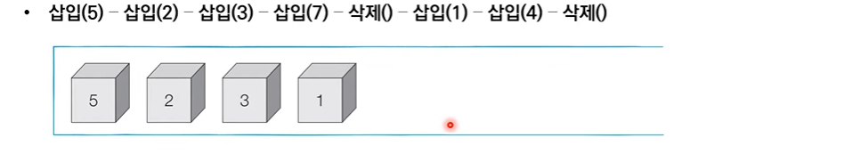
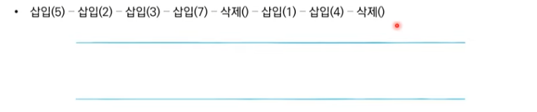
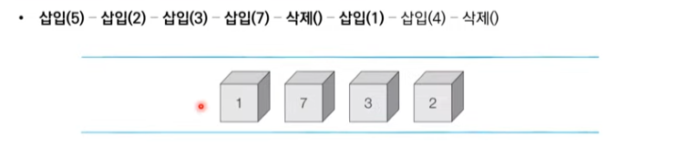
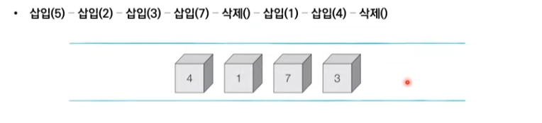

# 4_DFS_BFS [↩](../this_is_codingtest)

## contents📑<a id="contents"></a>

1. 그래프 탐색 알고리즘:DFS/BFS[👉](#4_1)
   * 스택 자료구조[👉](#4_1_1)
   * 큐 자료구조[👉](#4_1_2)
   * 재귀함수[👉](#4_1_3)

## 4_1그래프 탐색 알고리즘:DFS/BFS[📑](#contents)<a id="4_1"></a>

* 탐색(Search)이란 많은 양의 데이터 중에서 **원하는 데이터를 찾는 과정**을 말합니다.
* 대표적인 그래프 탐색 알고리즘으로는 DFS와 BFS가 있습니다.
* **DFS/BFS는 코딩 테스트에서 매우 자주 등장하는 유형**이므로 반드시 숙지해야 합니다.

### 스택 자료구조[📑](#contents)<a id="4_1_1"></a>

* 먼저 들어 온 데이터가 나중에 나가는 형식(선입후출)의 자료구조입니다.
* **입구와 출구가 동일한 형태**로 스택을 시각화할 수 있습니다.


> 박스쌓기 예시로 생각하면 됨.

#### 스택 동작 예시

> 프링글스 과자통과 유사함.







```python
stack = []

# 삽입(5) - 삽입(2) - 삽입(3) - 삽입(7) - 삭제() - 삽입(1) - 삽입(4) - 삭제()
stack.append(5)
stack.append(2)
stack.append(3)
stack.append(7)
stack.pop()
stack.append(1)
stack.append(4)
stack.pop()


print(stack[::-1])	# 최상단 원소부터 출력 -> 뒤집어서 출력
print(stack)		# 최하단 원소부터 출력

# 실행결과
[5, 2, 3, 1]
[1, 3, 2, 5]
```

> 스택 구현 예제(Python)

### 큐 자료구조[📑](#contents)<a id="4_1_2"></a>

* 먼저 들어 온 데이터가 먼저 나가는 형식(선입선출)의 자료구조.
* 큐는 **입구와 출구가 모두 뚫려 있는 터널과 같은 형태**로 시각화 할 수 있습니다.


#### 큐 동작 예시








```python
from collections import deque

# 큐(Queue) 구현을 위해 deque 라이브러리 사용
queue = deque()
# 삽입(5) - 삽입(2) - 삽입(3) - 삽입(7) - 삭제() - 삽입(1) - 삽입(4) - 삭제()
queue.append(5)		# 오른쪽으로 들어와서
queue.append(2)
queue.append(3)
queue.append(7)
queue.popleft()		# 왼쪽으로 나감
queue.append(1)
queue.append(4)
queue.popleft()

print(queue)	# 먼저 들어온 순서대로 출력
queue.reverse()	# 다음 출력을 위해 역순으로 바꾸기
print(queue)	# 나중에 들어온 원소부터 출력

# 실행 결과
deque([3, 7, 1, 4])
deque([4, 1, 7, 3])
```

> 큐 구현 예제(Python)

* `list`를 이용하는 것보다 `deque`을 이용하는 것이 `시간복잡도`면에서 유리함.

### 재귀함수(Recursive Function)[📑](#contents)<a id="4_1_3"></a>

* **재귀 함수(Recursive Function)란 자기 자신을 다시 호출하는 함수**를 의미함.
* 단순한 형채의 재귀 함수 예제
  * '재귀 함수를 호출합니다.'라는 문자열을 무한히 출력합니다.
  * 어느 정도 출력하다가 **최대 재귀 깊이 초과 메시지**가 추력됩니다.

```python
def recursive_function():
    print('재귀 함수를 호출합니다.')
    recursive_function()

recursive_function()

재귀 함수를 호출합니다.
...
재귀 함수를 호출합니다.
재귀 함수를 호출합니다.
재귀 함수를 호출합니다.Traceback (most recent call last):
  [Previous line repeated 993 more times]
  File "C:/", line 2, in recursive_function
    print('재귀 함수를 호출합니다.')
RecursionError: maximum recursion depth exceeded while calling a Python object
```

> 재귀함수 예제

#### 재귀 함수의 종료 조건

* 재귀 함수를 문제 풀이에서 사용할 때는 재귀함수의 종료 조건을 반드시 명시해야 합니다.
* 종료 조건을 제대로 명시하지 않으면 함수가 무한히 호출될 수 있습니다.
* 종료조건을 포함한 재귀 함수 예제

```python
def recursive_function(i):
    # 100번째 출력했을 때 종료되도록 종료 조건 명시
    if i == 100:
        return
    print(i, '번째 재귀 함수에서', i + 1, '번째 재귀 함수를 호출합니다.')
    recursive_function(i + 1)
    print(i, '번째 재귀 함수를 종료합니다.')

recursive_function(1)
```

> 재귀 함수 종료 예제
