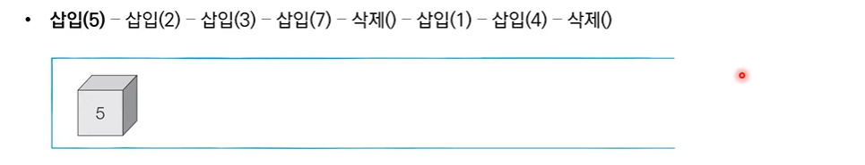
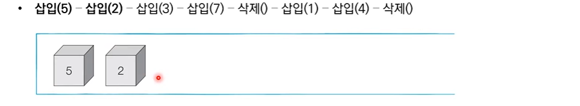
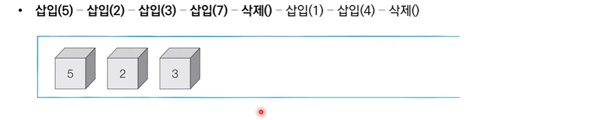
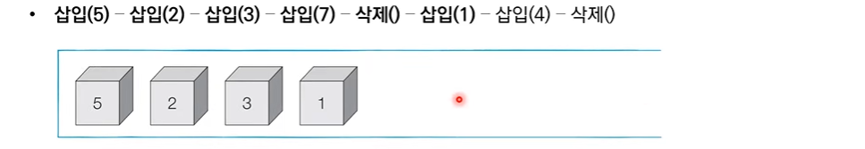
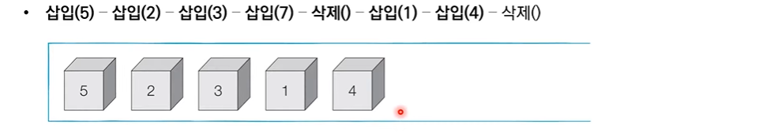

# 4_DFS_BFS [↩](../this_is_codingtest)

## contents📑

1. 그래프 탐색 알고리즘:DFS/BFS[👉](#4_1)
   * 스택 자료구조[👉](#4_1_1)

## 4_1그래프 탐색 알고리즘:DFS/BFS[📑](#contents)

* 탐색(Search)이란 많은 양의 데이터 중에서 **원하는 데이터를 찾는 과정**을 말합니다.
* 대표적인 그래프 탐색 알고리즘으로는 DFS와 BFS가 있습니다.
* **DFS/BFS는 코딩 테스트에서 매우 자주 등장하는 유형**이므로 반드시 숙지해야 합니다.

### 스택 자료구조[📑](#contents)

* 먼저 들어 온 데이터가 나중에 나가는 형식(선입후출)의 자료구조입니다.
* **입구와 출구가 동일한 형태**로 스택을 시각화할 수 있습니다.

> 박스쌓기 예시로 생각하면 됨.

#### 스택 동작 예시

