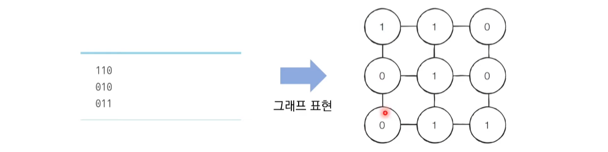
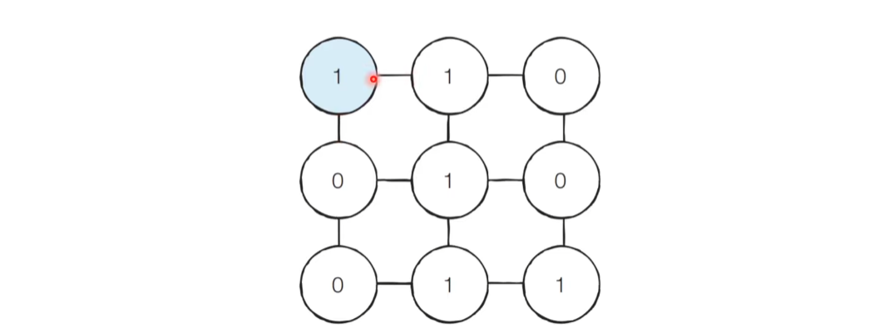
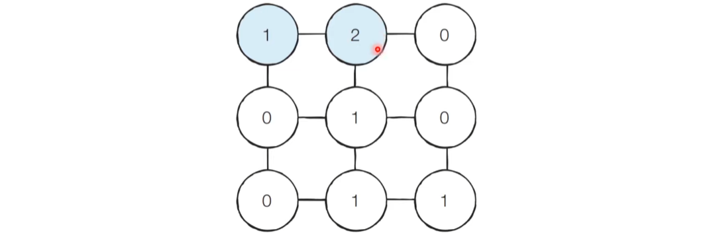

# Q4. 미로 탈출[↩](../this_is_codingtest)

| 난이도 | 풀이 시간 | 시간 제한 | 메모리 제한 |
| ------ | --------- | --------- | ----------- |
| ●◐○    | 30분      | 1초       | 12MB        |


## 🖋️문제
동빈이는 N X M 크기의 직사각형 형태의 미로에 갇혀 있다. 미로에는 여러 마리의 괴물이 있어 이를 피해 탈출해야 한다. 동빈이의 위치는 (1, 1)이고 미로의 출구는 (N, M)의 위치에 존재하며 한 번에 한 칸씩 이동할 수 있다. 이때 괴물이 있는 부분은 0으로, 괴물이 없는 부분은 1로 표시되어 있 다. 미로는 반드시 탈출할 수 있는 형태로 제시된다. 이때 동빈이가 탈출하기 위해 움직여야 하는 최소 칸의 개수를 구하시오. 칸을 셀 때는 시작 칸과 마지막 칸을 모두 포함해서 계산한다.

### 입력
*  첫째 줄에 두 정수 N, M(4 ≤ N, M ≤ 200)01 주어집니다. 다음 N개의 줄에는 각각 M개의 정수(0 혹은 1)로 미로의 정보가 주어진다. 각각의 수들은 공백 없이 붙어서 입력으로 제시된다. 또한 시작 칸 과 마지막 칸은 항상 1이다.

### 출력
* 첫째 줄에 최소 이동 칸의 개수를 출력핸다.

### 예제 입력 & 출력

```python
in[0]
5 6
101010
111111
000001
111111
111111

out[0]
10
```

---

## 💡풀이
```python
import sys

N, M = map(int, sys.stdin.readline().split())

arr = [list(map(int, sys.stdin.readline().rstrip())) for _ in range(N)]

print(arr)
```

* 미완성

#### 나동빈님 풀이[📌](https://github.com/ndb796/python-for-coding-test/blob/master/5/11.py)

* BFS는 시작 지점에서 가까운 노드부터 차례대로 그래프의 모든 노드를 탐색합니다.
* 상, 하, 좌, 우로 연결된 모든 노드로의 거리가 1로 동일합니다.
  * 따라서 (1, 1)지점부터 BFS 를 수행하여 모든 노드의 최단 거리 값을 기록하면 해결할 수 있습니다.
* 예시로 다음과 같이 3*3크기의 미로가 있다고 가정합시다.



* [Step 1] 처음에 (1, 1)의 위치에서 시작합니다.



* [Step 2] (1, 1)좌표에서 상, 하, 좌, 우로 탐색을 진행하면 바로 옆 노드인 (1, 2)위치의 노드를 방문하게 되고 새롭게 방문하는 (1, 2)노드의 값을 2로 바꾸게 됩니다.



* [Step 3] 마찬가지로 BFS를 계속 수행하면 결과적으로 다음과 같이 최단 경로의 값들이 1씩 증가하는 형태로 변경됩니다.


```python

from collections import deque

# N, M을 공백을 기준으로 구분하여 입력 받기
n, m = map(int, input().split())
# 2차원 리스트의 맵 정보 입력 받기
graph = []
for i in range(n):
    graph.append(list(map(int, input())))

# 이동할 네 가지 방향 정의 (상, 하, 좌, 우)
dx = [-1, 1, 0, 0]
dy = [0, 0, -1, 1]

# BFS 소스코드 구현
def bfs(x, y):
    # 큐(Queue) 구현을 위해 deque 라이브러리 사용
    queue = deque()
    queue.append((x, y))
    # 큐가 빌 때까지 반복하기
    while queue:
        x, y = queue.popleft()
        # 현재 위치에서 4가지 방향으로의 위치 확인
        for i in range(4):
            nx = x + dx[i]
            ny = y + dy[i]
            # 미로 찾기 공간을 벗어난 경우 무시
            if nx < 0 or nx >= n or ny < 0 or ny >= m:
                continue
            # 벽인 경우 무시
            if graph[nx][ny] == 0:
                continue
            # 해당 노드를 처음 방문하는 경우에만 최단 거리 기록
            if graph[nx][ny] == 1:
                graph[nx][ny] = graph[x][y] + 1
                queue.append((nx, ny))
    # 가장 오른쪽 아래까지의 최단 거리 반환
    return graph[n - 1][m - 1]

# BFS를 수행한 결과 출력
print(bfs(0, 0))
```

